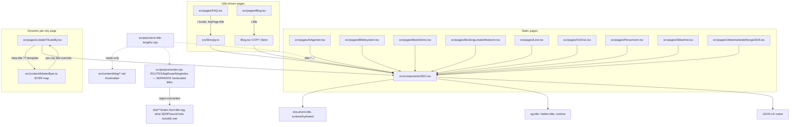

# XAL-1008 — title.long: shorten SEO `<title>` strings to ≤65 chars

## WHAT THIS IS

Several static marketing pages render a `<title>` (and `og:title`/`twitter:title`)
via `<SEO title="...">` that is longer than the ~65-character length Google
tends to render in full in a SERP snippet before truncating with an ellipsis.
Long titles get cut off mid-word/mid-phrase in search results, which is a
minor but real SEO/CTR hit. The fix is purely copy-editing: shorten each
offending title string to ≤65 chars, keeping the primary keyword phrase and
the `Digilist` brand suffix, dropping secondary/redundant clauses. No
behavioral, layout, or routing change.

## HOW IT WORKS NOW

- `src/components/SEO.tsx` — the shared SEO component. Its `title` prop
  (default `DEFAULT_TITLE`, line ~89) sets `document.title` (line 105),
  `og:title` (line 128), `og:image:alt` (line 133), `twitter:title` (line 144),
  `twitter:image:alt` (line 147), and a JSON-LD `name` field (line 382). Every
  page in `src/pages/*.tsx` renders `<SEO title="...">` once, near the top of
  its JSX, usually as a static double-quoted string literal.
- `scripts/prerender.mjs` renders each route to static HTML at build time
  (invoked by `pnpm build`). **Critically, it does NOT just capture React's
  `document.title`.** It has its own large, hand-maintained `ROUTES` array
  (and separate `faqRoute`/`blogIndex`/`/en/blogg` literals) of
  `{route, title, description, ...}` objects — one per page — and
  unconditionally overwrites the `<title>` tag via
  `.replace(/<title>[^<]*<\/title>/, ...)` (line ~2365) using `meta.title`
  from that array, regardless of what the React component would have
  rendered. This was discovered mid-task: an initial `pnpm build` after
  editing only `src/pages/*.tsx` still shipped the OLD long titles in
  `dist/`, because `prerender.mjs`'s copy hadn't been touched. The file's own
  top-of-file comment argues this static title is "purely for the no-JS
  unfurl case" (social crawlers) since "modern search bots... execute JS and
  will use the SPA-rendered meta anyway" — but the ticket's acceptance
  criterion (curl the live URL, see the shortened title) treats the shipped
  static HTML as authoritative, so both copies must match.
- `scripts/check-title-lengths.mjs` is a **separate, pre-existing** script
  that only checks blog-post frontmatter titles in `src/content/blog/*.md`
  (different 50-char "rendered title" rule, wired to nothing). It does not
  touch `src/pages/*.tsx` and is explicitly out of scope per the ticket.
- Two pages source their title from an i18n dictionary instead of a literal:
  - `src/pages/FAQ.tsx:37` — `title={t(locale, "faqPage.title")}`, resolved
    against `src/lib/copy.ts` (`"faqPage.title"` keys at line 278 (nb) and
    line 591 (en)).
  - `src/pages/Blog.tsx:154` — `title={t.title}`, where `t = COPY[locale]`
    and `COPY` is a local object literal in the same file (nb title at line
    52, en title at line 76).
- One page has a **dynamic, per-entity** title:
  `src/pages/LokalerTilLeieBy.tsx:146` —
  `title={data.title ?? \`Lokaler til leie i ${data.name} – finn og book ledige lokaler | Digilist\`}`.
  `data` comes from `BYER` in `src/content/lokalerByer.ts`, one entry per
  city (Oslo, Bergen, Trondheim, …). The `ByData` interface already has an
  optional `title?: string` override field (comment: "Use when the templated
  title exceeds ~60 chars for this city name"), and one city (Fredrikstad,
  line 376) already uses it. This confirms the template was already known to
  overflow for some city names and the fix mechanism (a per-city override)
  already exists — it just wasn't applied to every city that needs it.

## WHAT CHANGES

Static title-string edits only, in these files (old len → new len, all ≤65):

| File | Old len | New title |
|---|---|---|
| `src/pages/AiAgenter.tsx:147` | 72 | `AI-agenter for booking og utleie \| Digilist` (43) |
| `src/pages/Billettsystem.tsx:144` | 71 | `Billettsystem: selg billetter med rabatt \| Digilist` (51) |
| `src/pages/BookDemo.tsx:14` | 71 | `Book demo av Digilist · Norsk bookingplattform for kommuner` (59) |
| `src/pages/BookingLokalerMoterom.tsx:145` | 76 | `Booking av lokaler og møterom · Digilist` (40) |
| `src/pages/Leie.tsx:211` | 70 | `Leie lokaler – finn og book selskapslokale \| Digilist` (53) |
| `src/pages/OmOss.tsx:21` | 68 | `Om Digilist: norsk bookingplattform \| Digilist` (46) |
| `src/pages/Personvern.tsx:14` | 68 | `Personvernerklæring · Digilist \| GDPR og ISO 27701` (50) |
| `src/pages/Sikkerhet.tsx:96` | 69 | `Sikkerhet og personvern · Digilist \| ISO 27001, GDPR` (52) |
| `src/pages/UtleiemarkedetNorge2026.tsx:146` | 69 | `Utleiemarkedet i Norge 2026 – data og priser \| Digilist` (55) |
| `src/lib/copy.ts` `"faqPage.title"` (nb, line 278) | 76 | `FAQ · Digilist \| Vanlige spørsmål om booking og samsvar` (55) |
| `src/lib/copy.ts` `"faqPage.title"` (en, line 591) | 77 | `FAQ · Digilist \| Common questions about booking and compliance` (62) |
| `src/pages/Blog.tsx` `COPY.nb.title` (line 52) | 74 | `Blogg · Digilist \| Innsikt om booking, sesongleie og samsvar` (60) |
| `src/pages/Blog.tsx` `COPY.en.title` (line 76) | 70 | `Blog · Digilist \| Notes on venue booking and daily operations` (61) |

Plus `src/content/lokalerByer.ts`: add a `title:` override (same
`Lokaler til leie i {name} – finn og book | Digilist` pattern already used
for Fredrikstad) to every `BYER` entry whose *default templated* title
exceeds 65 chars: **Bergen (66), Trondheim (69), Stavanger (69), Kristiansand
(72), Tromsø (66), Drammen (67), Sandnes (67), Ålesund (67), Sandefjord (70),
Tønsberg (68), Sarpsborg (69), Haugesund (69)**. Oslo (64) and Bodø (64) stay
on the default template — already ≤65. Fredrikstad already has an override
and is untouched.

**Plus `scripts/prerender.mjs`** — its independent `ROUTES`/`faqRoute`/
`blogIndex`/`/en/blogg` title literals needed the *same* shortened strings
applied a second time, since this is what actually lands in the shipped
`dist/**/index.html`. Re-running the >65-char scan against this file (not
just `src/pages/*.tsx`, per the ticket's instruction to recheck for missed
patterns) turned up the 9 duplicates of pages already fixed, both `faqPage`/
`Blog` locale titles, the 12 city-page duplicates, **and 5 titles for routes
that don't have a matching `title=` literal in `src/pages/*.tsx` at all**
(their static SEO title is defined only in `prerender.mjs`): `/arrangementer`
(72→62), `/ai-agenter/importer-oppforing` (69→52),
`/booking-av-lokaler-og-moterom` (68→40, a wording independent of and
already-different from `BookingLokalerMoterom.tsx`'s own title before this
fix), `/bruksomrader/idrettshaller-gymsaler` (72→58), and
`/bruksomrader/kulturhus-kantiner` (69→55). All shortened using the same
rule: keep the primary phrase before the first `–`/`·`/`:`, keep the
`Digilist` brand mention, drop a secondary clause.

Verified after rebuilding: scanned all 431 prerendered `dist/**/index.html`
`<title>` tags; zero non-blog-post pages exceed 65 chars (141 individual
`/blogg/<slug>/` and `/en/blogg/<slug>/` post pages do, sourced from
`src/content/blog/*.md` frontmatter — explicitly out of scope, unchanged).

Each new title keeps the primary keyword/phrase (the clause before the first
`–`/`·`/`:`), keeps the `Digilist` brand mention, and drops a secondary
clause rather than truncating mid-word, per the ticket's rule.

Not changed: `src/content/blog/*.md` frontmatter (separate surface, separate
script, explicitly out of scope), all `description`/`keywords`/`breadcrumbs`
props, and every non-offending `title=`/`title:` in `src/pages/*.tsx` and
`scripts/prerender.mjs` (verified ≤65, see BLAST RADIUS).

## BLAST RADIUS

- `grep -rn 'title=' src/pages/*.tsx` — 60+ matches; only the strings listed
  above measured >65 chars. Confirmed by re-running the length check after
  editing (all pass, see below). Short titles on simple landing pages
  (`ArrangementTeaterOgScene.tsx`, `LeieHall.tsx`, etc.) are untouched.
- `title={t(locale, "pricing.title")}` (Priser.tsx) and
  `title={t(locale, "home.title")}` (Index.tsx) — checked, both nb/en
  variants are well under 65 chars already, not touched.
- `<SEO title=...>` consumers: only `src/components/SEO.tsx` reads the prop
  (`document.title`, OpenGraph/Twitter meta, JSON-LD `name`). No other
  component reads a page's title string directly.
- `scripts/prerender.mjs` — renders these pages at build time from its own
  separate `ROUTES`/`faqRoute`/`blogIndex` title literals (see WHAT CHANGES);
  updated those in lockstep with the component-level fixes. Ran `pnpm build`
  and diffed every `dist/**/index.html` `<title>` — no route or content-shape
  change, only shorter `<title>`/`og:title`/`twitter:title` text.
- `scripts/check-title-lengths.mjs` — separate script, only reads
  `src/content/blog/*.md`, untouched by this change and confirmed it does
  not reference `src/pages` or `src/lib/copy.ts`.
- `src/content/lokalerByer.ts` `title?` override field — already an existing,
  documented mechanism (used by Fredrikstad); adding more entries doesn't
  change `LokalerTilLeieBy.tsx`'s consumption logic (`data.title ?? \`...\``),
  which is untouched.
- No test currently asserts title length for `src/pages/*.tsx` or
  `lokalerByer.ts` (only blog frontmatter has `check-title-lengths.mjs`, and
  that isn't wired into `pnpm test`). Existing `SEO.*.test.ts(x)` tests
  assert canonical URL and JSON-LD dedupe behavior, not title length —
  unaffected by these edits.

