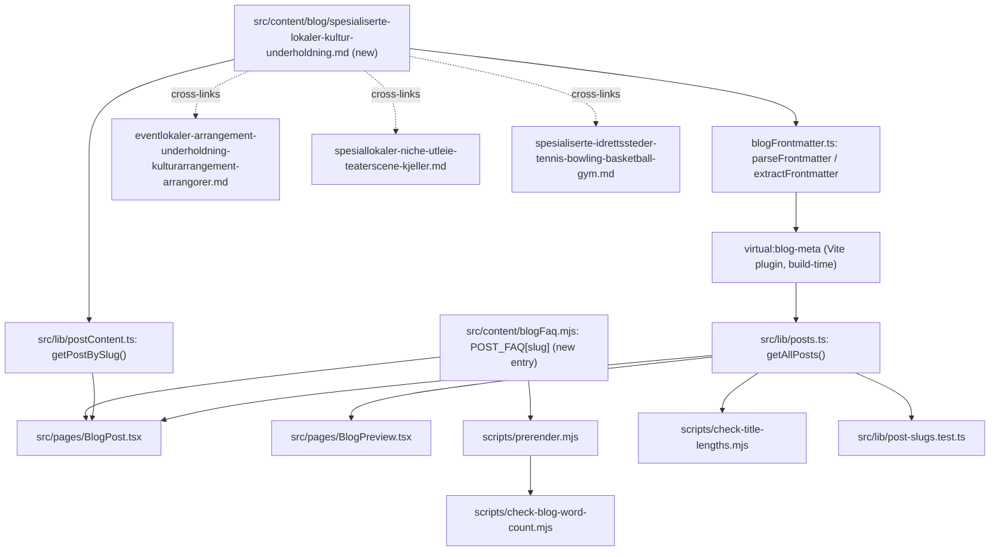

# XAL-1084 — Content gap: Spesialiserte lokaler for kultur og underholdning

## WHAT THIS IS

A content-only ticket in a marketing/SEO blog repo (Digilist has no booking
domain code here — confirmed repeatedly in prior tickets, see
`project_repo_has_no_booking_domain.md`). The ask: publish a new Norwegian
Bokmål blog post titled around "Spesialiserte lokaler for kultur og
underholdning", covering that kulturaktører, musikere og arrangører søker
spesialiserte rom — et nisje-marked med høy intent og færre konkurrenter enn
generelle selskapslokaler — so the site has content satisfying search intent
for the keyword **"spesialiserte"** combined with the kultur/underholdning
angle.

## HOW IT WORKS NOW (files read)

- `src/content/blog/*.md` — one file per post. Frontmatter (`slug`, `title`,
  `description`, `date`, `author`, `role`, `readingMinutes`, `tag`, `cover`,
  `keywords`) parsed by `src/lib/blogFrontmatter.ts::parseFrontmatter` /
  `extractFrontmatter`.
- `src/lib/posts.ts` — metadata-only list, built at Vite build time from the
  `virtual:blog-meta` plugin.
- `src/lib/postContent.ts` — loads full article bodies via
  `import.meta.glob("/src/content/blog/*.md", { query: "?raw", eager: true })`,
  keyed by slug. Any new `.md` file dropped in `src/content/blog/` is
  auto-registered — no registry/index file to edit.
- `src/content/blogFaq.mjs` (`POST_FAQ`, keyed by slug) — the only thing that
  renders per-post FAQPage JSON-LD (read by `src/pages/BlogPost.tsx` and
  `scripts/prerender.mjs`). Frontmatter `schema`/`faqQuestion`/`faqAnswer`
  fields are dead (confirmed recurring bug, hit 3x already:
  XAL-758/1155/1088, see `project_dead_faq_frontmatter_recurring_bug.md`).
  `src/content/blogFaq.test.ts` only pins one specific slug's FAQ verbatim
  match today — it is not a generic "every post must have an entry" test —
  but the established convention (every recent sibling post) is still to add
  a `## Vanlige spørsmål` section with a matching `POST_FAQ[slug]` entry.
- `src/lib/post-slugs.test.ts` — guards that no two posts resolve to the same
  slug.
- `scripts/check-blog-word-count.mjs` (`MIN_WORDS = 200`, checked against the
  prerendered `dist/blogg/<slug>/index.html`, wired into `pnpm build`) and
  `scripts/check-title-lengths.mjs` (informational, `LIMIT = 65` rendered
  chars).
- `scripts/guard-blog-redirects.mjs` — probes new slugs against live nginx
  301s (VPS-only, not relevant to a brand-new slug).

### Existing content already covering adjacent space (read all in full)

- `src/content/blog/eventlokaler-arrangement-underholdning-kulturarrangement-arrangorer.md`
  (XAL-1086, published today, tag Arrangør) — arrangør persona: technical
  requirements of an eventlokale (scene, lyd/lys, skjenkebevilling,
  garderobe, lasterampe), why it's mostly a private market vs. kommunal
  søknadsprosess, and the repeat-booking/customer-engagement argument. Does
  **not** make a niche-market/competition argument.
- `src/content/blog/sal-for-kulturarrangementer-og-seminarer.md` (tag
  Innbygger) — kommunal sal search/comparison (price, capacity, real-time
  availability) for konsert/utstilling/seminar. Kommune-side, not a
  niche/competition angle.
- `src/content/blog/spesiallokaler-niche-utleie-teaterscene-kjeller.md` (tag
  Utleier) — Utleier-facing: teaterscene/kjeller/industrilokale/atelier-loft/
  uvanlig uteareal as "spesiallokaler", argues low volume-per-lokale still
  adds up to real demand, so publish anyway. Character-driven venues in
  general, not specifically the kultur/underholdning category, and does not
  compare against selskapslokaler as a competing search category.
- `src/content/blog/spesialiserte-idrettssteder-tennis-bowling-basketball-gym.md`
  (tag Lag og foreninger) — the direct structural sibling: same "Spesialiserte
  X" title pattern, same Utleier/klubb-facing argument shape (few venues,
  formålsbygget, so publish/optimize for the specific niche), but for sport,
  not kultur.
- `src/content/blog/kunstner-verksteder-studio-dansesaler-kreative-lokaler.md`,
  `leie-ovingsrom-musikk-dans-studio.md`, `dans-og-kunstnerstudier-atelier-for-opplaering.md`,
  `booking-spesialiserte-trening-kunstnerlokaler.md` — all renter/teaching-side
  posts about individual room types (atelier, dansesal, øvingsrom) and
  personas (kunstner, danseinstruktør, teatergruppe, musiker), none framed
  around the kultur/underholdning venue *category* as a whole or its
  competitive position against selskapslokaler.

**Confirmed real gap, not a duplicate:** no existing post uses the bare
keyword "spesialiserte" together with the kultur/underholdning venue category
(konsertlokale, black box/scene-rom, utstillingslokale, øvingslokale for
band), and none makes the specific market-positioning argument that this
category is a smaller, higher-intent, lower-competition search segment than
the crowded "selskapslokale" category — the exact argument already
established for sport in `spesialiserte-idrettssteder-tennis-bowling-basketball-gym.md`
and, in a different framing, for general niche venues in
`spesiallokaler-niche-utleie-teaterscene-kjeller.md`. This is the missing
"Spesialiserte X" sibling for the kultur/underholdning niche, aimed at
Utleiere deciding whether to list/optimize a room under this category rather
than as a generic selskapslokale.

## WHAT CHANGES

One new file: `src/content/blog/spesialiserte-lokaler-kultur-underholdning.md`.

- Tag: `"Utleier"` — matches the two direct structural siblings
  (`spesialiserte-idrettssteder...`, `spesiallokaler-niche-utleie...`), since
  the "fewer competitors, higher intent" argument is a listing/positioning
  argument for lokaleeiere, not a renter-side how-to.
- Primary keyword "spesialiserte" placed first in `keywords`, plus
  kultur/underholdning-specific terms (konsertlokale, kulturlokale,
  underholdningslokale, øvingslokale musiker, utstillingslokale).
- Content covers: what makes a kultur/underholdning room "spesialisert"
  (konsertlokale, black box/scene, øvingslokale, utstillingslokale) versus a
  generic selskapslokale; the three personas named in the ticket
  (kulturaktører, musikere, arrangører) and how each searches differently;
  the competitive argument — fewer listings compete for these searches than
  for "selskapslokale", and searchers here already know exactly what they
  need (high intent), so a correctly labeled niche listing converts better
  than being buried in a generic category; how Digilist makes this
  bookable/searchable.
- `## Vanlige spørsmål` section + matching
  `POST_FAQ["spesialiserte-lokaler-kultur-underholdning"]` entry added to
  `src/content/blogFaq.mjs`, verbatim-matching, following the same pattern
  every recent sibling post uses (even though the generic test only pins one
  slug today).
- Cross-links to `eventlokaler-arrangement-underholdning-kulturarrangement-arrangorer.md`,
  `spesiallokaler-niche-utleie-teaterscene-kjeller.md`, and
  `spesialiserte-idrettssteder-tennis-bowling-basketball-gym.md` instead of
  re-explaining eventlokale technical requirements or the general
  low-volume-still-worth-it argument already covered there.
- No code changes. No touches outside `src/content/blog/` +
  `src/content/blogFaq.mjs`.

## BLAST RADIUS

Grepped every consumer of `src/content/blog/*.md`:

- `src/lib/postContent.ts`, `src/lib/posts.ts` (via `virtual:blog-meta`) —
  auto-pick up the new file, no changes needed.
- `src/pages/BlogPost.tsx`, `src/pages/BlogPreview.tsx` — render whatever
  `getPostBySlug`/`getAllPosts` return; no per-post special-casing.
- `src/content/blogFaq.mjs` / `blogFaq.test.ts` — new `POST_FAQ` key only;
  existing keys untouched; the pinned test targets a different slug and is
  unaffected.
- `src/lib/post-slugs.test.ts` — new slug must be unique (verified: no
  existing post uses `spesialiserte-lokaler-kultur-underholdning`).
- `scripts/check-blog-word-count.mjs`, `scripts/check-title-lengths.mjs`,
  `scripts/prerender.mjs`, sitemap generation — all operate over
  `fs.readdir(CONTENT_DIR)` / glob over every `.md` file; new post included
  by construction, no registry to update.
- The three cross-linked existing posts (`eventlokaler-...`,
  `spesiallokaler-niche-utleie-...`, `spesialiserte-idrettssteder-...`) are
  **not** edited to add a reverse link back — out of scope, they're already
  shipped/merged; the new post links outward only, one direction, to avoid
  touching shipped files (same policy as XAL-1085).
- Linear MCP tools are unreachable this session (confirmed again, matches
  `project_no_linear_mcp_tools_available.md` / XAL-1151) — this SPEC stays
  committed under `.agent/XAL-1084/` instead of attached to the issue.

## Diagram

