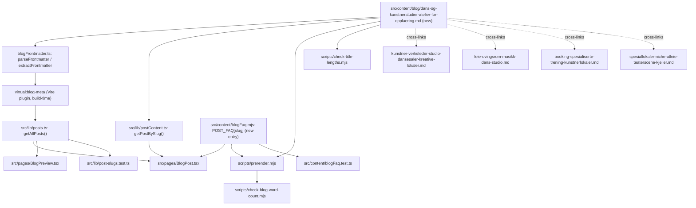

# XAL-1085 — Content gap: Dans- og Kunstnerstudier

## WHAT THIS IS

A content-only ticket in a marketing/SEO blog repo (Digilist has no booking
domain code here — confirmed repeatedly in prior tickets, see
`project_repo_has_no_booking_domain.md`). The ask: publish a new Norwegian
Bokmål blog post covering the segment "Danseinstruktører, kunstnere og små
teatergrupper finner spesialiserte ateliér og studioer for opplæring og
kreativ virksomhet" so the site has content that satisfies search intent for
the keyword **"dans"**.

## HOW IT WORKS NOW (files read)

- `src/content/blog/*.md` — one file per post. Frontmatter (`slug`, `title`,
  `description`, `date`, `author`, `role`, `readingMinutes`, `tag`, `cover`,
  `keywords`) parsed by `src/lib/blogFrontmatter.ts::parseFrontmatter` /
  `extractFrontmatter`.
- `src/lib/posts.ts` — metadata-only list, built at Vite build time from the
  `virtual:blog-meta` plugin (keeps the ~560KB of article bodies out of the
  eagerly-loaded homepage/search bundle).
- `src/lib/postContent.ts` — loads full article bodies via
  `import.meta.glob("/src/content/blog/*.md", { query: "?raw", eager: true })`,
  keyed by slug. **Any new `.md` file dropped in `src/content/blog/` is
  auto-registered — no registry/index file to edit.**
- `src/content/blogFaq.mjs` (`POST_FAQ`, keyed by slug) — the *only* thing
  that renders per-post FAQPage JSON-LD (read by `src/pages/BlogPost.tsx` and
  `scripts/prerender.mjs`). Frontmatter `schema`/`faqQuestion`/`faqAnswer`
  fields are dead — parsed by nothing (confirmed recurring bug, hit 3x:
  XAL-758/1155/1088, see `project_dead_faq_frontmatter_recurring_bug.md`).
  `src/content/blogFaq.test.ts` pins that a post's `## Vanlige spørsmål`
  body text must verbatim-match its `POST_FAQ` entry.
- `src/lib/post-slugs.test.ts` — guards that no two posts resolve to the same
  slug (one would silently shadow the other at build).
- `scripts/check-blog-word-count.mjs` (`MIN_WORDS = 200`, checked against the
  prerendered `dist/blogg/<slug>/index.html`, wired into `pnpm build`) and
  `scripts/check-title-lengths.mjs` (informational, `LIMIT = 65` rendered
  chars; title >50 chars renders verbatim, else gets `" — Digilist"` appended).
- `scripts/guard-blog-redirects.mjs` — probes new slugs against live nginx
  301s (VPS-only, not reproducible in this worktree; not relevant to a brand
  new slug with no prior redirect history).

### Existing content already covering this space (read all four in full)

- `src/content/blog/kunstner-verksteder-studio-dansesaler-kreative-lokaler.md`
  (XAL-1143, published 2026-08-10, tag Utleier) — landlord-side: what a
  kunstner-verksted/studio/dansesal *is*, and three usage patterns (hobby,
  kurs, profesjonell) for pricing/scheduling. Mentions danseinstruktør,
  koreograf and dansekompani, but only as room *users*, not as a distinct
  teaching/rehearsal segment.
- `src/content/blog/leie-ovingsrom-musikk-dans-studio.md` (2026-07-30, tag
  Privatperson) — renter-side guide to øvingsrom/øvesal/danse-studio: what to
  look for, a price table, and a generic booking flow. Covers "dansetrening"
  as one of several use cases (alongside musikk), not a dedicated segment.
- `src/content/blog/booking-spesialiserte-trening-kunstnerlokaler.md`
  (XAL-1089, published today, tag Privatperson) — hub post spanning four
  unrelated professions (musiker, fotograf, kunstner, treningsinstruktør),
  cross-linking to the deep-dive posts above plus the two below.
- `src/content/blog/spesiallokaler-niche-utleie-teaterscene-kjeller.md`
  (2026-08-10, tag Utleier) — teater angle, but about renting an actual
  **performance stage** for a production/photo shoot, the opposite framing
  of a rehearsal/teaching space.

**Confirmed real gap, not a duplicate:** none of the four mention "teater­gruppe"
as a room-seeking persona at all (only as a use case for a stage rental), and
none frame danseinstruktør + kunstner + teatergruppe together as recurring
*teaching/rehearsal* bookers (a group leader running a weekly class or a
production rehearsing toward a fixed premiere date) as opposed to individual
hobbyists, one-off renters, or landlord-side room typology. No existing post
targets the bare keyword "dans" as its primary term either (closest is
"leie øvingsrom til musikk og dans", which splits the keyword across musikk
+ dans). This clears the ticket for a new post — same "content gap" verdict
process as XAL-1086 (see `813f448` commit message for precedent on how this
repo handles overlapping-topic content gaps: differentiate on persona/angle
and cross-link instead of duplicating).

## WHAT CHANGES

One new file: `src/content/blog/dans-og-kunstnerstudier-atelier-for-opplaering.md`.

- Persona: danseinstruktør, kunstner (kurs-/verksted-holder) and a liten
  teatergruppe, unified by the same booking shape — a group leader who needs
  the *same room, recurring,* for teaching or rehearsing others, not personal
  use. Distinct sub-angle: teatergruppe's booking pattern is a rehearsal
  block counting down to a fixed premiere date (not an open-ended weekly
  class or an indefinite professional lease — the two patterns the existing
  posts already cover).
- Frontmatter: `tag: "Privatperson"` (renter-side, matches the two existing
  Privatperson posts in this cluster), keyword "dans" placed first/prominent,
  title/description built around "dans- og kunstnerstudier".
- `## Vanlige spørsmål` section + matching `POST_FAQ["dans-og-kunstnerstudier-atelier-for-opplaering"]`
  entry added to `src/content/blogFaq.mjs` (verbatim match, per the pinned
  test pattern).
- Cross-links to the four posts above instead of re-explaining room typology,
  pricing tables, or the generic booking flow already covered there.
- No code changes. No touches to `pnpm-workspace.yaml` or anything outside
  `src/content/blog/` + `src/content/blogFaq.mjs` (prior tickets on this repo
  — XAL-1099/1115/1127/1129/1086 — flagged an accidental
  `pnpm-workspace.yaml` edit from local `pnpm approve-builds`; watching for
  that and will revert if it reappears in `git status`).

## BLAST RADIUS

Grepped every consumer of `src/content/blog/*.md`:

- `src/lib/postContent.ts`, `src/lib/posts.ts` (via `virtual:blog-meta`) —
  auto-pick up the new file, no changes needed.
- `src/pages/BlogPost.tsx`, `src/pages/BlogPreview.tsx` — render whatever
  `getPostBySlug`/`getAllPosts` return; no per-post special-casing.
- `src/content/blogFaq.mjs` / `blogFaq.test.ts` — new `POST_FAQ` key only;
  existing keys untouched.
- `src/lib/post-slugs.test.ts` — new slug must be unique (verified: no
  existing post uses `dans-og-kunstnerstudier-atelier-for-opplaering`).
- `scripts/check-blog-word-count.mjs`, `scripts/check-title-lengths.mjs`,
  `scripts/prerender.mjs`, sitemap generation — all operate over
  `fs.readdir(CONTENT_DIR)`, i.e. every `.md` file; new post is included by
  construction, no registry to update.
- `booking-spesialiserte-trening-kunstnerlokaler.md`'s hub paragraph is NOT
  edited to add a fifth cross-link — out of scope for this ticket (that post
  belongs to XAL-1089, already merged/shipped); the new post links outward
  to the hub instead, one direction only, to avoid touching a shipped file.
- Linear MCP tools are unreachable this session (confirmed again, matches
  `project_no_linear_mcp_tools_available.md` / XAL-1151) — this SPEC stays
  committed under `.agent/XAL-1085/` instead of attached to the issue.

## Diagram

## Verification plan

- `pnpm test` (vitest) — full suite green, including `post-slugs.test.ts`
  and `blogFaq.test.ts`.
- `pnpm build` — prerender succeeds, `check-blog-word-count.mjs` (wired into
  `build`) passes ≥200 words in the prerendered HTML.
- `node scripts/check-title-lengths.mjs` — new post within the 65-char budget.
- `git status` — diff limited to the SPEC, the new post, and the
  `blogFaq.mjs` addition; watch for and revert any stray
  `pnpm-workspace.yaml` change from local tooling.
