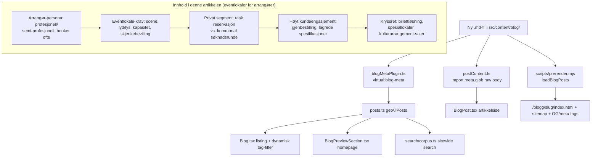

# XAL-1086: Content gap — Arrangement og Eventlokaler

## WHAT THIS IS

A new Norwegian-language SEO blog post for digilist.no targeting search
intent for the keyword **"arrangement"**. Per the ticket: **arrangører**
(event organizers/producers) rent **specialized eventlokaler** for
**underholdning og kulturelle arrangement** (entertainment and cultural
events — concerts, standup, klubbkvelder, teater, kulturarrangement) — a
**private segment** (venues privately owned/operated, not municipal
saksbehandling) with **høyt kundeengasjement** (organizers book
repeatedly/frequently, not a one-off private party).

This session found an earlier, empty placeholder commit already on this
branch (`51a3070 chore(XAL-1086): ...`, zero files changed) — a prior
session created the chore commit but never wrote the content. This SPEC and
the post itself are the actual work.

## HOW IT WORKS NOW

Blog content is filesystem-driven, no CMS, no per-post registration step.
Read to confirm the pipeline (unchanged since XAL-1090/XAL-1099, which
documented the same pipeline in `.agent/XAL-1090/SPEC.md`):

- `src/content/blog/*.md` — one Markdown file per post. Frontmatter
  (`slug`, `title`, `description`, `date`, `author`, `role`,
  `readingMinutes`, `tag`, `cover`, `keywords`) is parsed by
  `src/lib/blogFrontmatter.ts` (`parseFrontmatter` / `extractFrontmatter`).
- `build-plugins/blogMetaPlugin.ts` — Vite plugin exposing
  `virtual:blog-meta`: reads every `.md` in `src/content/blog/` at
  dev/build/test time via `fs.readdir`, extracts frontmatter, serializes to
  an array. New files are auto-discovered, nothing to register.
- `src/lib/posts.ts` (`getAllPosts`) — imports `virtual:blog-meta`, sorts by
  `date` descending. Consumers: `src/pages/Blog.tsx` (listing, and derives
  its tag-filter chips dynamically from every post's `tag` field via
  `allPosts.forEach((p) => p.tag && set.add(p.tag))` — a brand-new tag value
  needs no registration anywhere), `src/pages/BlogPreview.tsx`,
  `src/components/BlogPreviewSection.tsx` (homepage teaser),
  `src/lib/search/corpus.ts` (sitewide search index).
- `src/lib/postContent.ts` — separate `import.meta.glob` of raw `.md` body
  text, imported only by `src/pages/BlogPost.tsx` (article detail page), to
  keep the combined article text out of every other bundle.
- `scripts/prerender.mjs` (`loadBlogPosts`) — independently re-reads
  `src/content/blog/*.md` at static-build time with its own frontmatter
  regex, emits per-post `<title>`/meta description/OG/Twitter tags, adds the
  route to the sitemap. Auto-discovers via directory scan.
- `src/content/blogFaq.mjs` / `POST_FAQ` — optional per-slug FAQ entries for
  `FAQPage` JSON-LD. Not required for a normal post; this one doesn't add an
  entry (no dedicated FAQ angle for this ticket — it's a broad
  search-intent piece, not an AEO citation-gap fix).
- `src/lib/post-slugs.test.ts` — standing test asserting every post's slug
  is unique across `getAllPosts()`; guards against a new file's slug
  colliding with an existing one.
- `src/entry-server.main-landmark.test.tsx` — reads `getAllPosts()[0]`
  (whichever post is newest by date) dynamically, not hardcoded to a slug;
  unaffected regardless of where the new post sorts among same-date posts.

### Content survey (what already exists, to avoid duplication)

Ran `grep -ril "arrangement"`, `grep -ril "eventlokal"`, `grep -ril
"arrangør"`, `grep -ril "kunde­engasjement\|arrangementsbyrå"` across
`src/content/blog/*.md` and read every post that surfaced as a plausible
overlap:

- `src/content/blog/sal-for-kulturarrangementer-og-seminarer.md` — closest
  by topic (konsert/utstilling/seminar), but angle is **kommunale saler**
  (`tag: "Innbygger"`), a citizen/one-off booker comparing municipal hall
  prices and capacity via søknad. No professional-organizer persona, no
  private-market framing, no repeat-booking angle.
- `src/content/blog/spesiallokaler-niche-utleie-teaterscene-kjeller.md` —
  closest by *venue character* (teaterscene, kjeller, industrilokale), but
  written from the **venue owner's** side (`tag: "Utleier"`): how an owner
  publishes an oddly-shaped space so Digilist can match low-volume niche
  demand. Not the organizer's side, not framed around underholdning/kultur
  specifically, no repeat-customer angle.
- `src/content/blog/kunstner-verksteder-studio-dansesaler-kreative-lokaler.md`
  — creative workspaces (atelier, dansesal), also venue-owner side, aimed at
  hobby/kurs/profesjonell *makers*, not event organizers staging a
  performance for an audience.
- `src/content/blog/billettlosning-pamelding-offentlig-arrangement.md` —
  ticketing/påmelding as a **platform feature** (`tag: "Plattform"`); covers
  billettsalg + oppgjør, not venue selection or the organizer persona.
- `src/content/blog/leie-alt-til-arrangement-digilist-markedsplass.md` and
  `leie-alt-til-arrangementet-lokale-utstyr-tjenester-overnatting.md` — both
  `tag: "Privatperson"`, marketplace overview for **private individuals**
  planning bursdag/bryllup/konfirmasjon (one-off), not professional
  arrangører booking repeatedly for public entertainment/culture.
- `src/content/blog/arrangementer-mat-drikke-forsikring-logistikk.md` —
  covers mat/drikke/forsikring/logistikk for a large event, `tag:
  "Innbygger"`, generic event (bygdefest, firmafest, bryllup), not the
  eventlokale-selection or organizer-engagement angle.
- `src/content/blog/foreninger-lag-mote-arrangement-booking.md` — lag/
  foreningers *administrative* møterom bookinger (styremøte, årsmøte), not
  entertainment/culture venues.
- `src/content/blog/leie-lokale-privat-fest-og-bedriftsevent.md` —
  bursdag/julebord/firmafest venue guide, `tag: "Privatperson"`, one-off
  private/corporate party, not underholdning/kultur or a repeat-booking
  professional organizer.

No existing post combines: (a) the **arrangør** persona specifically (a
professional/semi-professional organizer, distinct from a citizen, a
private individual, or a venue owner), (b) **eventlokaler purpose-built for
underholdning/kultur** (scene, lyd/lys-rigg, skjenkebevilling, kapasitet
stående/sittende — not a generic selskapslokale or municipal sal), (c) the
**private-market** framing (privately operated venues with fast, flexible
booking vs. a municipal søknadsprosess), or (d) the **høyt
kundeengasjement** angle (organizers who book often, so what they actually
value is speed of rebooking, saved venue specs, and multi-date/gjentagende
booking, not a one-time lookup). This is a real, narrow gap — ticket is
actionable as scoped.

## WHAT CHANGES

- Add one new file:
  `src/content/blog/eventlokaler-arrangement-underholdning-kulturarrangement-arrangorer.md`
  (slug matches filename).
- Frontmatter: title/description built around the keyword **"arrangement"**
  and "eventlokaler"; `date: 2026-08-11`; author "Ibrahim Rahmani"; role
  "Grunnlegger, Digilist"; `readingMinutes: 7`; `tag: "Arrangør"` (new tag
  value — matches the ticket's named persona; no existing tag fits: not
  "Utleier" (venue owner), not "Privatperson" (one-off individual), not
  "Innbygger" (citizen/kommune context). `Blog.tsx` derives its tag-filter
  chip list dynamically from posts, so a new tag needs no code change —
  verified by reading its `useMemo` in `HOW IT WORKS NOW`); `cover:
  "/images/blog/booking_calendar_hero_no.webp"` (existing asset, already
  reused by `spesiallokaler-niche-utleie-teaterscene-kjeller.md` and
  `kunstner-verksteder-studio-dansesaler-kreative-lokaler.md` — no new
  image, no image gap for this niche); `keywords` array including
  `"arrangement"`, `"eventlokaler"`, `"arrangør"`, `"leie eventlokale"`,
  `"kulturarrangement lokale"`, `"underholdning lokale leie"`,
  `"konsertlokale leie"`.
- Body (Norwegian Bokmål): what makes an arrangør's need different from a
  citizen's or a private party-planner's; what a purpose-built eventlokale
  for underholdning/kultur actually requires (scene, lyd/lys, kapasitet
  stående vs. sittende, skjenkebevilling, garderobe/backstage, lasterampe);
  why this is a private-market segment (privately run venues, fast
  reservasjon vs. kommunal søknadsrunde); why arrangører are a
  high-engagement segment (de booker ofte — flere arrangement i året — så
  det de trenger er rask gjenbestilling, lagrede lokale-spesifikasjoner, og
  oversikt på tvers av flere lokaler, ikke et engangsoppslag); a practical
  checklist for choosing an eventlokale; cross-links to the closest
  siblings (billettløsning for selve billettsalget, spesiallokaler for
  nisje-karakter-lokaler, kulturarrangement-saler for kommunal
  sammenligning) rather than duplicating their depth; a Digilist
  product/CTA close.
- No mermaid diagram in the post body — confirmed (again, same as
  XAL-1090/XAL-1099) that `BlogPost.tsx` renders body markdown via
  `ReactMarkdown` with only `remarkGfm`, no mermaid plugin anywhere in the
  repo, so a fenced ```mermaid``` block would render as an inert code
  listing. The relationship is captured as the diagram below instead, as
  SPEC documentation, not post content.
- No code changes — content-only addition. No new test file needed beyond
  the standing `post-slugs.test.ts` (uniqueness, already covers every
  post).

## BLAST RADIUS

Grepped every consumer of blog content; none need edits because discovery
is directory-scan based, not a registry:

- `build-plugins/blogMetaPlugin.ts` — auto-discovers via `fs.readdir`.
- `scripts/prerender.mjs` `loadBlogPosts()` — auto-discovers via
  `fsp.readdir`, adds the route to the sitemap, prerenders
  `/blogg/<slug>/index.html` with SEO tags.
- `src/lib/postContent.ts` — auto-discovers via `import.meta.glob`.
- `src/lib/posts.ts` (`getAllPosts`) → `src/pages/Blog.tsx` (listing **and**
  tag-filter chips, both dynamic), `src/pages/BlogPreview.tsx`,
  `src/components/BlogPreviewSection.tsx`, `src/lib/search/corpus.ts` — all
  read from `getAllPosts()`, include the new post and its new `"Arrangør"`
  tag automatically.
- `src/lib/post-slugs.test.ts` — runs against the new file; passes because
  the slug is unique (checked: no existing file uses this slug or
  filename).
- `src/entry-server.main-landmark.test.tsx` — reads `getAllPosts()[0]`
  dynamically; unaffected regardless of where the new post sorts among
  same-date posts.
- `src/content/blogFaq.mjs` — not touched; no FAQ entry added, none
  required.
- Existing posts (`billettlosning-pamelding-offentlig-arrangement.md`,
  `spesiallokaler-niche-utleie-teaterscene-kjeller.md`,
  `sal-for-kulturarrangementer-og-seminarer.md`) are linked *from* the new
  post one-directionally; none of them require edits to link back.
- No `.tsx` page, no route table, no nav entry, no other markdown file
  requires edits to wire this post in.



No CLARIFICATION needed — the ticket's specific combination (arrangør
persona + purpose-built eventlokaler for underholdning/kultur + private
market + high-engagement/repeat-booking framing, targeting the keyword
"arrangement") is not covered by any existing post. Ticket is actionable as
scoped.
