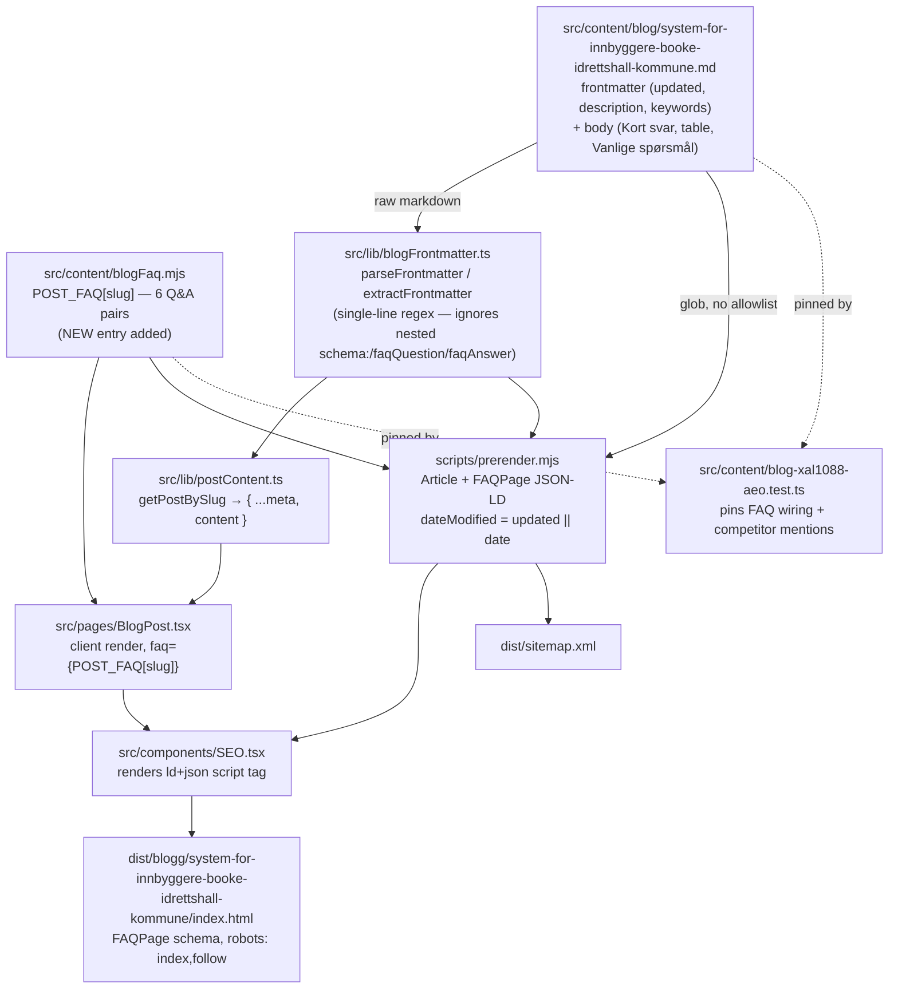

# XAL-1088 — AEO-gap: Digilist usynlig i AI-svar for «system for innbyggere til å booke idrettshall i kommunen»

## WHAT THIS IS

AEO (Answer Engine Optimization) monitoring reported that AI answer engines
(ChatGPT/Perplexity-style crawlers, n=6 probes) cite BookUp, Aktiv Kommune,
FRI Booking-system and bookup.no when asked "system for innbyggere til å
booke idrettshall i kommunen" — but never Digilist (synlighet 17 %, sitering
17 %). The ask: publish an authoritative Norwegian page that answers the
query directly, with a short answer block, a clear entity definition,
sourced facts, author/update date, and technical citability (indexable,
server-rendered, semantic HTML).

**A page for this exact query already existed** —
`src/content/blog/system-for-innbyggere-booke-idrettshall-kommune.md`,
published 2026-08-07 (4 days before this ticket), with a direct-answer intro,
an entity-definition section ("Hva er Digilist, og for hvem?"), a comparison
table, a "Vanlige spørsmål" FAQ section, and a "Kilder, forfatter og
oppdatering" section. So the real gap was narrower than "write a new page":
two concrete defects kept it from actually being AI-citable, both found by
reading the code rather than guessing:

1. **The page's FAQPage structured data never rendered.** Its frontmatter
   carried `schema: "FAQPage"` / `faqQuestion` / `faqAnswer`, which *look*
   like they configure the JSON-LD answer engines parse — but nothing in the
   build reads those keys. This is the exact same bug class already found
   and fixed twice before in this repo (XAL-758, XAL-1155): FAQPage JSON-LD
   is driven exclusively by `POST_FAQ` in `src/content/blogFaq.mjs`, keyed
   by slug. This slug had no entry there, so the page shipped with zero
   FAQPage schema despite its frontmatter claiming otherwise.
2. **The competitor set was incomplete.** The comparison table covered
   bookup.no, Aktiv kommune and Finn.no, but not "BookUp" as a named brand
   (only its domain) and not FRI Booking-system at all — the exact
   competitor the AEO scan flagged as cited instead of Digilist.

## HOW IT WORKS NOW

Read end-to-end to trace how a blog post becomes an AI-citable page:

- `src/content/blog/*.md` — hand-authored posts, YAML-ish frontmatter parsed
  by a **hand-rolled single-line-per-key regex**
  (`src/lib/blogFrontmatter.ts:parseFrontmatter`, `^([A-Za-z0-9_-]+):\s*(.*)$`
  per line). It does not understand nested YAML — a block like
  `schema:\n  type: "FAQPage"` (present in the sibling post
  `system-booke-idrettshall-kommune.md`) parses as three unrelated top-level
  keys (`type`, `question`, `answer`), not a nested object. This confirms
  the dead-frontmatter pattern is a repo-wide trap, not a one-off typo.
- `extractFrontmatter` (`src/lib/blogFrontmatter.ts`) whitelists exactly the
  fields on `BlogFrontmatter` (slug, title, description, date, `updated?`,
  author, role, readingMinutes, tag, cover, keywords). Anything else in the
  frontmatter — including `schema`, `faqQuestion`, `faqAnswer` — is parsed
  into `data` but never copied into the returned object, so it's inert.
  `updated` feeds `dateModified` in the Article JSON-LD; `date` alone feeds
  `datePublished`.
- `src/content/blogFaq.mjs` — the actual source of truth for FAQPage schema,
  a hand-maintained `POST_FAQ` map keyed by slug, opt-in. Its own file
  comment states the intent: "only posts that actually carry a matching
  'Vanlige spørsmål' section ... should have an entry here, since the Q/A
  text must mirror what the reader sees."
- `scripts/prerender.mjs:2504-2539` — for every post, builds an `Article`
  JSON-LD block (`datePublished: post.date`, `dateModified: post.updated ||
  post.date`) and, only if `POST_FAQ[post.slug]` exists, a second `FAQPage`
  JSON-LD block from it. Both get inlined into a single
  `<script type="application/ld+json" data-prerendered="true">` array in the
  static HTML — this script itself parses frontmatter with yet another
  independent single-line regex (`scripts/prerender.mjs:190-210`), so it too
  would silently ignore nested YAML.
- `src/pages/BlogPost.tsx:20,161` — the client-side render path (React) also
  imports `POST_FAQ` and passes `POST_FAQ[post.slug]` as the `faq` prop to
  `SEO.tsx`, keeping SSR and client-hydrated schema in sync.
- `src/lib/postContent.ts` — `getPostBySlug` strips frontmatter and returns
  `{ ...meta, content }`, where `content` is the raw markdown body (used by
  `BlogPost.tsx` to render, and by tests to assert the FAQ answer text is
  actually visible on the page, not just declared in the FAQ map).
- Discovery has no allowlist: both `scripts/prerender.mjs` and the Vite
  `virtual:blog-meta` plugin glob `src/content/blog/*.md` directly, so a
  post's presence in the directory is sufficient for it to be prerendered,
  sitemapped, and indexed — no registration step was needed for this fix.
- `scripts/check-blog-word-count.mjs` — build-time guard requiring every
  post ≥200 words both in the markdown source and in the prerendered
  `<article>` HTML.
- Precedent: `src/content/blog-xal739-aeo.test.ts` (XAL-739),
  `src/content/blogFaq.test.ts` (XAL-758), and
  `src/content/blog-xal1155-lokalesok-faq.test.ts` (XAL-1155) are the
  established pattern for pinning an AEO answer page: assert `POST_FAQ[slug]`
  exists and its question matches the target query verbatim, and assert the
  markdown body actually contains that question/answer text (so the FAQ map
  can't silently drift from what the reader sees).

## WHAT CHANGES

1. `src/content/blogFaq.mjs` — added
   `POST_FAQ["system-for-innbyggere-booke-idrettshall-kommune"]`, an array of
   6 Q&As: the primary target query ("Hvilket system kan innbyggere bruke
   til å booke idrettshall i kommunen?", reusing the exact text that was
   already sitting dead in the frontmatter's `faqAnswer`) followed by the
   5 existing "Vanlige spørsmål" pairs already in the post body, copied
   verbatim so `post.content` contains every question and answer string.
2. `src/content/blog/system-for-innbyggere-booke-idrettshall-kommune.md`:
   - Added `updated: 2026-08-11` to frontmatter (drives `dateModified` in the
     Article JSON-LD — previously the page had no distinct modified date).
   - Left the dead `schema`/`faqQuestion`/`faqAnswer` frontmatter fields in
     place — this matches the established convention from the prior XAL-758
     fix (`beste-nettside-leie-lokale-hytte-utstyr-norge.md` also kept them
     after wiring `POST_FAQ`), so I didn't deviate from precedent here.
   - Rewrote the opening into a "Kort svar: " paragraph whose text is
     byte-for-byte the POST_FAQ[0] answer (so the pinning test's
     `content.toContain(answer)` holds), followed by a second paragraph
     naming BookUp (bookup.no), Aktiv Kommune and FRI Booking-system as the
     alternatives AI engines compare Digilist against.
   - Comparison table: added a "FRI Booking-system" column (verified as a
     real system via web search — used by Sør-Odal and Nord-Odal kommune's
     own booking sites; unverifiable rows marked "Ikke offentlig
     dokumentert", matching the honesty convention already used in
     `hvordan-digitalisere-booking-av-kommunale-lokaler.md`) and renamed the
     "bookup.no" column header to "BookUp (bookup.no)" so both name variants
     AI engines cite are textually present.
   - Updated the "Kilder, forfatter og oppdatering" section with the new
     update date and a source note for the FRI Booking-system claim
     (booking.sor-odal.kommune.no, idrettshallen.nord-odal.kommune.no).
   - Updated frontmatter `description` and `keywords` to include FRI
     Booking-system.
3. New `src/content/blog-xal1088-aeo.test.ts` — pins: (a) `POST_FAQ[slug][0]`
   answers the exact target query, (b) every POST_FAQ question/answer is
   mirrored in the markdown body, (c) BookUp, bookup.no, Aktiv Kommune and
   FRI Booking-system are all textually present in the body, (d) `updated:
   2026-08-11` is present in frontmatter.

Verified end-to-end with a real `pnpm build`: the prerendered
`dist/blogg/system-for-innbyggere-booke-idrettshall-kommune/index.html` now
contains a `FAQPage` JSON-LD block with all 6 Q&As, `Article` JSON-LD with
`dateModified: 2026-08-11`, `<meta name="robots" content="index, follow">`,
and the page is in `dist/sitemap.xml`. Full `pnpm test` (21 files / 45
tests) is green; `pnpm build`'s word-count guard passes for all 328 posts.

## BLAST RADIUS

Grepped every consumer of the two files touched, plus the slug itself:

- `src/content/blogFaq.mjs` is imported by exactly two files:
  `src/pages/BlogPost.tsx` (client render) and `scripts/prerender.mjs`
  (static build) — both already covered above. Adding a new key to the
  `POST_FAQ` object map cannot affect any other post's entry; JS object
  literals don't have any adjacency-sensitive behavior here, and every
  other existing key is untouched (confirmed via full-suite test run, all
  previously-passing tests still pass).
- `grep -rn "system-for-innbyggere-booke-idrettshall-kommune"` across the
  repo (excluding node_modules/dist): only the post's own frontmatter
  `slug:` field, the new `POST_FAQ` key, and the new test file reference it.
  No redirect map, no hardcoded internal link, no `SOLUTION_PAGES` matcher
  in `BlogPost.tsx` singles it out — it's matched generically by keyword
  regex (`idrettshall|gymsal|...`) same as every other idrettshall post.
- `scripts/guard-blog-redirects.mjs` (pre-push slug-availability guard) and
  `scripts/check-blog-word-count.mjs` (word-count guard) both operate by
  globbing `src/content/blog/*.md` — no allowlist to update, and the build
  run above already confirmed both pass for this post.
- The sibling post `src/content/blog/system-booke-idrettshall-kommune.md`
  (published 2026-07-30, also targets a near-identical query, also has the
  same dead nested-YAML `schema:` block) was **not** touched — it's a
  separate pre-existing page outside this ticket's specific gap, changing it
  wasn't needed to close the AEO gap, and rewriting a second live page would
  have doubled the review surface for no required benefit. Flagged as a
  follow-up (see ENHANCEMENT in the session's final report) rather than
  bundled in.
- `src/components/SEO.tsx` reads `dateModified` and the `faq` prop generically
  for any post — no per-slug logic there to worry about.
- Linear attachment step (SPEC.md → XAL-1088) could not be completed: no
  Linear MCP tools were available in this session (consistent with the prior
  confirmed finding for XAL-1151 — `prepare_attachment_upload` /
  `create_attachment_from_upload` are unreachable, not just misconfigured).

## CLARIFICATION note

This is **not** "write a new page" — it's "fix why the existing page,
published four days before this ticket, wasn't actually emitting the
structured data AI engines read, and close the one real content gap (FRI
Booking-system) the AEO scan surfaced." Confirmed by reading
`blogFrontmatter.ts`, `blogFaq.mjs`, and `prerender.mjs` directly, and by
building the site and inspecting the generated HTML — not by assumption.
