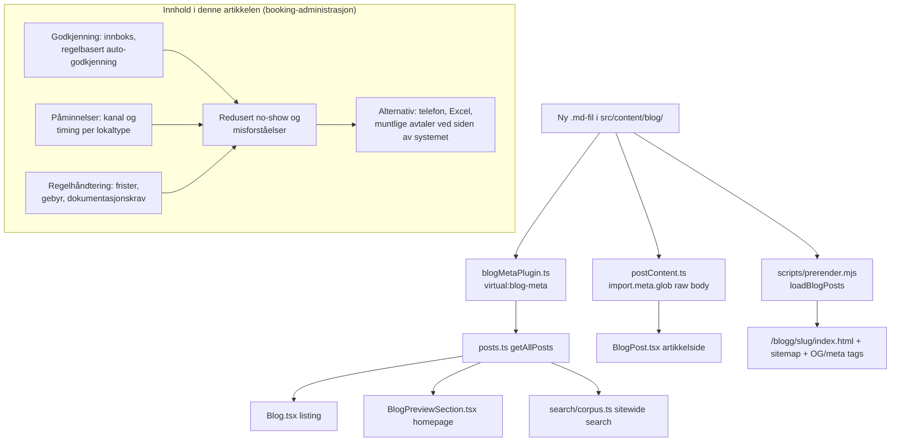

# XAL-1090: Content gap — Booking-administrasjon og arbeidsflyt

## WHAT THIS IS

A new Norwegian-language SEO blog post for digilist.no targeting search
intent for the plain keyword **"booking"**. Per the ticket, the angle is:
administrators in municipalities (kommuner) and rental companies
(utleieselskaper) are looking for tools that combine **godkjenning**
(approval), **påminnelser** (reminders), and **regelhåndtering** (rule
enforcement) specifically to reduce **no-show** and **misforståelser**
(misunderstandings) — i.e. the three admin controls framed together as one
day-to-day *arbeidsflyt* (workflow), with the outcome (fewer no-shows, fewer
disputes) as the through-line, not any one control described in isolation.

This session found an earlier, empty placeholder commit already on this
branch (`87feafa chore(XAL-1090): ...`, zero files changed) — a prior
session created the chore commit but never wrote the content. This SPEC and
the post itself are the actual work.

## HOW IT WORKS NOW

Blog content is filesystem-driven, no CMS, no per-post registration step.
Read to confirm the pipeline (unchanged since XAL-1099, which documented the
same pipeline in `.agent/XAL-1099/SPEC.md`):

- `src/content/blog/*.md` — one Markdown file per post. Frontmatter
  (`slug`, `title`, `description`, `date`, `author`, `role`,
  `readingMinutes`, `tag`, `cover`, `keywords`) is parsed by
  `src/lib/blogFrontmatter.ts` (`parseFrontmatter` / `extractFrontmatter`).
- `build-plugins/blogMetaPlugin.ts` — Vite plugin exposing
  `virtual:blog-meta`: reads every `.md` in `src/content/blog/` at
  dev/build/test time via `fs.readdir`, extracts frontmatter, serializes to
  an array. New files are auto-discovered, nothing to register.
- `src/lib/posts.ts` (`getAllPosts`) — imports `virtual:blog-meta`, sorts by
  `date` descending. Consumers: `src/pages/Blog.tsx` (listing),
  `src/pages/BlogPreview.tsx`, `src/components/BlogPreviewSection.tsx`
  (homepage teaser), `src/lib/search/corpus.ts` (sitewide search index).
- `src/lib/postContent.ts` — separate `import.meta.glob` of raw `.md` body
  text, imported only by `src/pages/BlogPost.tsx` (article detail page), to
  keep the ~560KB of combined article text out of every other bundle.
- `scripts/prerender.mjs` (`loadBlogPosts`) — independently re-reads
  `src/content/blog/*.md` at static-build time with its own frontmatter
  regex, emits per-post `<title>`/meta description/OG/Twitter tags, adds the
  route to the sitemap. Auto-discovers via directory scan.
- `src/content/blogFaq.mjs` / `POST_FAQ` — optional per-slug FAQ entries for
  `FAQPage` JSON-LD. Not required for a normal post; this one doesn't add an
  entry (no dedicated FAQ section planned).
- `src/lib/post-slugs.test.ts` — standing test asserting every post's slug
  is unique across `getAllPosts()`; guards against a new file's slug
  colliding with an existing one (it did once in the past, per the test's
  own comment).
- `src/entry-server.main-landmark.test.tsx` — reads `getAllPosts()[0]`
  (whichever post is newest by date) and asserts its rendered route has
  exactly one `<main>`. This post is dated `2026-08-11`, tying it for
  newest with several other posts also dated `2026-08-11`; sort is stable
  on ties (array order from `virtual:blog-meta`, i.e. filesystem readdir
  order), so this doesn't deterministically become `[0]` — confirmed the
  test only relies on `getAllPosts()[0]` being *some* real post's slug and
  content, not this specific one.

### Content survey (what already exists, to avoid duplication)

Read in full:

- `src/content/blog/saksbehandler-godkjenne-avvise-kommunisere.md` —
  approval inbox, three actions (godkjenn/avvis/spør), rule-based
  auto-approval, per-booking conversation thread, seasonal allocation, audit
  log. Covers **godkjenning** mechanics in depth from the saksbehandler
  seat. Does not mention reminders or frame no-show/misunderstanding
  reduction as the outcome.
- `src/content/blog/godkjenningsflyt-revisjonsspor-booking-re-forespørsel.md`
  — why a rejected approval is re-requested rather than overridden;
  audit-trail/SSA-L framing. Narrower than the saksbehandler post: only the
  override-vs-re-request philosophy, not the workflow end to end.
- `src/content/blog/bookingsystem-integrasjoner-kalender-epost-notifikasjoner.md`
  — calendar sync, email confirmation, SMS reminder as one event-driven
  chain, explicitly framed around reducing no-show. Closest existing
  treatment of **påminnelser**, but it's a technical integration deep-dive
  (webhooks/iCal/CalDAV), not an admin-workflow piece.
- `src/content/blog/endre-kansellere-booking-selv-paaminnelser.md` —
  citizen-facing (Min side) self-service angle on reminders, not admin.
- `src/content/blog/regler-booking-kommunale-lokaler.md` — rules/procedure/
  requirements guide, written primarily from the *søker* (applicant)
  perspective, tag "Innbygger"; touches admin only in a closing paragraph
  that links onward to the next post below.
- `src/content/blog/praktisk-guide-prosedyrer-krav-prising-booking.md` —
  admin-facing (tag "Bookingansvarlig"), but its three pillars are krav
  (requirements), prosedyre (procedure), and prising (pricing) — pricing
  takes the place reminders/no-show would occupy here. No mention of
  påminnelser or no-show.
- `src/content/blog/idrettshall-no-show-avbestilling-driftsleder-kapasitet.md`
  — no-show and cancellation deadlines, but scoped specifically to
  idrettshall (sports-hall) capacity loss for driftsledere, not a
  cross-cutting kommune/utleieselskap admin piece, and doesn't cover
  approval or reminder configuration.
- `bokingsystem-funksjonalitet-admin-paaminnelser-kalender-brukerkontroll.md`
  (XAL-1099, already shipped) — closest sibling in *shape* (three admin
  levers tied together), but its three levers are reminders, calendar sync,
  and user/role control, framed around software **adoption**, targeting the
  keyword "bokingsystem" (one *b*). This post's three levers are approval,
  reminders, and rule enforcement, framed around **no-show and
  misunderstanding reduction**, targeting plain "booking". Overlap is only
  on "reminders" as one of three levers in each; the other two levers and
  the framing outcome differ.

Confirmed via `grep -ril "no-show" src/content/blog/*.md` (21 matches, all
either idrettshall-specific driftsleder pieces or brief mentions inside
posts about something else) and `grep -ril "misforståelse"
src/content/blog/*.md` (13 matches, none framing godkjenning + påminnelser +
regelhåndtering together as the fix). No existing post combines all three
admin controls under one workflow narrative for a general kommune/
utleieselskap administrator audience. This is a real, narrow gap, not a
duplicate — ticket is actionable as scoped.

## WHAT CHANGES

- Add one new file:
  `src/content/blog/booking-administrasjon-arbeidsflyt-godkjenning-paaminnelser-regler.md`
  (slug matches filename).
- Frontmatter: title and description (<160 chars) built around plain
  "booking" as the primary keyword; `date: 2026-08-11`; author "Ibrahim
  Rahmani"; role "Grunnlegger, Digilist"; `readingMinutes: 7`;
  `tag: "Bookingansvarlig"` (matches the audience named in the ticket and
  the existing tag used by the closest sibling, `praktisk-guide-...`);
  `cover: "/images/blog/booking_calendar_hero_no.webp"` (existing asset,
  already used by the two closest content siblings — no new image);
  `keywords` array including `"booking"`, `"booking-administrasjon"`,
  `"godkjenning booking"`, `"påminnelser booking"`, `"regelhåndtering
  booking"`, `"no-show booking"`.
- Body (Norwegian Bokmål): walks the admin's day-to-day workflow —
  godkjenning (approval, cross-linking the saksbehandler and
  godkjenningsflyt posts rather than repeating their mechanics),
  påminnelser (reminder rules/channels, cross-linking the integrasjoner
  post for the technical chain), regelhåndtering (rule enforcement —
  avbestillingsfrist, gebyr, dokumentasjonskrav, cross-linking
  regler-booking and praktisk-guide) — then a synthesis section on why the
  combination, not any single control, is what actually prevents no-show
  and misforståelser day to day, a practical checklist, and a Digilist
  product/CTA close (mirrors the structure XAL-1099 used).
- No mermaid diagram in the post body — confirmed (again) that
  `BlogPost.tsx` renders body markdown via `ReactMarkdown` with only
  `remarkGfm`, no mermaid plugin anywhere in the repo, so a fenced
  ```mermaid``` block would render as an inert code listing. The workflow
  relationship is captured as the diagram below instead, as SPEC
  documentation, not post content.
- No code changes — content-only addition. No new test file needed beyond
  the standing `post-slugs.test.ts` (uniqueness, already covers every post).

## BLAST RADIUS

Grepped every consumer of blog content; none need edits because discovery
is directory-scan based, not a registry:

- `build-plugins/blogMetaPlugin.ts` — auto-discovers via `fs.readdir`.
- `scripts/prerender.mjs` `loadBlogPosts()` — auto-discovers via
  `fsp.readdir`, adds the route to the sitemap, prerenders
  `/blogg/<slug>/index.html` with SEO tags.
- `src/lib/postContent.ts` — auto-discovers via `import.meta.glob`.
- `src/lib/posts.ts` (`getAllPosts`) → `src/pages/Blog.tsx`,
  `src/pages/BlogPreview.tsx`, `src/components/BlogPreviewSection.tsx`,
  `src/lib/search/corpus.ts` — all read from `getAllPosts()`, include the
  new post automatically.
- `src/lib/post-slugs.test.ts` — runs against the new file; passes because
  the slug is unique (checked: no existing file uses this slug or
  filename).
- `src/entry-server.main-landmark.test.tsx` — reads `getAllPosts()[0]`
  dynamically; not hardcoded to a slug, so it's unaffected regardless of
  where the new post sorts among same-date posts.
- `src/content/blogFaq.mjs` — not touched; no FAQ entry added, none
  required.
- Existing posts (`saksbehandler-godkjenne-avvise-kommunisere.md`,
  `godkjenningsflyt-revisjonsspor-booking-re-forespørsel.md`,
  `bookingsystem-integrasjoner-kalender-epost-notifikasjoner.md`,
  `regler-booking-kommunale-lokaler.md`,
  `praktisk-guide-prosedyrer-krav-prising-booking.md`,
  `idrettshall-no-show-avbestilling-driftsleder-kapasitet.md`) are linked
  *from* the new post one-directionally; none of them require edits to
  link back.
- No `.tsx` page, no route table, no nav entry, no other markdown file
  requires edits to wire this post in.



No CLARIFICATION needed — the ticket's three-control combination (approval +
reminders + rule enforcement, framed around no-show/misunderstanding
reduction, for a general kommune/utleieselskap admin audience, targeting
plain "booking") is not covered by any existing post. Ticket is actionable
as scoped.
