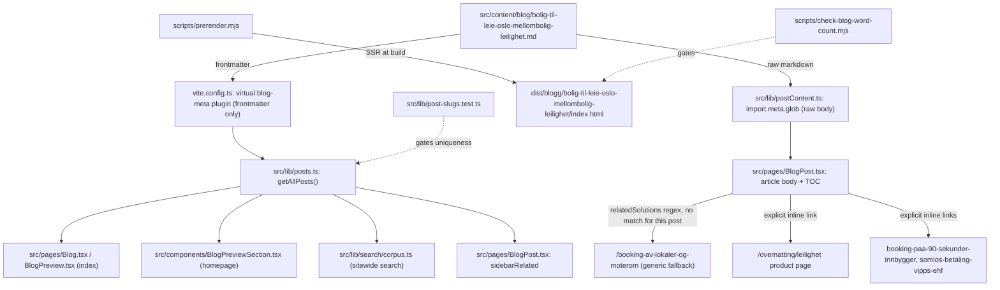

# XAL-1091: Content gap — bolig

## WHAT THIS IS

A new Norwegian-Bokmål blog post that addresses the "bolig" keyword cluster
(auto-generated from `cluster:Bolig til leie i Oslo`, described in the ticket
as "Heuristic cluster around 'bolig' (2 terms)") in the only way that is
actually true to what Digilist sells.

Digilist is a booking platform for **municipal/private facilities** (rooms,
halls, sports facilities, equipment, vehicles) and, via its `/overnatting`
vertical, **short-term furnished stays** (hytte, leilighet, rom, feriehus).
It is *not* a long-term residential real-estate marketplace — it does not
list homes for sale or long-term rental contracts (that is FINN.no's
domain). A literal "bolig til leie i Oslo" ("housing for rent in Oslo")
search intent — someone looking for a permanent home to rent — has no
product on this site to serve it.

The one place "bolig" genuinely intersects with a real Digilist product is
**mellombolig**: short-term furnished-apartment stays for people between two
permanent homes (moving, renovation, waiting period), which
`/overnatting/leilighet` already targets in its own on-page copy
("mellombolig" appears 4 times in `OvernattingLeilighet.tsx`) but which no
blog post covers as its own topic. That gap is real and fillable without
overstating what Digilist does: the post's job is to capture "bolig" /
"mellombolig" search intent for the *short-term, furnished-apartment* reading
of the term, focused on Oslo, and funnel it to the existing
`/overnatting/leilighet` product page — the same job every other blog post
in this repo does for its own product surface (e.g.
`sal-generalforsamling-borettslag-styreleder.md` funnels
borettslag/generalforsamling search intent to sal-booking, not to a
nonexistent "manage your housing cooperative" product).

I checked whether the ticket could instead mean "boligsameie/borettslag"
(housing-cooperative common-room booking, which Digilist *does* support) —
that angle is already thoroughly covered by
`sal-generalforsamling-borettslag-styreleder.md` and mentioned across
`foreninger-lag-mote-arrangement-booking.md`,
`finn-og-book-ledige-moterom-i-din-kommune.md`,
`leie-ut-pa-digilist-guide-for-utleiere.md`, and others (see HOW IT WORKS
NOW below), so a further borettslag post would duplicate existing content
rather than close a gap. The mellombolig/short-term-housing angle is the one
genuinely uncovered thread that ties back to a real product.

The post is discovered automatically by the existing content pipeline (no
code changes) once it lands in `src/content/blog/`.

## HOW IT WORKS NOW

Blog posts are plain Markdown files with YAML frontmatter in
`src/content/blog/*.md`. The publishing pipeline is entirely file-glob-driven,
no manual registration — confirmed by reading:

- `src/lib/blogFrontmatter.ts` — `BlogFrontmatter` interface (slug, title,
  description, date, author, role?, readingMinutes?, tag?, cover?, keywords?)
  and `parseFrontmatter`/`extractFrontmatter`.
- `vite.config.ts` exposes `virtual:blog-meta` (built at Node build time),
  extracting only frontmatter from every `.md` file.
- `src/lib/posts.ts` — `getAllPosts()` reads `virtual:blog-meta`, sorts by
  `date` descending. Consumed by `src/components/BlogPreviewSection.tsx`
  (homepage), `src/pages/Blog.tsx` / `src/pages/BlogPreview.tsx` (index), and
  `src/lib/search/corpus.ts` (sitewide search).
- `src/lib/postContent.ts` — `import.meta.glob("/src/content/blog/*.md",
  {query: "?raw", eager: true})`, matched to metadata by `slug`, imported only
  by `src/pages/BlogPost.tsx`.
- `src/pages/BlogPost.tsx` — renders the post; `relatedSolutions()`
  (line 39) maps a post's slug/title/tag/keywords against a fixed
  `SOLUTION_PAGES` regex list (kommune, idrettshall, møterom, selskapslokale,
  kulturhus) to pick 1-2 "related solution" links, falling back to
  `/booking-av-lokaler-og-moterom` if nothing matches. None of the existing
  patterns match accommodation/overnatting terms, so this post will fall
  back to the generic link — pre-existing behavior, unrelated to this
  ticket's scope, and not something a content-only PR should change.
- `scripts/prerender.mjs` — SSR-prerenders every post to
  `dist/blogg/<slug>/index.html` at build time.
- `scripts/check-blog-word-count.mjs` — fails the build if the rendered
  `<article>` (or the raw Markdown body, as a cheap floor) is under 200 words.
- `scripts/check-title-lengths.mjs` — informational: rendered title
  (title as-is if >50 chars, else `"<title> — Digilist"`) should stay <=65
  chars.
- `src/lib/post-slugs.test.ts` — vitest guard: every post's `slug` must be
  globally unique.

I confirmed the gap and the existing coverage by reading:
- `README.md` — confirms Digilist's actual scope: "booking av kommunale
  anlegg og ressurser" (6 facility types, 6 booking models); no residential
  real-estate product exists.
- `src/pages/Overnatting.tsx` and `src/pages/OvernattingLeilighet.tsx` — the
  short-term-stay product; "mellombolig" is used as a persona/FAQ term on
  the leilighet page but has no dedicated blog post.
- `grep -rl "mellombolig\|bolig til leie" src/content/blog/*.md` — zero
  hits; no existing post covers this angle.
- `grep -rl "sameie\|borettslag" src/content/blog/*.md` — 8 hits, led by
  `sal-generalforsamling-borettslag-styreleder.md`, which already owns the
  housing-cooperative angle of "bolig".

## WHAT CHANGES

- New file: `src/content/blog/bolig-til-leie-oslo-mellombolig-leilighet.md`
  - `tag: "Privatperson"` (matches the audience — private individuals
    searching "bolig til leie", not facility owners).
  - `cover: "/images/blog/booking_calendar_hero_no.webp"` (existing, generic
    hero image already reused across the leie-leilighet family — no new
    image asset).
  - Covers: why "bolig til leie i Oslo" searches often mean a short-term,
    furnished need (flytting, oppussing, ventetid mellom to boliger — i.e.
    mellombolig), what separates a mellombolig-egnet leilighet from a
    vanlig korttidsleie (varighet, hva som er inkludert, fleksibel
    oppsigelse), how totalpris/ledige netter/Vipps-betaling works on
    Digilist, and a short FAQ. Explicitly scoped to short-term furnished
    stays — does not claim to offer permanent home rental.
  - Internally links to `/overnatting/leilighet` (the product page this
    content funnels to) and to 1-2 sibling posts
    (`booking-paa-90-sekunder-innbygger`, `somlos-betaling-vipps-ehf` — the
    same two the leilighet product page itself links to as `relatedPosts`,
    keeping this post consistent with that page's existing cross-link
    choices) — all verified to resolve.
  - No code, schema, or script changes.

## BLAST RADIUS

Grepped `getAllPosts\|virtual:blog-meta\|content/blog` across `src` — same
consumers as every prior content-only blog post in this repo:

- `src/lib/posts.ts` (`getAllPosts`) → `src/components/BlogPreviewSection.tsx`,
  `src/pages/Blog.tsx`, `src/pages/BlogPreview.tsx`, `src/lib/search/corpus.ts`,
  `src/pages/BlogPost.tsx` (both the main list and `sidebarRelated`) — all
  read the new post through the same glob/`getAllPosts()` machinery every
  existing post uses; nothing assumes a fixed post count or fixed slug set.
- `src/lib/postContent.ts` → `src/pages/BlogPost.tsx` — raw markdown body,
  same `import.meta.glob` mechanism.
- `scripts/prerender.mjs`, `scripts/check-blog-word-count.mjs`,
  `scripts/check-title-lengths.mjs` — iterate every `.md` file in
  `src/content/blog/`; the new file is picked up automatically.
- `src/lib/post-slugs.test.ts` — will assert the new slug
  (`bolig-til-leie-oslo-mellombolig-leilighet`) is unique; confirmed no
  existing post uses it.
- No other file references this slug, so there is no risk of collision or
  silent shadowing (the failure mode that test guards against).

## Mermaid: content pipeline for this post

## Testing requirements

- `pnpm vitest run` (full suite) green, including `post-slugs.test.ts`.
- `node scripts/check-blog-word-count.mjs` (or the build step that runs it)
  passes for the new post.
- `node scripts/check-title-lengths.mjs` — title is 64 chars as-is (over 50
  so rendered verbatim), within the 65-char informational limit.

## Definition of done

Post committed, slug unique, word count and title-length gates pass, full
vitest suite green, internal links resolve to real pages/posts, Linear
attachment attempted (blocked — see below).

## Linear attachment status

No Linear MCP tools are available in this environment at all (confirmed:
`ToolSearch` for `linear`/`prepare_attachment_upload`/`create_attachment_from_upload`
returns no matches, same as prior tickets XAL-1151 and others noted in
session memory). This SPEC is committed to the branch instead; a later phase
with Linear access can attach it.
