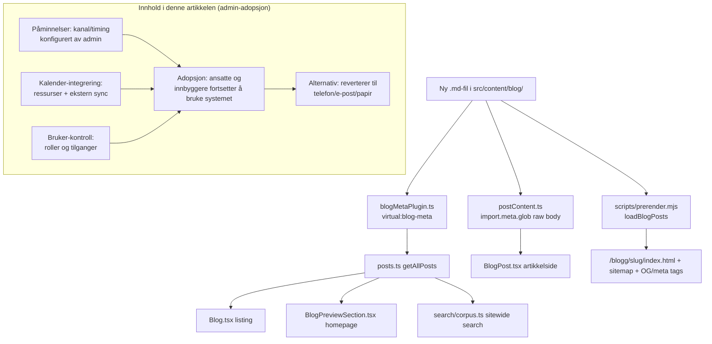

# XAL-1099: Content gap — Bokingsystem-funksjonalitet og admin

## WHAT THIS IS

A new Norwegian-language SEO blog post for digilist.no targeting search
intent for the keyword **"bokingsystem"** (the common one-*b* misspelling of
"bookingsystem" that Norwegian searchers actually type — confirmed zero
existing posts target this exact spelling, see BLAST RADIUS below).

The angle, per the ticket: **admin-side functionality — reminders, calendar
integration, and user/role control — is what actually determines whether a
booking system gets *adopted* by staff and citizens**, not just whether it
has those features on a spec sheet. This is a genuinely new angle versus the
sibling posts already in the repo (see below) — none of them frame
reminders/calendar/access as an *adoption* lever from the admin's point of
view; they cover the same primitives from different angles (no-show
reduction, GDPR compliance, citizen self-service, audit trail).

## HOW IT WORKS NOW

Blog content is filesystem-driven, no CMS and no per-post registration step.
I read the following to confirm the pipeline:

- `src/content/blog/*.md` — one Markdown file per post. Frontmatter fields
  (`slug`, `title`, `description`, `date`, `author`, `role`,
  `readingMinutes`, `tag`, `cover`, `keywords`) are parsed by
  `src/lib/blogFrontmatter.ts` (`parseFrontmatter` / `extractFrontmatter`).
- `build-plugins/blogMetaPlugin.ts` — a Vite plugin exposing
  `virtual:blog-meta`: at dev/build/test time it reads every `.md` file in
  `src/content/blog/`, extracts frontmatter via `extractFrontmatter`, and
  serializes it into one array. **Any new `.md` file is picked up
  automatically** — nothing else needs to import or register it.
- `src/lib/posts.ts` — `getAllPosts()` imports `virtual:blog-meta` and
  returns it sorted by date descending. Consumers: `src/pages/Blog.tsx`
  (listing), `src/pages/BlogPreview.tsx`, `src/components/BlogPreviewSection.tsx`
  (homepage teaser), `src/lib/search/corpus.ts` (sitewide search index).
- `src/lib/postContent.ts` — separately globs the raw `.md` body text
  (`import.meta.glob("/src/content/blog/*.md", {...})`), imported only by
  `src/pages/BlogPost.tsx` (the article detail page), so the ~560KB of
  combined article text stays out of every other bundle.
- `scripts/prerender.mjs` (`loadBlogPosts`, line ~178) — independently
  re-reads `src/content/blog/*.md` with its own minimal frontmatter regex
  parser at static-build time, to emit per-post `<title>`/`<meta
  description>`/OG/Twitter tags and add the route to the sitemap. Also
  auto-discovers new files by directory scan.
- `src/content/blogFaq.mjs` / `POST_FAQ` — optional per-slug FAQ entries
  that drive `FAQPage` JSON-LD. Only used if a post has a matching entry;
  not required for a normal post (confirmed via `src/content/blogFaq.test.ts`,
  which pins a case where a post *claimed* FAQ schema in frontmatter but had
  no `POST_FAQ` entry — the frontmatter claim alone does nothing).
- Existing convention for "description" length: `<meta description>` is
  written verbatim at prerender time and truncated by Google above ~160
  chars (`src/lib/digitalt-bookingsystem-description.test.ts`, XAL-787).
- Slug-uniqueness is enforced by `src/lib/post-slugs.test.ts` — two files
  resolving to the same slug silently collide at build (one overwrites the
  other in `getAllPosts()`), so it's covered by a standing test on every
  post, not just new ones.

### Content survey (what already exists, to avoid duplication)

Read in full or in relevant part:

- `bookingsystem-integrasjoner-kalender-epost-notifikasjoner.md` — kalender/
  e-post/SMS as one event-driven chain, framed around reducing no-show.
  Closest sibling; explicitly linked from the new post as "the technical
  deep-dive on the integration chain."
- `booking-funksjonalitet-systemkrav-gdpr-sms-kalender-tilgang.md` — GDPR,
  SMS, kalendersync, tilgangsstyring framed as four procurement/compliance
  requirements a buyer checks before signing.
- `realtime-varsler-driftsroller.md` — notification layering for
  operational roles (vaktmester, renhold), not admin/adoption framed.
- `endre-kansellere-booking-selv-paaminnelser.md` — citizen self-service
  (Min side) angle on reminders, not admin.
- `godkjenningsflyt-revisjonsspor-booking-re-forespørsel.md` — approval flow
  / audit trail, adjacent to "bruker-kontroll" but focused on the approval
  step itself, not role/permission administration or adoption.
- `id-porten-bankid-integrasjon-kommune-booking.md` — authentication
  (ID-porten/BankID), not admin role management.

None of these use the keyword "bokingsystem" (one *b*) anywhere, and none
frame reminders + calendar integration + user control together as adoption
drivers from the admin's perspective. Confirmed via
`grep -rl "bokingsystem" src/content/blog/*.md` → zero matches, and
`grep -rli "adopsjon" src/content/blog/*.md` → one unrelated match. This is
a real content gap, not a duplicate — ticket is actionable as scoped.

## WHAT CHANGES

- Add one new file: `src/content/blog/bokingsystem-funksjonalitet-admin-paaminnelser-kalender-brukerkontroll.md`
  (slug matches filename). Frontmatter: title, description (<160 chars),
  date `2026-08-11`, author "Ibrahim Rahmani", role "Grunnlegger, Digilist",
  `readingMinutes`, `tag: "Plattform"`, an existing `cover` image (reused,
  no new asset), `keywords` including `"bokingsystem"` and `"bookingsystem"`
  variants.
- Body (Norwegian Bokmål): frames three admin capabilities — påminnelser
  (who configures reminder rules and channels, not just that reminders
  exist), kalender-integrering (admin managing multiple rooms/resources and
  external calendar sync so double-bookings and stale data don't erode
  trust), bruker-kontroll (role/permission administration: who can approve,
  who can book what, without calling support) — as the actual lever for
  whether staff and citizens keep using the system after rollout instead of
  reverting to phone/email/paper. Cross-links to the sibling posts above
  rather than repeating their technical detail. Includes one mermaid diagram
  of the admin-configuration → adoption-outcome relationship.
- No code changes — this is a content-only addition. No new test file
  required beyond the standing `post-slugs.test.ts` (already covers
  uniqueness) and `digitalt-bookingsystem-description.test.ts` pattern (that
  test is specific to one other post pinning a past regression, not a
  per-post requirement — confirmed by grep, only one such test exists across
  ~130+ posts).

## BLAST RADIUS

Grepped every consumer of blog content, no other call site needs edits
because discovery is directory-scan based, not a registry:

- `build-plugins/blogMetaPlugin.ts` — auto-discovers via `fs.readdir`.
- `scripts/prerender.mjs` `loadBlogPosts()` — auto-discovers via
  `fsp.readdir`, adds the route to the sitemap and prerenders
  `/blogg/<slug>/index.html` with SEO tags.
- `src/lib/postContent.ts` — auto-discovers via `import.meta.glob`.
- `src/lib/posts.ts` (`getAllPosts`) → `src/pages/Blog.tsx`,
  `src/pages/BlogPreview.tsx`, `src/components/BlogPreviewSection.tsx`,
  `src/lib/search/corpus.ts` — all read from `getAllPosts()`, will include
  the new post automatically once it exists.
- `src/lib/post-slugs.test.ts` — will run against the new file and fail
  the build only if the slug collides (it won't; verified unique).
- `src/content/blogFaq.mjs` / FAQ JSON-LD — not touched; no FAQ section
  planned for this post, so no entry needed.
- No `.tsx` page, no route table, no nav, no other markdown file requires
  edits to link this post in — cross-links are added one-directionally from
  the new post to existing ones; existing posts are not required to
  link back.

No CLARIFICATION needed — ticket is well-scoped, the keyword gap is real,
and the adoption angle is not covered elsewhere.
