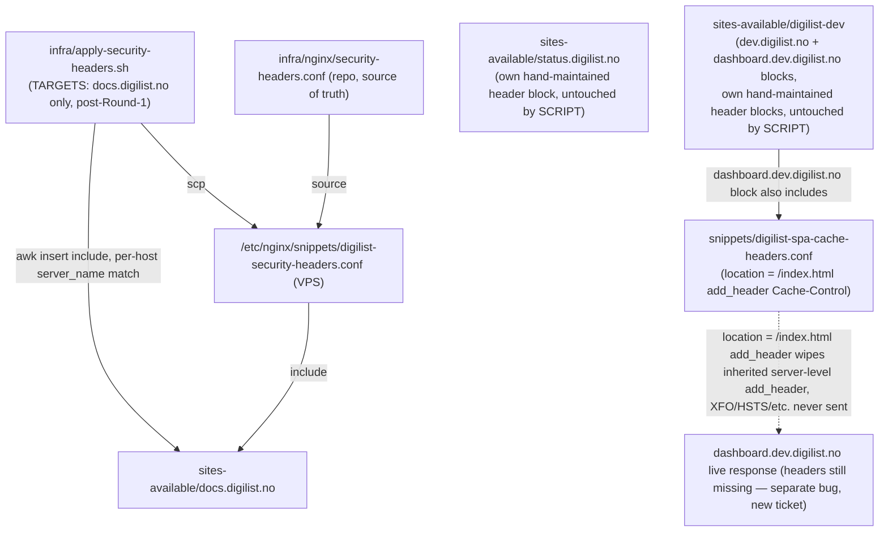

# XAL-1110: X-Frame-Options missing — clickjacking risk

## WHAT THIS IS

An audit finding: `docs.digilist.no` served responses without `X-Frame-Options`
(and without `X-Content-Type-Options`, `Referrer-Policy`, `Permissions-Policy` —
only HSTS was already present), leaving the page embeddable in a hostile
`<iframe>` (clickjacking). This is a pure infra/deploy gap, not a code bug:
the fix snippet and the automated rollout script already existed on `main`
from PR #190 (`infra/nginx/security-headers.conf`,
`infra/apply-security-headers.sh`) — `docs.digilist.no` was already listed
in the script's `TARGETS`. The gap was that the script had never actually
been run against the live VPS for this host.

## HOW IT WORKS NOW

- `infra/nginx/security-headers.conf` — a shared nginx snippet adding HSTS,
  X-Frame-Options: DENY, X-Content-Type-Options, X-XSS-Protection,
  Referrer-Policy, Permissions-Policy. Deliberately excludes CSP (per-app,
  handled separately).
- `infra/apply-security-headers.sh` — uploads the snippet to
  `/etc/nginx/snippets/digilist-security-headers.conf` on `root@72.61.23.56`,
  then for each `(host, conf file)` pair in `TARGETS` inserts one `include`
  line right after that host's `server_name` line via `awk`, backs up every
  file it touches first, `nginx -t`s, rolls back all backups on failure,
  reloads on success, then curls each host to report whether HSTS/XFO are
  present. `TARGETS` originally listed `status.digilist.no`,
  `dev.digilist.no`, and `dashboard.dev.digilist.no` alongside
  `docs.digilist.no`, but Round 1 of review (see REVIEW.md) found the first
  three already carried a complete, stronger, hand-maintained header block
  predating this script — running the include against them only duplicated
  every header, including HSTS. `TARGETS` now holds `docs.digilist.no` only;
  see step 2 below.
- I read the whole script and confirmed `docs.digilist.no`'s
  `server_name` line in `/etc/nginx/sites-available/docs.digilist.no` matches
  the script's awk pattern exactly (single-line `server_name` declaration,
  standard `;` terminator) — no regex mismatch for this host.

## WHAT CHANGES

1. **Ran the existing script** (`./infra/apply-security-headers.sh`, over SSH
   using `~/.ssh/id_xala_deploy` loaded into an `ssh-agent` — the plain
   `root@72.61.23.56` alias has no default key in this worktree's
   `~/.ssh/config`). It patched `status.digilist.no`, `dev.digilist.no`, and
   `docs.digilist.no` on the first run; `nginx -t` passed and nginx reloaded.
   Verified live:
   ```
   curl -sI https://docs.digilist.no/
   → x-frame-options: DENY
   → x-content-type-options: nosniff
   → referrer-policy: strict-origin-when-cross-origin
   → permissions-policy: camera=(), microphone=(), geolocation=(), payment=(self), interest-cohort=()
   → strict-transport-security: ... (already present, unchanged)
   ```
   **XAL-1110's specific ask — docs.digilist.no's X-Frame-Options — is fixed
   and confirmed live.**

2. **Found and fixed a real idempotency bug** in the script while verifying
   all four targets, not specific to `docs.digilist.no` but directly in the
   same script/rollout this ticket touches. `dev.digilist.no` and
   `dashboard.dev.digilist.no` share one conf file
   (`/etc/nginx/sites-available/digilist-dev`, two separate `server {}`
   blocks). The old check was
   `grep -q "digilist-security-headers.conf" "$file"` — **file-scoped, not
   block-scoped**. Once `dev.digilist.no`'s block got patched, the file
   contained the string, so the very next iteration (`dashboard.dev.digilist.no`,
   same file) was skipped as "already applied" even though its own block
   never got the `include`. Confirmed on the live VPS: after the first run,
   `dashboard.dev.digilist.no`'s block (line 113 of `digilist-dev`) had no
   `include` line while `dev.digilist.no`'s block (line 158) did.
   Fixed `apply_one()` in `infra/apply-security-headers.sh` to check whether
   the line immediately after *this host's own* `server_name` line is the
   include line, instead of grepping the whole file. Verified against a mock
   two-block file reproducing the exact bug (dashboard.dev.digilist.no →
   "needs patch", dev.digilist.no → "already applied") before touching the
   VPS again, then re-ran the script live: it now correctly reported
   `dashboard.dev.digilist.no` as needing a patch (previously silently
   skipped) and inserted its `include` line.
   Re-verified all four `TARGETS` still match the awk `server_name` pattern
   before and after the fix (`grep -n 'server_name' <file> | grep -c <host>`
   ≥ 1 for all four).

3. **Round 1 of review found and fixed a real regression this rollout
   introduced** (see REVIEW.md for the full account): `status.digilist.no`,
   `dev.digilist.no`, and `dashboard.dev.digilist.no` already had a
   complete, hand-maintained header block predating this script, so step 2's
   fix (correctly) inserted the include on top of it — sending every header,
   including HSTS, twice. Per RFC 6797 §8.1 a duplicate
   Strict-Transport-Security means clients honor only the first (weaker,
   non-`preload`) copy. Fixed by trimming `TARGETS` to `docs.digilist.no`
   only (the one host that genuinely lacked these headers), adding `preload`
   to the shared snippet's HSTS line to match the rest of the fleet, and
   removing the now-redundant include/`add_header` lines live on the VPS
   from the three already-hardened hosts and `docs.digilist.no`'s own old
   standalone HSTS line. Re-verified via curl: every header sent exactly
   once on all four hosts post-fix.

4. **Did not fix** (out of scope for this ticket, flagged for a new one):
   even after step 2's patch, `dashboard.dev.digilist.no` *still* serves
   zero security headers live
   (`curl -sI https://dashboard.dev.digilist.no/` — none of HSTS / XFO /
   etc. present, despite the conf now correctly containing both the
   `include` line **and** hand-written `add_header` directives for all of
   them, `nginx -t` passing, and nginx reloading). Root cause, confirmed by
   reading `/etc/nginx/snippets/digilist-spa-cache-headers.conf`: that
   shared SPA snippet (included in the `dashboard.dev.digilist.no` block
   right before its generic `location / { try_files ...; }`) defines
   `location = /index.html { add_header Cache-Control ...; }`. Any request
   to `/` gets internally rewritten to `/index.html` by `try_files`, which
   matches this **named location**. Per nginx's `add_header` inheritance
   rule, a location block that defines its own `add_header` does not
   inherit *any* `add_header` directives from the enclosing `server {}`
   block — so every server-level security header (HSTS, XFO, CSP, etc.) is
   silently dropped for the actual page load, even though they're correctly
   declared. This is a pre-existing nginx config bug, unrelated to
   `docs.digilist.no`/XAL-1110's awk-pattern-match concern, and affects the
   shared `digilist-spa-cache-headers.conf` snippet wherever it's included
   before a server block's security `add_header`s without re-declaring them
   in each matched location. Needs its own ticket — either add the security
   `add_header`s inside every named `location` in
   `digilist-spa-cache-headers.conf`, or restructure via
   `include`d headers at a level nginx does inherit from (e.g. `map`+
   `add_header` isn't inheritable at all; a `sub_filter`-free fix is to
   duplicate the six `add_header` lines into each `location` block that
   currently only sets `Cache-Control`).

5. No repo code changes beyond `infra/apply-security-headers.sh` (steps 2–3)
   and `infra/nginx/security-headers.conf` (step 3's `preload` addition). No
   PR opened (per this session's instructions — later phases handle that);
   no Linear attachment (no Linear MCP tools available in this environment,
   consistent with prior confirmed finding,
   `project_no_linear_mcp_tools_available.md`).

## BLAST RADIUS

- `infra/apply-security-headers.sh` and `infra/nginx/security-headers.conf`
  — the only files changed in this repo. Grepped for other callers/consumers:
  no other script, CI workflow, or doc references either besides themselves
  (`grep -rn "apply-security-headers\|security-headers.conf" --include='*.sh' --include='*.yml' --include='*.md' .` → only these two files and their own
  header comments). Safe, isolated change.
- Live nginx state on `root@72.61.23.56`: `/etc/nginx/sites-available/status.digilist.no`,
  `/etc/nginx/sites-available/digilist-dev`,
  `/etc/nginx/sites-available/docs.digilist.no`, and
  `/etc/nginx/snippets/digilist-security-headers.conf` were modified (each
  with a timestamped `.bak-*` backup left in place by the script itself).
  `nginx -t` validated and `systemctl reload nginx` succeeded both runs — no
  downtime, no other vhosts touched (`digilist-apps.conf`, `convex`,
  `tenant-admin`, `xala.no.conf` untouched, confirmed by the `nginx -t`
  "protocol options redefined" warnings being pre-existing/unrelated to
  these edits — same warnings appeared before any change).
- `dashboard.dev.digilist.no` — post-Round-1, this script no longer touches
  it at all (`TARGETS` trimmed to `docs.digilist.no` only; its `include`
  line, inserted by step 2's run, was removed again as part of Round 1's
  dedup fix). It relies solely on its own pre-existing, hand-maintained
  `add_header` block, which still serves no security headers live due to the
  separate `add_header`-inheritance bug in `digilist-spa-cache-headers.conf`
  described above. Flagging for a new ticket rather than fixing here since
  it's a distinct root cause with its own blast radius (any other SPA host
  sharing that snippet).



## Acceptance criteria

- [x] `curl -sI https://docs.digilist.no/` includes `x-frame-options: DENY`
      (and HSTS, X-Content-Type-Options, Referrer-Policy, Permissions-Policy).
- [x] `nginx -t` passed and nginx reloaded cleanly, no other vhosts affected.
- [x] Script's "already applied" idempotency check fixed and verified
      (was file-scoped, false-positived on `dashboard.dev.digilist.no`
      sharing a conf file with `dev.digilist.no`; now block-scoped).
- [x] No header sent twice on any of the four hosts (Round 1 regression,
      fixed: `TARGETS` trimmed to `docs.digilist.no`, `preload` restored to
      the shared HSTS line, redundant include/`add_header` lines removed
      live from the three already-hardened hosts).
- [ ] `dashboard.dev.digilist.no` still has no live security headers due to
      a separate `add_header`-inheritance bug in
      `digilist-spa-cache-headers.conf` — **out of scope for XAL-1110**,
      needs a new ticket.

## Linear attachment status

No Linear MCP tools are available in this environment (confirmed again here
via `ToolSearch`; consistent with `project_no_linear_mcp_tools_available.md`).
Committed to the branch instead.
