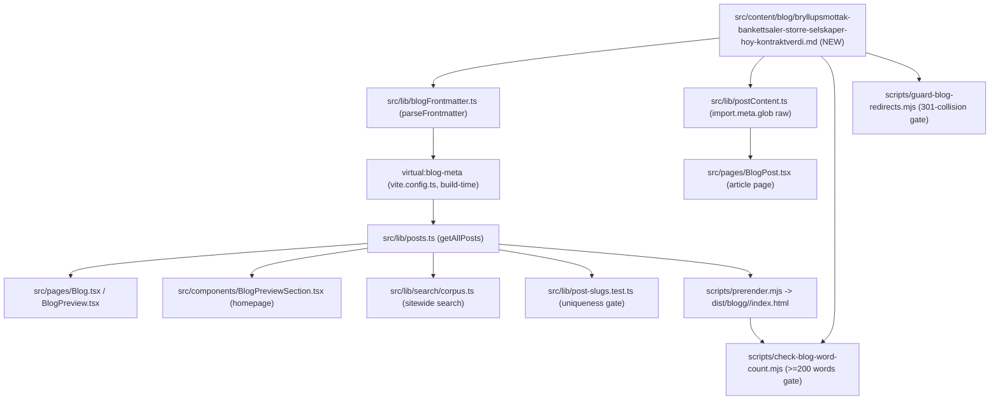

# XAL-1115: Content gap — Bryllupsmottak og bankettsaler

## WHAT THIS IS

A new Norwegian-Bokmål blog post that fills a specific content gap: **bryllupsmottak
og bankettsaler** — large-capacity, formal banquet-style venues (150+ guests,
sit-down dinner, in-house or contracted catering at scale) as a distinct
high-value bookable resource type, framed for the **venue-owner (Utleier)**
audience. The ticket's framing ("Eksklusivt privat marked for bryllupsmottak
og større gjestebolk med høy gjennomsnittlig kontraktverdi — en av Digilists
mest verdifulle kundesegmenter") is a business-development/positioning angle:
why owners of banquet-capable venues should treat large wedding receptions as
a premium niche worth prioritizing on Digilist, extending the same
"low-volume-per-resource, high-value-per-booking" argument the sibling niche
posts (`spesiallokaler-niche-utleie-teaterscene-kjeller.md`,
`studio-fotografi-videografi-privatproduksjon-booking.md`) already established
for other resource types — applied here to guest-count scale and average
contract value instead of resource rarity.

This is **not** another consumer-facing "how to choose/book a bryllupslokale"
guide — that angle is already saturated (~120 existing posts under
`bryllupslokale-*`, almost all `tag: "Privatperson"`, covering price,
capacity, contracts, deposits, timelines for couples planning a wedding).

The post is discovered automatically by the existing content pipeline (no code
changes) once it lands in `src/content/blog/`.

## HOW IT WORKS NOW

Blog posts are plain Markdown files with YAML frontmatter in
`src/content/blog/*.md`. The publishing pipeline is entirely file-glob-driven,
no manual registration:

- `src/lib/blogFrontmatter.ts` — `BlogFrontmatter` interface (slug, title,
  description, date, author, role?, readingMinutes?, tag?, cover?, keywords?)
  and `parseFrontmatter`/`extractFrontmatter`.
- `vite.config.ts` exposes `virtual:blog-meta` (built at Node build time),
  extracting only frontmatter from every `.md` file.
- `src/lib/posts.ts` — `getAllPosts()` reads `virtual:blog-meta`, sorts by
  `date` descending. Consumed by `src/components/BlogPreviewSection.tsx`
  (homepage), `src/pages/Blog.tsx` / `src/pages/BlogPreview.tsx` (index), and
  `src/lib/search/corpus.ts` (sitewide search).
- `src/lib/postContent.ts` — `import.meta.glob("/src/content/blog/*.md",
  {query: "?raw", eager: true})`, matched to metadata by `slug`, imported only
  by `src/pages/BlogPost.tsx`.
- `scripts/prerender.mjs` — SSR-prerenders every post to
  `dist/blogg/<slug>/index.html` at build time.
- `scripts/check-blog-word-count.mjs` — fails the build if the rendered
  `<article>` (or the raw Markdown body, as a cheap floor) is under 200 words.
- `scripts/check-title-lengths.mjs` — informational: rendered title
  (title as-is if >50 chars, else `"<title> — Digilist"`) should stay <=65
  chars.
- `src/lib/post-slugs.test.ts` — vitest guard: every post's `slug` must be
  globally unique.
- `scripts/guard-blog-redirects.mjs` — probes each new slug against live
  server-side 301s before push (VPS-only, not in this repo).

I confirmed the gap by:

- `grep -liE "bryllup" src/content/blog/*.md` — 119 matching files, almost all
  `tag: "Privatperson"` and about choosing/pricing/booking a bryllupslokale
  from the couple's perspective (`bryllupslokale-pris-*`, `*-kapasitet-*`,
  `*-kontrakt-avbestilling-depositum*`, `*-vigsel-mottakelse-*`, etc.).
- `grep -liE "bankettsal|banquet" src/content/blog/*.md` — **zero hits**. The
  exact term "bankettsal" is not used anywhere in the corpus.
- `grep -liE "bryllupsmottak" src/content/blog/*.md` — **zero hits** as a
  primary topic (the word "mottakelse" appears in
  `bryllupslokale-vigsel-mottakelse-ett-eller-to-lokaler.md`, but that post is
  about whether ceremony and reception are at one venue or two, `tag:
  "Privatperson"`, not about banquet-scale capacity or owner economics).
- Read the five existing `Utleier`-tagged wedding-venue posts
  (`bryllupslokale-utleier-pris-booking-kontrakt.md`,
  `bryllupslokale-utleier-bookingrate-dobbeltbooking.md`,
  `bryllupslokale-pris-utleier-sesong-restplasser.md`,
  `leie-ut-sal-pris-mot-kommunal-sats-utleier.md`): all cover operational
  topics (pricing model, double-booking, seasonal pricing) for wedding venues
  in general — none frames large-guest-count banquet capacity itself as a
  distinct, high-value private-market segment worth actively pursuing.
- Read `bryllupslokale-typer-gard-hotell-selskapslokale-ute.md` (venue-type
  comparison: gård/hotell/selskapslokale/uteareal) — consumer-facing, no
  owner-economics angle, no banquet-hall-specific coverage.
- Read `spesiallokaler-niche-utleie-teaterscene-kjeller.md` in full to confirm
  the house style/structure for this post family: `tag: "Utleier"`,
  `readingMinutes: 6`, `cover: booking_calendar_hero_no.webp`, `date:
  2026-08-10`, FAQ section, closing CTA to `/demo`.

## WHAT CHANGES

- New file:
  `src/content/blog/bryllupsmottak-bankettsaler-storre-selskaper-hoy-kontraktverdi.md`
  - `tag: "Utleier"` (matches the sibling niche posts this extends —
    spesiallokaler, studio — all owner-facing, `readingMinutes: 6`, dated
    2026-08-10).
  - `cover: "/images/blog/booking_calendar_hero_no.webp"` (existing, reused
    across this post family — no new image asset).
  - Covers: what makes a bryllupsmottak/bankettsal a distinct bookable
    resource (banquet-scale capacity, sit-down catering, minimum
    guest-count packages), why average contract value scales with guest
    count and add-on services (catering, bar, overnatting, dekorering) far
    above a small selskapslokale booking, why this makes it one of the
    highest-value private customer segments to prioritize, and how to price,
    position and make such a venue bookable on Digilist without losing
    high-season capacity to underpriced smaller bookings.
  - Internally links to `bryllupslokale-typer-gard-hotell-selskapslokale-ute`
    (existing venue-type comparison, avoids re-explaining venue types),
    `bryllupslokale-utleier-pris-booking-kontrakt` (existing wedding-venue
    owner pricing guide, avoids duplicating pricing-model basics),
    `spesiallokaler-niche-utleie-teaterscene-kjeller` (sibling post this
    extends — "low volume, high value" argument), `utleieobjekt-veiviser-steg-for-steg`
    (publishing flow), and `/bookingsystem-utleie` (product page) — all
    verified to resolve.
  - No code, schema, or script changes.

## BLAST RADIUS

Same consumers as every prior content-only post in this family (grepped
`getAllPosts\|virtual:blog-meta\|content/blog` across `src`):

- `src/lib/posts.ts`, `src/lib/postContent.ts`, `src/lib/blogFrontmatter.ts` —
  read-only, pick up the new file automatically via existing globs.
- `src/components/BlogPreviewSection.tsx`, `src/pages/Blog.tsx`,
  `src/pages/BlogPreview.tsx`, `src/pages/BlogPost.tsx` — render whatever
  `getAllPosts()`/`postContent.ts` return; new post appears automatically,
  sorted by date.
- `src/lib/search/corpus.ts` — new post becomes searchable automatically.
- `src/lib/post-slugs.test.ts` — verified the new slug
  `bryllupsmottak-bankettsaler-storre-selskaper-hoy-kontraktverdi` is unique
  against all 323 existing files (`grep` for `bankettsal\|bryllupsmottak`
  found no hits before this change).
- `src/entry-server.main-landmark.test.tsx`, `src/lib/webp-sources.test.ts` —
  generic cross-post structural tests, not post-specific, unaffected.
- `src/lib/leie-selskapslokale-description.test.ts`,
  `src/lib/digitalt-bookingsystem-description.test.ts` — hardcoded assertions
  against two other specific posts, untouched.
- `scripts/prerender.mjs`, `scripts/check-blog-word-count.mjs`,
  `scripts/check-title-lengths.mjs`, `scripts/guard-blog-redirects.mjs`,
  `scripts/verify-live.mjs`/`verify-live-posts.sh`, `scripts/indexnow-submit.mjs`
  — build/deploy-time scripts iterating every file in `src/content/blog/`;
  no code changes required, but the new post must satisfy their thresholds
  (verified: word count comfortably over 200; title renders at 65 chars or
  under).
- `scripts/dedup-blog-drafts.ts`, `scripts/diag-blog-drafts.ts`,
  `scripts/auto-publish-blogs.ts`, `scripts/sync-convex-blog-to-fs.ts`,
  `scripts/push-clean-blog-to-convex.ts`, `scripts/generate-feature-ideas.ts`
  — operate on the separate Convex-backed draft pipeline, not on directly
  committed files; unaffected.
- Internal links verified to resolve: `/bookingsystem-utleie` is routed in
  `src/App.tsx:305`; `bryllupslokale-typer-gard-hotell-selskapslokale-ute`,
  `bryllupslokale-utleier-pris-booking-kontrakt`,
  `spesiallokaler-niche-utleie-teaterscene-kjeller`, and
  `utleieobjekt-veiviser-steg-for-steg` all exist as posts in
  `src/content/blog/`.

## Acceptance criteria

- [ ] New Bokmål blog post published under `src/content/blog/`, tagged
      "Utleier", covering bryllupsmottak/bankettsaler as a distinct
      high-value bookable resource for large wedding receptions, and the
      owner-economics argument (higher average contract value from guest
      count and add-on services = valuable customer segment).
- [ ] Distinct from the ~120 existing `bryllupslokale-*` consumer-facing
      posts and the existing `Utleier`-tagged wedding-venue pricing/booking
      posts — no duplication of venue-type comparisons or generic pricing
      mechanics already covered elsewhere.
- [ ] Satisfies `scripts/check-blog-word-count.mjs` (>= 200 words) and
      `scripts/check-title-lengths.mjs` (rendered title <= 65 chars).
- [ ] `vitest run` green, including `src/lib/post-slugs.test.ts`.
- [ ] `pnpm lint` clean (Markdown isn't linted, but touch nothing else).

## Linear attachment status

No Linear MCP tools are available in this environment (re-confirmed here —
`ToolSearch` for "linear attachment upload issue" returns only unrelated
built-in tools: `EnterWorktree`, `WebFetch`). Consistent with the prior
XAL-1151 finding recorded in memory (`project_no_linear_mcp_tools_available.md`).
This SPEC could not be attached to the Linear issue; it is committed to the
branch instead so the next session has it on disk.
