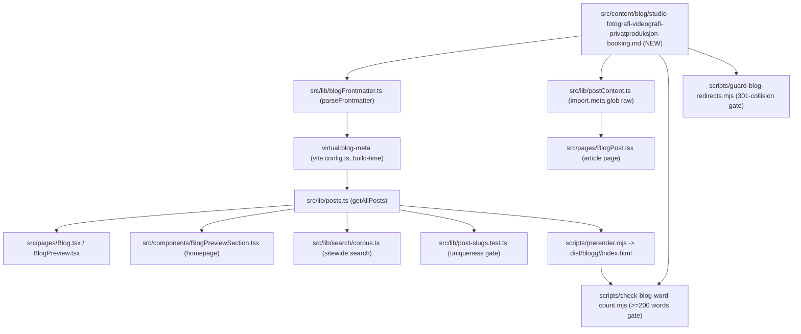

# XAL-1119: Content gap — Studio for fotografi, videografi og privatproduksjon

## WHAT THIS IS

A new Norwegian-Bokmål blog post that fills a specific content gap: dedicated
photo/video studios (fotostudio, videostudio) as a **bookable resource type**
for private demand — freelance photographers, content creators, YouTubers/
podcasters, and small video/production teams who book a studio for a single
shoot, a recurring weekly recording slot, or a one-off production day. The
ticket's framing ("Privat etterspørsel etter spesialiserte studio for
fotografi og videografi; nisje med høy verdi per booking") describes exactly
the same "low volume per resource, high value per booking" pattern the sibling
niche posts already established for other room types, but no existing post
covers a fotostudio/videostudio itself as the topic.

The post is discovered automatically by the existing content pipeline (no code
changes) once it lands in `src/content/blog/`.

## HOW IT WORKS NOW

Blog posts are plain Markdown files with YAML frontmatter in
`src/content/blog/*.md`. The publishing pipeline is entirely file-glob-driven,
no manual registration:

- `src/lib/blogFrontmatter.ts` — `BlogFrontmatter` interface (slug, title,
  description, date, author, role?, readingMinutes?, tag?, cover?, keywords?)
  and `parseFrontmatter`/`extractFrontmatter`.
- `vite.config.ts` exposes `virtual:blog-meta` (built at Node build time),
  extracting only frontmatter from every `.md` file.
- `src/lib/posts.ts` — `getAllPosts()` reads `virtual:blog-meta`, sorts by
  `date` descending. Consumed by `src/components/BlogPreviewSection.tsx`
  (homepage), `src/pages/Blog.tsx` / `src/pages/BlogPreview.tsx` (index), and
  `src/lib/search/corpus.ts` (sitewide search).
- `src/lib/postContent.ts` — `import.meta.glob("/src/content/blog/*.md",
  {query: "?raw", eager: true})`, matched to metadata by `slug`, imported only
  by `src/pages/BlogPost.tsx`.
- `scripts/prerender.mjs` — SSR-prerenders every post to
  `dist/blogg/<slug>/index.html` at build time.
- `scripts/check-blog-word-count.mjs` — fails the build if the rendered
  `<article>` (or the raw Markdown body, as a cheap floor) is under 200 words.
- `scripts/check-title-lengths.mjs` — informational: rendered title
  (title as-is if >50 chars, else `"<title> — Digilist"`) should stay <=65
  chars.
- `src/lib/post-slugs.test.ts` — vitest guard: every post's `slug` must be
  globally unique.
- `scripts/guard-blog-redirects.mjs` — probes each new slug against live
  server-side 301s before push, to catch a slug already consolidated away by a
  standing nginx redirect (VPS-only, not in this repo).

I confirmed the gap by reading every post that mentions studio/foto/video
terms (`grep -liE "fotostudio|videostudio|fotografer|videograf|greenscreen|
podcast.?studio|opptaksstudio" src/content/blog/*.md`, and separately
`studio|foto|video` in filenames):

- `kunstner-verksteder-studio-dansesaler-kreative-lokaler.md` — defines
  "studio" as a broad umbrella term including "et lite fotostudio" in one
  sentence, but the post's actual topic is kunstner-verksted/dansesal for
  hobby/kurs/profesjonell bruk. No coverage of what a photo/video studio
  itself needs (cyc wall, lighting, greenscreen).
- `spesiallokaler-niche-utleie-teaterscene-kjeller.md` — opens with "En
  fotograf som trenger en tom teaterscene ... **ikke** et fotostudio med hvit
  cyc-vegg" — explicitly contrasts its own topic (character-driven spaces)
  against a proper fotostudio, but never covers the fotostudio itself. This
  post also establishes the "lavt volum per lokale betyr ikke lav verdi"
  argument the new post extends to photo/video.
- `leie-ovingsrom-musikk-dans-studio.md` — music/dance rehearsal rooms, not
  photo/video.
- `yoga-wellness-studio-klasseromlokaler.md` — yoga/wellness, not photo/video.
- No post anywhere mentions greenscreen, cyc-vegg (as a studio topic in its
  own right), podcast-studio, or opptaksstudio as the primary subject.

Confirmed no code changes are needed: the pipeline above is entirely
content-agnostic and picks up any new `.md` file automatically.

## WHAT CHANGES

- New file:
  `src/content/blog/studio-fotografi-videografi-privatproduksjon-booking.md`
  - `tag: "Utleier"` (matches the three sibling niche posts this extends —
    kunstner-verksteder, yoga-wellness, spesiallokaler — all owner-facing,
    all `readingMinutes: 6`, all dated 2026-08-10)
  - `cover: "/images/blog/booking_calendar_hero_no.webp"` (existing, generic
    hero image already reused across this post family — no new image asset)
  - Covers: what makes a fotostudio/videostudio a distinct bookable resource
    (cyc-vegg, lysrigg, greenscreen, lydisolasjon, strømkapasitet), the
    private-demand user groups (portrettfotograf, produktfotograf/
    content-creator, videograf/podcaster), why low volume per studio is still
    high value per booking (extends the `spesiallokaler` post's argument),
    and how Digilist makes the studio bookable.
  - Internally links to `kunstner-verksteder-studio-dansesaler-kreative-
    lokaler` (broader studio umbrella), `spesiallokaler-niche-utleie-
    teaterscene-kjeller` (the post that explicitly excluded fotostudio),
    `utleieobjekt-veiviser-steg-for-steg` (publishing flow), and
    `/bookingsystem-utleie` (product page) — all verified to resolve.
  - No code, schema, or script changes.

## BLAST RADIUS

Same consumers as every prior content-only post in this family (grepped
`getAllPosts\|virtual:blog-meta\|content/blog` across `src`):

- `src/lib/posts.ts`, `src/lib/postContent.ts`, `src/lib/blogFrontmatter.ts` —
  read-only, pick up the new file automatically via existing globs.
- `src/components/BlogPreviewSection.tsx`, `src/pages/Blog.tsx`,
  `src/pages/BlogPreview.tsx`, `src/pages/BlogPost.tsx` — render whatever
  `getAllPosts()`/`postContent.ts` return; new post appears automatically,
  sorted by date.
- `src/lib/search/corpus.ts` — new post becomes searchable automatically.
- `src/lib/post-slugs.test.ts` — verified the new slug
  `studio-fotografi-videografi-privatproduksjon-booking` is unique against all
  322 existing files (`grep` for `studio-fotografi\|fotografi-videografi`
  found no hits).
- `src/entry-server.main-landmark.test.tsx`, `src/lib/webp-sources.test.ts` —
  generic cross-post structural tests, not post-specific, unaffected.
- `src/lib/leie-selskapslokale-description.test.ts`,
  `src/lib/digitalt-bookingsystem-description.test.ts` — hardcoded assertions
  against two other specific posts, untouched.
- `scripts/prerender.mjs`, `scripts/check-blog-word-count.mjs`,
  `scripts/check-title-lengths.mjs`, `scripts/guard-blog-redirects.mjs`,
  `scripts/verify-live.mjs`/`verify-live-posts.sh`, `scripts/indexnow-submit.mjs`
  — build/deploy-time scripts iterating every file in `src/content/blog/`;
  no code changes required, but the new post must satisfy their thresholds
  (verified: word count comfortably over 200, title `Studio for fotografi,
  videografi og privatproduksjon: booking` renders at 58 chars, under the
  65-char limit).
- `scripts/dedup-blog-drafts.ts`, `scripts/diag-blog-drafts.ts`,
  `scripts/auto-publish-blogs.ts`, `scripts/sync-convex-blog-to-fs.ts`,
  `scripts/push-clean-blog-to-convex.ts`, `scripts/generate-feature-ideas.ts`
  — operate on the separate Convex-backed draft pipeline, not on directly
  committed files; unaffected.
- Internal links verified to resolve: `/bookingsystem-utleie` is routed in
  `src/App.tsx:305`; `utleieobjekt-veiviser-steg-for-steg` and
  `spesiallokaler-niche-utleie-teaterscene-kjeller` and
  `kunstner-verksteder-studio-dansesaler-kreative-lokaler` all exist as posts
  in `src/content/blog/`.

## Acceptance criteria

- [ ] New Bokmål blog post published under `src/content/blog/`, tagged
      "Utleier", covering fotostudio/videostudio as a distinct bookable
      resource for private demand (photographers, videographers, content
      creators) and the high-value-per-booking niche economics.
- [ ] Distinct from `kunstner-verksteder-studio-dansesaler-kreative-lokaler.md`
      (broad creative-studio umbrella) and
      `spesiallokaler-niche-utleie-teaterscene-kjeller.md` (character-driven
      spaces that explicitly excludes fotostudio) — no duplication.
- [ ] Satisfies `scripts/check-blog-word-count.mjs` (>= 200 words) and
      `scripts/check-title-lengths.mjs` (rendered title <= 65 chars).
- [ ] `vitest run` green, including `src/lib/post-slugs.test.ts`.
- [ ] `pnpm lint` clean (Markdown isn't linted, but touch nothing else).

## Linear attachment status

No Linear MCP tools are available in this environment (re-confirmed here —
`ToolSearch` for "linear attachment upload issue" returns only unrelated
built-in tools: `EnterWorktree`, `WebFetch`). Consistent with the prior
XAL-1151 finding recorded in memory. This SPEC could not be attached to the
Linear issue; it is committed to the branch instead so the next session has it
on disk.
