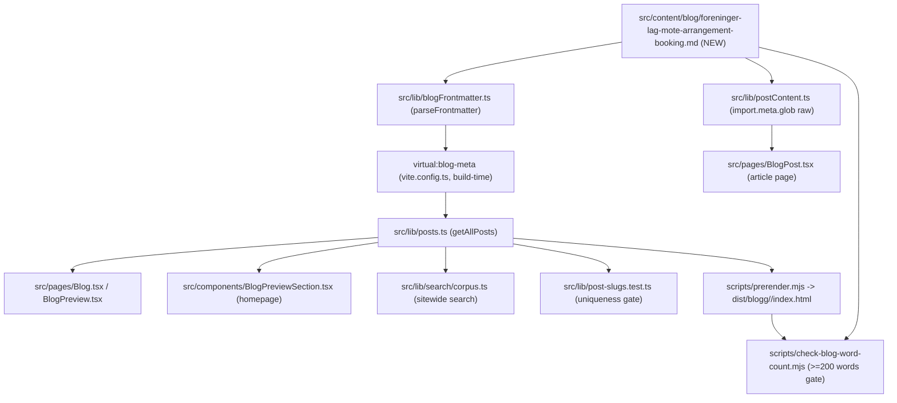

# XAL-1123: Content gap — Foreninger og lag: møter og arrangementer

## WHAT THIS IS

A new Norwegian-Bokmål blog post that fills a specific content gap: associations,
clubs and community organizations ("foreninger og lag") that need to book a room
for the organization's **own internal life** — styremøter (board meetings),
årsmøte/generalforsamling (the association's annual general meeting), and sosiale
sammenkomster (member socials: julebord, sommerfest, jubileum) — as distinct from
the two audiences the existing "Lag og foreninger" content already serves well:
sports teams booking training time in an idrettshall, and housing
cooperatives/sameier booking a hall for their generalforsamling.

The post is discovered automatically by the existing content pipeline (no code
changes) once it lands in `src/content/blog/`.

## HOW IT WORKS NOW

Blog posts are plain Markdown files with YAML frontmatter in
`src/content/blog/*.md`. The publishing pipeline is entirely file-glob-driven,
no manual registration:

- `src/lib/blogFrontmatter.ts` — `BlogFrontmatter` interface (slug, title,
  description, date, author, role?, readingMinutes?, tag?, cover?, keywords?)
  and `parseFrontmatter`/`extractFrontmatter`, shared by the browser bundle and
  the Node-side Vite plugin.
- `vite.config.ts` exposes a `virtual:blog-meta` module (built at build time in
  Node) that extracts just the frontmatter from every `.md` file — this is what
  keeps the ~560KB of combined article text out of the metadata-only bundle.
- `src/lib/posts.ts` — `getAllPosts()` reads `virtual:blog-meta` and sorts posts
  by `date` descending. Consumed eagerly by the homepage
  (`src/components/BlogPreviewSection.tsx`), the blog index
  (`src/pages/Blog.tsx`, `src/pages/BlogPreview.tsx`), and the sitewide search
  corpus (`src/lib/search/corpus.ts`).
- `src/lib/postContent.ts` — `import.meta.glob("/src/content/blog/*.md", {query:
  "?raw", eager: true})` loads full article bodies, matched to metadata by
  `slug`. Only imported by `src/pages/BlogPost.tsx` (the article page), kept out
  of every other bundle deliberately (see the file's own header comment).
- `scripts/prerender.mjs` — SSR-prerenders every post from `getAllPosts()` to
  `dist/blogg/<slug>/index.html` at build time.
- `scripts/check-blog-word-count.mjs` — fails the build if any post's Markdown
  body is under 200 words, or if the prerendered HTML `<article>` renders under
  200 words (content.thin guard, part of `pnpm build`).
- `scripts/check-title-lengths.mjs` — informational check: a title is rendered
  verbatim if `> 50 chars`, otherwise suffixed with `" — Digilist"`; either way
  the effective rendered length should stay `<= 65 chars`.
- `src/lib/post-slugs.test.ts` — vitest guard: every post's `slug` must be
  globally unique (two files resolving to the same slug silently collide at
  prerender).

I confirmed by reading existing "Lag og foreninger"-tagged posts
(`frivillig-organisasjon-bookingsystem-medlemstilgang.md`,
`registrere-lag-organisasjon-booke-kommunale-lokaler.md`,
`ovingslokale-fast-sesongleie-kor-korps-speider-kr-time.md`,
`sesongleie-fordeling-lag-foreninger.md`, and the ~120 `idrettshall-*-lag-foreninger-*`
posts) that existing coverage is almost entirely: (a) sports teams booking
recurring training time in an idrettshall, (b) role-based member access /
registering a lag as an org in the system, and (c) `sal-generalforsamling-borettslag-styreleder.md`,
which is specifically the housing-cooperative (`borettslag`/`sameie`) audience
booking a hall for *their* annual meeting — a different organizational type
than a forening/lag. No existing post addresses a forening's own board
meetings, its own årsmøte, or member social events as the topic.

## WHAT CHANGES

- New file: `src/content/blog/foreninger-lag-mote-arrangement-booking.md`
  - `tag: "Lag og foreninger"` (existing taxonomy value, reused)
  - `cover: "/images/blog/booking_calendar_hero_no.webp"` (existing, generic
    hero image already reused across several "Lag og foreninger" posts — no new
    image asset needed)
  - Internally links to the adjacent existing posts above (to route the
    audience to already-covered training/registration content instead of
    duplicating it) and to `/bookingsystem-utleie` / `/bookingsystem-kommune`.
  - No code, schema, or script changes — this is a pure content addition
    picked up automatically by the glob-based pipeline described above.

## BLAST RADIUS

Grepped every consumer of blog content (`grep -rl "getAllPosts\|virtual:blog-meta\|content/blog" src`):

- `src/lib/posts.ts`, `src/lib/postContent.ts`, `src/lib/blogFrontmatter.ts` —
  read-only consumers, no changes needed; new file is picked up automatically
  by the existing globs.
- `src/components/BlogPreviewSection.tsx`, `src/pages/Blog.tsx`,
  `src/pages/BlogPreview.tsx`, `src/pages/BlogPost.tsx` — render whatever
  `getAllPosts()`/`postContent.ts` return; new post shows up automatically,
  sorted by date.
- `src/lib/search/corpus.ts` — sitewide search corpus; new post becomes
  searchable automatically.
- `src/lib/post-slugs.test.ts` — will fail the suite if the new slug collides
  with an existing one (verified `foreninger-lag-mote-arrangement-booking` is
  unique against all 321 existing files).
- `src/entry-server.main-landmark.test.tsx`, `src/lib/webp-sources.test.ts` —
  generic cross-post structural tests (landmark/heading structure, image
  sources); not post-specific, don't need updating for a new post.
- `src/lib/leie-selskapslokale-description.test.ts`,
  `src/lib/digitalt-bookingsystem-description.test.ts` — hardcoded assertions
  against two specific unrelated posts; untouched by this change.
- `scripts/prerender.mjs`, `scripts/check-blog-word-count.mjs`,
  `scripts/check-title-lengths.mjs`, `scripts/guard-blog-redirects.mjs`,
  `scripts/verify-live.mjs` / `verify-live-posts.sh`, `scripts/indexnow-submit.mjs`
  — build/deploy-time scripts that iterate every file in `src/content/blog/`;
  none require code changes, but the new post must satisfy their thresholds
  (>= 200 words in Markdown body, rendered title <= 65 chars).
- `scripts/dedup-blog-drafts.ts`, `scripts/diag-blog-drafts.ts`,
  `scripts/auto-publish-blogs.ts`, `scripts/sync-convex-blog-to-fs.ts`,
  `scripts/push-clean-blog-to-convex.ts`, `scripts/generate-feature-ideas.ts` —
  operate on the separate Convex-backed content-agent draft pipeline, not on
  committed files in `src/content/blog/`; unaffected by a directly-committed
  Markdown file.

## Acceptance criteria

- [ ] New Bokmål blog post published under `src/content/blog/`, tagged
      "Lag og foreninger", covering styremøter, årsmøte/generalforsamling for
      the association itself, and sosiale sammenkomster/member socials.
- [ ] Distinct from existing sports-training and borettslag content (no
      duplication of `sal-generalforsamling-borettslag-styreleder.md` or the
      `idrettshall-*-lag-foreninger-*` training posts).
- [ ] Satisfies `scripts/check-blog-word-count.mjs` (>= 200 words) and
      `scripts/check-title-lengths.mjs` (rendered title <= 65 chars).
- [ ] `vitest run` green, including `src/lib/post-slugs.test.ts`.
- [ ] `pnpm lint` clean (Markdown isn't linted, but touch nothing else).

## Linear attachment status

No Linear MCP tools are available in this environment (confirmed again here —
`ToolSearch` for "linear" and for attachment-upload tools returns no matches,
consistent with the prior XAL-1151 finding). This SPEC could not be attached to
the Linear issue; it is committed to the branch instead so the next session has
it on disk.
