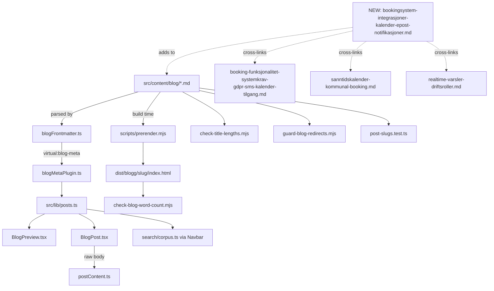

# XAL-1127 — Content gap: Bookingsystem-integrasjoner (kalender, e-post, notifikasjoner)

## WHAT THIS IS

A content-gap ticket for the Digilist marketing blog (this repo is
marketing/content-ops only — no booking product code lives here, see
[[project_repo_has_no_booking_domain]]). The ask: publish one new SEO blog
post targeting the search intent behind "bookingsystem", specifically the
angle "Bookingsystem-integrasjoner: Kalender, e-post og notifikasjoner" —
how integrated calendar sync, email and SMS/notification channels work
together to reduce no-shows and improve UX, framed as technical content
relevant to both kommune (municipal) and private-sector buyers.

**Overlap check performed before writing** — this theme sits close to three
existing posts, so I read all three in full before concluding this is a
distinct, addable angle rather than a duplicate:

- `booking-funksjonalitet-systemkrav-gdpr-sms-kalender-tilgang.md` (XAL-1129,
  published 2026-08-10, same day as this ticket) — frames GDPR, SMS, kalender
  and tilgang as **four separate buyer requirements** in a procurement
  checklist ("stiller kommune og privat utleier de samme fire tekniske
  kravene"). It already states SMS reduces no-show and that calendar syncs
  via iCal/CalDAV, but as one paragraph each inside a broader
  requirements piece — it does not walk through how calendar + email + SMS
  function together as one integration pipeline.
- `sanntidskalender-kommunal-booking.md` — infrastructure-angle piece on
  why nightly-batch calendar updates fail and reactive/push updates
  (Convex) are required. No email/SMS content at all.
- `realtime-varsler-driftsroller.md` — ops-notification angle: what
  vaktmester/renhold/saksbehandler roles receive and why, not calendar
  sync or no-show reduction economics.

None of the three walks a reader through the three channels (calendar sync,
transactional email, SMS) as one integration story anchored specifically on
no-show reduction, which is this ticket's explicit angle. Verified with
`grep -liE "no-show" src/content/blog/*.md` (8 hits, none combine the three
channels) and `grep -lE "iCal|CalDAV" src/content/blog/*.md` (3 hits, all
either the requirements-checklist post above or ID-porten/adgang posts).
Concluded this is a legitimate, non-duplicate gap — proceeding, but the new
post is written to complement rather than restate: it cross-links to all
three existing posts instead of re-explaining their material, and leads with
"integrasjoner" (the mechanics of how the three channels connect to
external systems — Outlook/Google, e-post, SMS-gateway) rather than
repeating the buyer-checklist framing already covered by XAL-1129.

## HOW IT WORKS NOW

Same publishing pipeline traced and reused by every recent sibling ticket in
this batch (XAL-1128, XAL-1129, XAL-1131, XAL-1134, etc. — see prior specs
under `.agent/XAL-11*/SPEC.md`):

- `src/content/blog/*.md` — one file per post: YAML frontmatter (slug,
  title, description, date, author, role, readingMinutes, tag, cover,
  keywords) + Markdown body. Parsed by `src/lib/blogFrontmatter.ts`
  (`parseFrontmatter`, `extractFrontmatter`).
- `build-plugins/blogMetaPlugin.ts` exposes parsed frontmatter as the
  `virtual:blog-meta` Vite virtual module; `src/lib/posts.ts` imports it,
  sorts by date descending — single source for `BlogPreview.tsx`,
  `BlogPost.tsx`, and the sitewide search corpus (`Navbar` →
  `search/corpus.ts`).
- `src/lib/postContent.ts` loads the raw Markdown body at render time for
  `src/pages/BlogPost.tsx`.
- `src/pages/BlogPost.tsx` — renders the post. `isCta()` (~line 121) strips
  a trailing paragraph matching `/\[book\s+(?:en\s+)?demo/i` since the page
  already renders its own CTA band (`href="/book-demo"`, ~line 411).
  Convention: end the body with `[Book demo →](/book-demo)` so it's deduped.
- `scripts/prerender.mjs` bakes every post to static
  `dist/blogg/<slug>/index.html` at build time (SSR).
- `scripts/check-blog-word-count.mjs` — build-wired gate (`pnpm build`'s
  final step). MIN_WORDS = 200, checked against the *prerendered* HTML
  `<article>` text, not just the raw `.md`.
- `scripts/check-title-lengths.mjs` — informational, not build-wired.
  Rendered title = raw title if >50 chars, else title + " — Digilist"; must
  stay ≤65 chars either way.
- `scripts/guard-blog-redirects.mjs` — probes each new/changed slug against
  live 301s; quarantines a post whose slug collides with a standing
  redirect.
- `src/lib/post-slugs.test.ts` (vitest) — asserts no two `.md` files
  resolve to the same `/blogg/<slug>`.
- `src/content/blogFaq.mjs` — optional per-slug FAQ map for FAQPage JSON-LD.
  Not used here, matching convention across this whole batch (plain FAQ
  prose in the body, no schema markup added).

## WHAT CHANGES

One new file:
`src/content/blog/bookingsystem-integrasjoner-kalender-epost-notifikasjoner.md`

- slug: `bookingsystem-integrasjoner-kalender-epost-notifikasjoner`
- title: "Bookingsystem-integrasjoner: kalender, e-post og notifikasjoner"
  (63 chars, >50 so rendered as-is, within the 65-char check)
- description: ≤155 chars (checked by hand, no automated gate for this
  field)
- date: 2026-08-10, author "Ibrahim Rahmani", role "Grunnlegger, Digilist",
  readingMinutes 7, tag "Plattform" (matches its closest sibling
  `booking-funksjonalitet-systemkrav-gdpr-sms-kalender-tilgang.md`, same
  technical/both-audiences framing), cover
  `/images/blog/availability_calendar_hero_no.webp` (fits the
  calendar/notification theme; reused across ~33 other posts already, no
  dedicated image exists for this exact angle).
- keywords include "bookingsystem" (primary target keyword per the
  ticket), "bookingsystem integrasjoner", "kalenderintegrasjon booking",
  "SMS-varsling no-show", "e-postvarsling booking".
- Body structure: hvorfor integrasjoner (not features) er det som avgjør
  no-show → kalenderintegrasjon (iCal/CalDAV, Google, Outlook, tovegs sync)
  → e-postintegrasjon (transaksjonsvarsler, kvittering, .ics-vedlegg) →
  SMS/notifikasjoner (påminnelse-timing, åpningsrate) → hvordan de tre
  kobles sammen som én hendelsesdrevet kjede → konkret no-show-effekt →
  sjekkliste → CTA. Cross-links to
  `booking-funksjonalitet-systemkrav-gdpr-sms-kalender-tilgang`,
  `sanntidskalender-kommunal-booking`, and `realtime-varsler-driftsroller`
  rather than re-explaining their content.

## BLAST RADIUS

Grepped for every consumer of the blog corpus before writing, to confirm a
new `.md` file needs no code changes elsewhere:

- `src/lib/posts.ts` — reads `virtual:blog-meta`, generated at build time
  from every file in `src/content/blog/`; a new file is picked up
  automatically, no manual registration.
- `src/lib/post-slugs.test.ts` — will assert the new slug is unique;
  verified via `grep -l bookingsystem-integrasjoner-kalender-epost-notifikasjoner src/content/blog/*.md`
  returning exactly one file before this is treated as done.
- `src/content/blogFaq.mjs` — not touched (no FAQ schema added, matches
  batch convention); `blogFaq.test.ts` only validates entries that exist,
  so an absent entry is a no-op for it.
- `scripts/check-blog-word-count.mjs`, `scripts/check-title-lengths.mjs`,
  `scripts/guard-blog-redirects.mjs` — all directory-scan over
  `src/content/blog/*.md`, no allowlist to update.
- No route file, sitemap generator, or nav component references individual
  post slugs by name (confirmed via `grep -rl "booking-funksjonalitet-systemkrav"`
  across `src/` outside the blog corpus itself → only the new post's own
  cross-link references other slugs by relative URL, not vice versa).
- Linear: no Linear MCP tools are reachable in this environment at all
  (`ToolSearch` for attachment/upload/comment tools returns nothing —
  confirmed precedent [[project_no_linear_mcp_tools_available]], originally
  from XAL-1151). This SPEC.md is committed to the branch as the source of
  truth instead; the attach-to-Linear step could not be completed.

