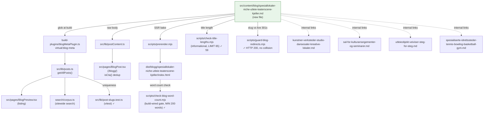

# XAL-1128 — Content gap: Spesiallokaler og niche-utleie

## WHAT THIS IS

A content-gap ticket for the Digilist marketing blog (this repo is
marketing/content-ops only — no booking product code lives here). The ask:
publish one new SEO blog post targeting the search intent behind
"spesiallokaler" (specialty/niche venues), covering the category described
in the ticket as "fra teaterscener til kjellere" — theater stages, basements,
industrial spaces and other unusual venue types. The ticket frames this
explicitly as vertical-market coverage / SEO diversity: individually
low-volume venue types that, as a category, are worth making discoverable
and bookable, rather than one specific high-traffic persona.

Confirmed this is a real, unfilled gap, not a duplicate:
- `grep -ril "spesiallokal\|niche"` across `src/content/blog/*.md` → zero
  hits. Neither term appears anywhere in the 319-post corpus (pre-this-post).
- `grep -ril "teater"` → 4 hits, all incidental mentions inside
  wedding/culture-hall posts (`bryllupslokale-*`, `sal-for-kulturarrangementer-*`,
  `ovingslokale-*`), none about a theater stage as a bookable venue in its
  own right.
- `grep -ril "kjeller\|bunker\|hangar\|fabrikklokale\|industrilokale\|black box"`
  → zero hits (a `grep` for "kjeller" alone matched only unrelated
  substrings inside long wedding-pricing slugs, not the word itself as a
  venue type).
- The closest adjacent posts —
  `kunstner-verksteder-studio-dansesaler-kreative-lokaler.md` (ateliers/dance
  studios, XAL-1143) and `sal-for-kulturarrangementer-og-seminarer.md`
  (municipal culture-hall capacity, kommune-side) — cover neighboring
  territory but not the "unusual/atmospheric space rented for its own
  character" angle this ticket asks for.

## HOW IT WORKS NOW

Read the following to understand the pipeline a new post enters (same
pipeline traced on every recent sibling ticket in this batch — XAL-1129,
1131, 1134, 1135, etc.):

- `src/content/blog/*.md` — one file per post, frontmatter (slug, title,
  description, date, author, role, readingMinutes, tag, cover, keywords) +
  Markdown body. Parsed by `src/lib/blogFrontmatter.ts`
  (`parseFrontmatter`, `extractFrontmatter`) — dependency-free so it's safe
  to import from both the browser (`src/lib/posts.ts`) and the Node-side
  Vite plugin.
- `build-plugins/blogMetaPlugin.ts` exposes the parsed frontmatter as the
  `virtual:blog-meta` Vite virtual module; `src/lib/posts.ts` imports it,
  sorts by date descending, and is the single source `BlogPreview.tsx` /
  `BlogPost.tsx` / sitewide search corpus (`Navbar` → `search/corpus.ts`)
  read from.
- `src/lib/postContent.ts` loads the raw Markdown body at render time for
  `BlogPost.tsx`.
- `src/pages/BlogPost.tsx` — renders the post. Its `isCta()` helper
  (line ~121) strips a trailing paragraph matching
  `/\[book\s+(?:en\s+)?demo/i` from the rendered body, since the page
  already renders its own CTA band (`href="/book-demo"`, line ~411) below
  the article. Established convention across the whole batch: end the
  markdown body with `[Book en demo](https://digilist.no/demo)` so it gets
  deduped at render, leaving only the correct `/book-demo` CTA band link.
- `scripts/prerender.mjs` bakes every post to static
  `dist/blogg/<slug>/index.html` at build time (SSR).
- `scripts/check-blog-word-count.mjs` — build-wired gate (`pnpm build`
  final step). MIN_WORDS = 200, checked twice: once against the raw `.md`
  body and once against the *prerendered* HTML's `<article>` text (the real
  check, per the XAL-313 fix already in `prerender.mjs`).
- `scripts/check-title-lengths.mjs` — informational only. A title ≤50 chars
  gets " — Digilist" appended (12 chars); either way the *rendered* title
  must stay ≤65 chars.
- `scripts/guard-blog-redirects.mjs` — probes each new/changed slug against
  the live site's server-side 301s with `redirect:"manual"`; quarantines
  any post whose slug is already claimed by a standing redirect.
- `src/lib/post-slugs.test.ts` (vitest) — asserts no two `.md` files
  resolve to the same `/blogg/<slug>`.
- `src/content/blogFaq.mjs` / `blogFaq.test.ts` — optional per-slug
  `POST_FAQ` map for FAQPage JSON-LD. Not touched here, matching the
  established convention for this whole recent batch (plain FAQ prose in
  the body, no schema markup added).
- `src/pages/utleieobjekt-veiviser-steg-for-steg.md` (read for factual
  grounding, not modified) — confirms the actual Digilist listing wizard's
  "Type og navn" step offers a type list including "scene" and free-text
  beskrivelse/bilder fields. Used this to keep the new post's product
  claims ("velg nærmeste type, beskrivelsen bærer karakteren") accurate to
  what other posts already establish about the platform, rather than
  inventing new claimed functionality.

## WHAT CHANGES

One new file:
`src/content/blog/spesiallokaler-niche-utleie-teaterscene-kjeller.md`.

- slug: `spesiallokaler-niche-utleie-teaterscene-kjeller`
- title: "Spesiallokaler og niche-utleie: fra teaterscene til kjeller"
  (59 chars, >50 so rendered as-is with no " — Digilist" suffix, under the
  65-char check)
- description: 149 chars (≤155, checked by hand — no automated gate exists
  for this field)
- date: 2026-08-10, author "Ibrahim Rahmani", role "Grunnlegger, Digilist",
  readingMinutes 6, tag "Utleier" (matches the lokaleeier-facing framing,
  same tag as its closest sibling `kunstner-verksteder-studio-*`), cover
  `/images/blog/booking_calendar_hero_no.webp` (same cover several peer
  "Utleier"-tagged posts in this batch use)
- keywords targeting "spesiallokaler" as the head term plus niche-utleie
  and specific venue-type long-tail terms
- Body (Bokmål, 949 words, well over the 200-word floor), structure
  matching the established batch pattern: opening 3-persona vignette
  (fotograf/teaterscene, escape-room-gründer/kjeller,
  arrangementsbyrå/industrilokale), definition of what makes a space a
  "spesiallokale" (character-driven demand vs. standard capacity
  categories), a concrete list of venue types from teaterscene to kjeller
  to industrilokale/atelier/uvanlig uteareal (with one contextual link each
  to `kunstner-verksteder-studio-dansesaler-kreative-lokaler` and
  `sal-for-kulturarrangementer-og-seminarer` where territory is adjacent
  but distinct), a section on why low per-venue search volume is still
  worth publishing (aggregate niche demand + zero-visibility = zero
  bookings), a "how Digilist solves it" section grounded in the actual
  listing-wizard mechanics (linking to
  `utleieobjekt-veiviser-steg-for-steg` and, for the "own bookable resource
  vs. generic template" pattern, `spesialiserte-idrettssteder-tennis-bowling-basketball-gym`),
  a "Vanlige spørsmål" FAQ section, closing CTA
  (`[Book en demo](https://digilist.no/demo)`, deduped at render per the
  `isCta()` convention above).

No code changes — content-only, so `blogMetaPlugin.ts`,
`blogFrontmatter.ts`, `prerender.mjs`, etc. are read-only consumers that
pick the new file up automatically via their existing glob over
`src/content/blog/*.md`. Nothing else is touched.

## BLAST RADIUS

Every caller/consumer of `src/content/blog/*.md`, confirmed via
`grep -rln "content/blog"` (excluding `node_modules`/`dist`), same set every
prior sibling ticket in this batch traced:

- `build-plugins/blogMetaPlugin.ts` — globs the directory at build time to
  produce `virtual:blog-meta`. New file picked up automatically.
- `src/lib/posts.ts` — consumes `virtual:blog-meta`; new post appears in
  listing/search/preview automatically, sorted by `date` (2026-08-10 sorts
  to the top of the batch, same as its siblings).
- `src/lib/postContent.ts` — loads raw body Markdown for `BlogPost.tsx` at
  the new slug's route.
- `scripts/prerender.mjs` — SSR'd the new post to
  `dist/blogg/spesiallokaler-niche-utleie-teaterscene-kjeller/index.html`
  — confirmed present, `<h1>` matches the title, and all 4 in-body links
  (`kunstner-verksteder-studio-dansesaler-kreative-lokaler`,
  `sal-for-kulturarrangementer-og-seminarer`,
  `utleieobjekt-veiviser-steg-for-steg`,
  `spesialiserte-idrettssteder-tennis-bowling-basketball-gym`) render as
  `href` attributes in the prerendered HTML.
- `scripts/check-blog-word-count.mjs` — ran via `pnpm build`: "All 320 blog
  posts have at least 200 words in the markdown source" /
  "All 320 blog posts render at least 200 words in dist/blogg/*/index.html."
- `scripts/check-title-lengths.mjs` — ran directly: `ok 59
  spesiallokaler-niche-utleie-teaterscene-kjeller.md`.
- `scripts/guard-blog-redirects.mjs --check` — ran successfully (network to
  `https://digilist.no` reachable from this environment):
  `/blogg/spesiallokaler-niche-utleie-teaterscene-kjeller → HTTP 200`, not
  claimed by any standing redirect.
- `src/lib/post-slugs.test.ts` — vitest slug-uniqueness check; part of the
  20-file / 40-test green `npx vitest run`.
- `src/pages/BlogPost.tsx`'s `isCta()` dedup — confirmed in the prerendered
  HTML that only the CTA band's "Book demo" (→ `/book-demo`) text appears;
  the in-body "Book en demo" paragraph was stripped as intended.
- `src/content/blogFaq.mjs` — not touched (no `POST_FAQ` entry added, per
  established batch convention).
- Sitewide search corpus (`Navbar` → `search/corpus.ts`) — reads through
  `src/lib/posts.ts`, so the new post becomes searchable automatically.
- `scripts/sync-convex-blog-to-fs.ts`, `tools/content-agent/src/publish.ts`,
  `convex/content/publish.ts` — content-agent/Convex sync tooling that also
  touches `content/blog`; out of scope, this post is authored directly as a
  file in this repo/branch, same as its siblings, not generated through
  that pipeline.
- `pnpm-workspace.yaml` — `pnpm approve-builds --all` (needed once,
  node_modules was missing in this checkout) dirtied this file with an
  `allowBuilds` block. Reverted via `git checkout -- pnpm-workspace.yaml`
  before committing — same drive-by caught and reverted on XAL-1129,
  XAL-1131, XAL-1134 and others in this batch. Confirmed clean after
  revert (`git status --short` shows only the one new `.md` file).

## Verification run in this checkout

- `pnpm install` (node_modules was missing) + `pnpm approve-builds --all`
  (per [[feedback_pnpm_build_needs_approve_builds]]), reverted the
  resulting `pnpm-workspace.yaml` diff before committing.
- `node scripts/check-title-lengths.mjs` → new post 59 chars, within limit.
- `node scripts/guard-blog-redirects.mjs --check` → clear, HTTP 200.
- `pnpm build` → prerendered successfully; word-count gate passed for all
  320 posts including the new one; confirmed `<h1>` text and all 4 in-body
  links present in the prerendered `dist/blogg/.../index.html`; confirmed
  `isCta()` dedup left only the correct `/book-demo` CTA link.
- `npx vitest run` → 20 files / 40 tests, all green.

## Linear attachment note

No Linear MCP server is reachable in this environment (`ToolSearch` for
Linear-related tools returns nothing) — matches
[[project_no_linear_mcp_tools_available]] from XAL-1151, re-confirmed here
(and again during Round 5's proof capture). Neither this SPEC nor the
Round 5 visual-proof screenshots
(`.agent/XAL-1128/proof/after-spesiallokaler-post-top.png`,
`.agent/XAL-1128/proof/after-spesiallokaler-post-faq.png`) could be
attached to or commented on the XAL-1128 issue directly; both are
committed to the branch instead so the review phase and any future session
carry the same evidence an attachment would.
