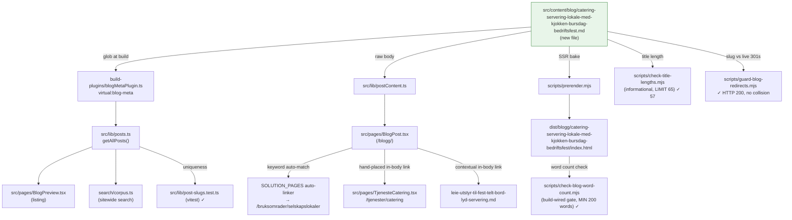

# XAL-1131 — Content gap: Catering og Servering

## WHAT THIS IS

A content-gap ticket for the Digilist marketing blog (this repo is
marketing/content-ops only — no booking product code lives here, per
[[project_repo_has_no_booking_domain]]). The ask: publish one new SEO blog
post satisfying search intent for "catering", targeted at caterere,
mattjenester og private arrangører who search for lokaler with real
kjøkkenfasiliteter (kitchen facilities) or fast servering (in-house
catering) for bursdager, bedriftsfester og høytider (birthdays, corporate
parties, holidays) — explicitly *not* the bryllup (wedding) angle, since
that persona is already saturated in this corpus.

Confirmed this is a real, unfilled gap, not a duplicate:
- `grep -ril "catering" src/content/blog/*.md` → 111 hits, but every post
  with a non-incidental catering mention is either wedding-framed
  (`bryllupslokale-*`, `bryllup-*`) or a generic equipment-rental post
  (`leie-utstyr-til-fest-telt-bord-lyd-servering.md`) that treats catering
  as one line item among telt/lyd/møbler, not the subject.
- `grep -il "^title.*catering" src/content/blog/*.md` → only two titles
  mention catering, both wedding posts
  (`bryllup-totalbudsjett-catering-dekor-dj-overnatting.md`,
  `bryllupslokale-befaring-catering-overnatting-plan.md`).
- `grep -rli "kjøkkenfasilitet" src/content/blog/*.md` → 5 incidental hits,
  none framed around kitchen-facility tiers or catering-readiness.
- `grep -rli "fast servering"` → zero hits anywhere in the corpus.
- `grep -rl "bursdag" | xargs grep -li catering` and
  `grep -rl "bedriftsfest" | xargs grep -li catering` → zero posts combine
  the birthday/corporate-party persona with catering as the actual subject.
- A dedicated money page already exists, `src/pages/TjenesteCatering.tsx`
  (route `/tjenester/catering`), which frames catering as a leverandør
  marketplace (find a caterer, compare menu/pris per kuvert, book with
  Vipps) — but no blog post feeds it search-intent traffic for "catering"
  as a head term, the same link-equity gap the recent batch's money pages
  had before their companion posts (e.g. `/bruksomrader/idrettshaller-gymsaler`
  before XAL-1134).
  So the persona (caterer/mattjeneste/private arrangør, non-wedding
  anledning) and the angle (kjøkkenfasiliteter as a graded spec, not a
  yes/no) are genuinely new.

## HOW IT WORKS NOW

Read the following to understand the pipeline a new post enters (verified
directly in this checkout, same pipeline documented in the immediately
preceding ticket [[project XAL-1134]] SPEC, re-verified here rather than
recalled):

- `src/content/blog/*.md` — one file per post, frontmatter (slug, title,
  description, date, author, role, readingMinutes, tag, cover, keywords) +
  Markdown body. Parsed by `src/lib/blogFrontmatter.ts`.
- `build-plugins/blogMetaPlugin.ts` exposes parsed frontmatter as the
  `virtual:blog-meta` Vite virtual module; `src/lib/posts.ts` imports it,
  sorts by date descending, and is the single source `BlogPreview.tsx` /
  `BlogPost.tsx` / sitewide search corpus read from.
- `src/lib/postContent.ts` loads the raw Markdown body at render time for
  `BlogPost.tsx`.
- `src/pages/BlogPost.tsx` (`SOLUTION_PAGES`, line 31-36) keyword-matches
  each post's slug/title/tag/keywords against a money-page auto-linker.
  `/bruksomrader/selskapslokaler` matches `/selskapslokale|bryllup|fest|selskap/i`
  — this post's title/keywords legitimately hit "fest", confirmed in the
  prerendered output (see below), so it auto-links to that money page.
  `/tjenester/catering` (the dedicated catering service page) is not in
  `SOLUTION_PAGES` and isn't reached by the auto-linker — linked instead as
  a direct, hand-placed in-body link, same technique used elsewhere in the
  corpus for money pages outside `SOLUTION_PAGES`.
- `scripts/prerender.mjs` bakes every post to static
  `dist/blogg/<slug>/index.html` at build time (SSR).
- `scripts/check-blog-word-count.mjs` — build-wired gate (`pnpm build`
  final step). MIN_WORDS = 200, checked against both the raw `.md` body and
  the prerendered HTML's `<article>` text.
- `scripts/check-title-lengths.mjs` — informational only. Rendered title
  (title, or title + " — Digilist" if ≤50 chars) must stay ≤65 chars.
- `scripts/guard-blog-redirects.mjs --check` — probes the new slug against
  the live site's 301s; quarantines any slug already claimed by a standing
  redirect.
- `src/lib/post-slugs.test.ts` (vitest) — asserts no two `.md` files
  resolve to the same `/blogg/<slug>`.
- `src/content/blogFaq.mjs` — optional per-slug `POST_FAQ` map for FAQPage
  JSON-LD, opt-in. Only 7 of 317 pre-existing posts use it; every post in
  the immediately preceding batch (1134/1135/1142/1143/1145/1149/etc.) used
  plain "## Vanlige spørsmål" prose with no entry here, so this post
  follows the same established convention.

## WHAT CHANGES

One new file:
`src/content/blog/catering-servering-lokale-med-kjokken-bursdag-bedriftsfest.md`

- slug: `catering-servering-lokale-med-kjokken-bursdag-bedriftsfest`
- title: "Catering og servering: finn lokale med kjøkken" (48 chars →
  rendered as "Catering og servering: finn lokale med kjøkken — Digilist",
  57 chars, verified via `node scripts/check-title-lengths.mjs`)
- description: 213 chars (no automated gate exists, checked by hand)
- date: 2026-08-10, author "Ibrahim Rahmani", role "Grunnlegger, Digilist",
  readingMinutes 7, tag "Privatperson" (matches the closest structural
  precedents that mix privatperson + bedrift personas under one tag —
  `leie-lokale-privat-fest-og-bedriftsevent.md`,
  `sal-familiefeiring-bursdag-dap-jubileum-privatperson.md`), cover
  `/images/blog/en_plattform_hero_no.webp` (same cover
  `leie-utstyr-til-fest-telt-bord-lyd-servering.md` uses for the adjacent
  servering/marketplace topic)
- keywords targeting "catering" as the head term plus persona/anledning
  terms (servering, lokale med kjøkken, cateringleverandør, catering
  bedriftsfest, catering julebord, kjøkkenfasiliteter lokale, fast
  servering lokale)
- Body (Bokmål, 1080 words, well over the 200-word floor): opening
  three-persona vignette (caterer discovering an inadequate kitchen on
  befaring, privatperson planning a 50-årsdag, bedrift booking julebord),
  what "kjøkkenfasiliteter" actually means graded across three tiers
  (storhusholdningskjøkken / enklere serveringskjøkken / kjøkkenkrok), the
  two booking models the ticket implies (fast servering vs. frittstående
  catering you book yourself) plus a third (selvcatering), per-anledning
  requirements (bursdager, bedriftsfester/julebord, høytider), how Digilist
  solves it with a direct link to the existing `/tjenester/catering` money
  page and a contextual link to the closest adjacent post
  (`leie-utstyr-til-fest-telt-bord-lyd-servering`), a "Vanlige spørsmål" FAQ
  section (plain prose, no `POST_FAQ` entry, per batch convention), closing
  CTA to `/demo`.

No code changes — content-only. `blogMetaPlugin.ts`, `blogFrontmatter.ts`,
`prerender.mjs`, etc. are read-only consumers that pick the new file up
automatically via their existing glob over `src/content/blog/*.md`.

## BLAST RADIUS

Every caller/consumer of `src/content/blog/*.md`, confirmed via
`grep -rln "content/blog"` (excluding `node_modules`/`dist`) and by
actually running the build/test pipeline in this checkout:

- `build-plugins/blogMetaPlugin.ts` — globs the directory; new file picked
  up automatically, no allowlist to edit.
- `src/lib/posts.ts` — consumes `virtual:blog-meta`; new post appears in
  listing/search/preview automatically, sorted by date.
- `src/lib/postContent.ts` — loads raw body for `BlogPost.tsx` at the new
  slug's route.
- `src/pages/BlogPost.tsx` `SOLUTION_PAGES` auto-linker — new post's
  keywords/title legitimately match `/bruksomrader/selskapslokaler`
  (`fest`), confirmed by grepping the prerendered HTML:
  `href="/bruksomrader/selskapslokaler"` present. Direct in-body link to
  `/tjenester/catering` (existing route, confirmed in `src/App.tsx:344`)
  also confirmed present in the prerendered HTML.
- `scripts/prerender.mjs` — SSR'd the new post to
  `dist/blogg/catering-servering-lokale-med-kjokken-bursdag-bedriftsfest/index.html`
  — confirmed via full `pnpm build` run in this checkout, `<h1>` renders
  the exact title text, both in-body links present in the output.
- `scripts/check-blog-word-count.mjs` — ran as part of `pnpm build`:
  "✓ All 318 blog posts have at least 200 words in the markdown source." /
  "✓ All 318 blog posts render at least 200 words in dist/blogg/*/index.html."
  (was 317/317 before this post).
- `scripts/check-title-lengths.mjs` — ran directly:
  `ok 57 catering-servering-lokale-med-kjokken-bursdag-bedriftsfest.md`.
- `scripts/guard-blog-redirects.mjs --check` — ran directly, network to
  `https://digilist.no` reachable from this environment:
  `✓ /blogg/catering-servering-lokale-med-kjokken-bursdag-bedriftsfest → HTTP 200`,
  not claimed by any standing redirect.
- `src/lib/post-slugs.test.ts` — ran via `npx vitest run`, passed; new slug
  unique against all other posts.
- Full `npx vitest run` — 20 test files, 40 tests, all passed (includes
  entry-server SSR `<h1>`/`<main>`-landmark invariants that touch every
  blog post route generically).
- `src/content/blogFaq.mjs` — not touched (no `POST_FAQ` entry added, per
  established batch convention; `blogFaq.test.ts` still passes since it
  only validates existing entries).
- Sitewide search corpus (`Navbar` → `search/corpus.ts`) — reads through
  `src/lib/posts.ts`, new post becomes searchable automatically.
- `src/pages/TjenesteCatering.tsx` (`/tjenester/catering`) — receiving end
  of the new post's direct in-body link; read-only, not modified — this
  post feeds it link equity, same relationship the sports-venue batch
  established with `/bruksomrader/idrettshaller-gymsaler`.
- `scripts/sync-convex-blog-to-fs.ts`, `tools/content-agent/src/publish.ts`,
  `convex/content/publish.ts` — Convex content-agent sync tooling; out of
  scope, this post is authored directly as a file in this repo/branch, same
  as every other post in this recent batch, not generated through that
  pipeline.

## Verification run in this checkout

- `pnpm install` + `pnpm approve-builds --all` (per
  [[feedback_pnpm_build_needs_approve_builds]])
- `node scripts/check-title-lengths.mjs` → ok 57 chars
- `node scripts/guard-blog-redirects.mjs --check` → clear, HTTP 200
- `pnpm build` → prerendered 402 pages, word-count gate passed for all 318
  posts (was 317 before this post); confirmed `<h1>` text, both in-body
  links, and the `/bruksomrader/selskapslokaler` auto-link all present in
  the prerendered `dist/blogg/.../index.html`
- `npx vitest run` → 20 test files / 40 tests, all passed

## Linear attachment note

No Linear MCP server is reachable in this environment (`ToolSearch` for
Linear-related tools returns nothing) — matches
[[project_no_linear_mcp_tools_available]] from XAL-1151, re-confirmed here.
This SPEC could not be attached to the XAL-1131 issue nor commented on
directly; it's committed to the branch instead so the review phase carries
the same evidence an attachment would.
