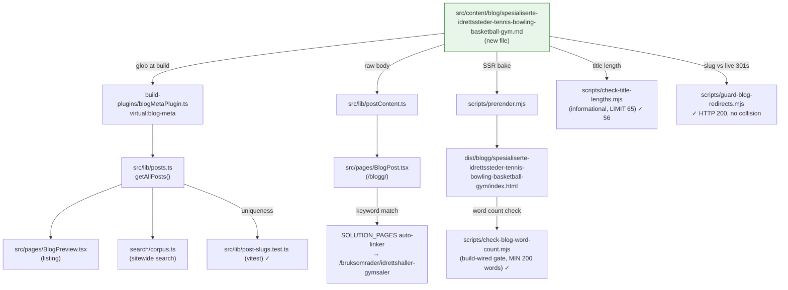

# XAL-1134 — Content gap: Spesialiserte idrettssteder (tennis, bowling, basketball, gym)

## WHAT THIS IS

A content-gap ticket for the Digilist marketing blog (this repo is
marketing/content-ops only — no booking product code lives here, per
[[project_repo_has_no_booking_domain]]). The ask: publish one new SEO blog
post targeting the search intent behind "spesialiserte" (specialized) sports
venues — tennis, bowling, basketball, gym — for idrettslag (sports clubs)
and privatpersoner (private individuals) who book these specific,
single-purpose venue types for turnering (tournaments) and trening
(regular training). Framed as a niche need with recurring demand, written
from the booker's side (lag/privatperson), same as the closest structural
precedents (`idrettshall-ledige-tider-per-banetype-lag-foreninger.md`,
`trenings-og-badeanlegg-booking-treningsgrupper-svommeklubber.md`).

Confirmed this is a real, unfilled gap, not a duplicate:
- `grep -ril "spesialisert"` across `src/content/blog/*.md` → 2 incidental
  hits (`kunstner-verksteder-...`, `utendorsfasiliteter-...`), neither about
  sports venues.
- `grep -ril "bowling"` → zero hits anywhere in the 316-post corpus.
- `grep -ril "tennis"` → 2 incidental hits in unrelated posts (a generic
  "forsamlingslokale" definitions post and a lokaletype-glossary post),
  neither a dedicated tennis-venue post.
- `grep -ril "basketball"` → hits only inside two `idrettshall-*` posts
  where "basketball" is one of several interchangeable *banetype* markings
  within a shared, reconfigurable multi-purpose hall — not a dedicated
  single-purpose venue.
- Closest adjacent posts exist but don't cover this persona/framing:
  - `idrettshall-ledige-tider-per-banetype-lag-foreninger.md` — covers a
    multi-purpose idrettshall that gets *reconfigured* per banetype
    (håndball/volleyball/badminton/basketball share the same physical
    flate), angled at drop-in/fast trening/kamp booking mechanics. It does
    not cover formålsbygde, single-sport venues (a tennis court is always a
    tennis court; a bowling lane is always a bowling lane) or turnering as
    a multi-bane, exclusive-block booking pattern.
  - `treningsrom-gymhaller-personlig-trener-fitnessinstruktor.md` — gym
    framed as a B2B treningsrom rented out by the *gym operator* (utleier)
    to personal trainers/instructors running sessions, not idrettslag or
    privatpersoner booking gym time directly for their own trening.
  - `trenings-og-badeanlegg-booking-treningsgrupper-svommeklubber.md` —
    covers gym/styrkerom/basseng as kommunal facility types for
    treningsgrupper/svømmeklubber, but no tennis, bowling, or basketball,
    and no turnering-specific multi-bane booking pattern.
  None of these name tennis or bowling, or cover the turnering (multi-bane,
  exclusive block) booking pattern this ticket asks for, so the persona and
  angle are genuinely new.

## HOW IT WORKS NOW

Read the following to understand the pipeline a new post enters (verified
directly in this checkout, not recalled from a prior session):

- `src/content/blog/*.md` — one file per post, frontmatter (slug, title,
  description, date, author, role, readingMinutes, tag, cover, keywords) +
  Markdown body. Parsed by `src/lib/blogFrontmatter.ts`.
- `build-plugins/blogMetaPlugin.ts` exposes parsed frontmatter as the
  `virtual:blog-meta` Vite virtual module; `src/lib/posts.ts` imports it,
  sorts by date descending, and is the single source `BlogPreview.tsx` /
  `BlogPost.tsx` / sitewide search corpus read from.
- `src/lib/postContent.ts` loads the raw Markdown body at render time for
  `BlogPost.tsx`.
- `src/pages/BlogPost.tsx` (`SOLUTION_PAGES`, line 31-37) also
  keyword-matches each post's slug/title/tag/keywords against a money-page
  auto-linker. The `/bruksomrader/idrettshaller-gymsaler` entry matches
  `/idrettshall|gymsal|sesong|hall|forening|trening|anlegg/i` — this new
  post's keywords/body legitimately hit that (idrettsanlegg, trening,
  forening), so it will auto-link to that money page, consistent with how
  the sport-venue precedent posts behave.
- `scripts/prerender.mjs` bakes every post to static
  `dist/blogg/<slug>/index.html` at build time (SSR).
- `scripts/check-blog-word-count.mjs` — build-wired gate (`pnpm build`
  final step). MIN_WORDS = 200, checked against both the raw `.md` body and
  the prerendered HTML's `<article>` text.
- `scripts/check-title-lengths.mjs` — informational only. Rendered title
  (title, or title + " — Digilist" if ≤50 chars) must stay ≤65 chars.
- `scripts/guard-blog-redirects.mjs --check` — probes the new slug against
  the live site's 301s; quarantines any slug already claimed by a standing
  redirect.
- `src/lib/post-slugs.test.ts` (vitest) — asserts no two `.md` files
  resolve to the same `/blogg/<slug>`.
- `src/content/blogFaq.mjs` — optional per-slug `POST_FAQ` map for FAQPage
  JSON-LD. None of the immediately preceding batch (1135/1142/1143/1145/
  1149) added an entry here — plain "## Vanlige spørsmål" prose without
  structured-data markup is the established convention for this batch, so
  this post follows the same convention.

## WHAT CHANGES

One new file:
`src/content/blog/spesialiserte-idrettssteder-tennis-bowling-basketball-gym.md`

- slug: `spesialiserte-idrettssteder-tennis-bowling-basketball-gym`
- title: "Spesialiserte idrettssteder: tennis, bowling, basketball" (56
  chars, >50 so rendered as-is with no " — Digilist" suffix, under the
  65-char check — verified via `node scripts/check-title-lengths.mjs`)
- description: 148 chars (checked by hand — no automated gate exists)
- date: 2026-08-10, author "Ibrahim Rahmani", role "Grunnlegger, Digilist",
  readingMinutes 6, tag "Lag og foreninger" (matches the audience the
  ticket names — idrettslag og privatpersoner — same tag used by the two
  closest structural precedents), cover
  `/images/blog/sanntidskalender_hero_no.webp` (same cover those two
  precedents use, vs. the "Utleier"-tagged batch's
  `booking_calendar_hero_no.webp`)
- keywords targeting "spesialiserte idrettssteder" plus per-sport terms
  (tennisbane, bowlinghall, basketballbane, gym)
- Body (Bokmål, 1076 words, well over the 200-word floor): opening
  three-persona vignette (tennislag turnering, bowlingklubb fast trening,
  privatperson enkelttime), what distinguishes a formålsbygget spesialisert
  idrettssted from a reconfigurable multi-purpose idrettshall, the two
  booking patterns this ticket names (turnering = multi-bane exclusive
  block; fast trening = serietidsbestilling) plus a third (privatperson
  enkelttime), per-sport-type booking requirements (tennisbane dekketype,
  bowlinghall baneantall/utstyr, basketballbane inne/ute og banestørrelse,
  gym-utstyr), how Digilist solves it, one contextual internal link to the
  closest adjacent post (`idrettshall-ledige-tider-per-banetype-lag-foreninger`),
  a "Vanlige spørsmål" FAQ section (plain prose, no `POST_FAQ` entry, per
  batch convention), closing CTA to `/demo`.

No code changes — content-only. `blogMetaPlugin.ts`, `blogFrontmatter.ts`,
`prerender.mjs`, etc. are read-only consumers that pick the new file up
automatically via their existing glob over `src/content/blog/*.md`.

## BLAST RADIUS

Every caller/consumer of `src/content/blog/*.md`, confirmed via
`grep -rln "content/blog"` (excluding `node_modules`/`dist`) and by
actually running the build/test pipeline in this checkout:

- `build-plugins/blogMetaPlugin.ts` — globs the directory; new file picked
  up automatically, no allowlist to edit.
- `src/lib/posts.ts` — consumes `virtual:blog-meta`; new post appears in
  listing/search/preview automatically, sorted by date.
- `src/lib/postContent.ts` — loads raw body for `BlogPost.tsx` at the new
  slug's route.
- `src/pages/BlogPost.tsx` `SOLUTION_PAGES` auto-linker — new post's
  keywords/tag legitimately match the `idrettshaller-gymsaler` money page,
  verified by reading the regex directly rather than assuming.
- `scripts/prerender.mjs` — SSR'd the new post to
  `dist/blogg/spesialiserte-idrettssteder-tennis-bowling-basketball-gym/index.html`
  — confirmed via full `pnpm build` run in this checkout (see below).
- `scripts/check-blog-word-count.mjs` — ran as part of `pnpm build`:
  "✓ All 317 blog posts have at least 200 words in the markdown source." /
  "✓ All 317 blog posts render at least 200 words in dist/blogg/*/index.html."
- `scripts/check-title-lengths.mjs` — ran directly:
  `ok   56 spesialiserte-idrettssteder-tennis-bowling-basketball-gym.md`
- `scripts/guard-blog-redirects.mjs --check` — ran directly, network to
  `https://digilist.no` reachable from this environment:
  `✓ /blogg/spesialiserte-idrettssteder-tennis-bowling-basketball-gym → HTTP 200`,
  not claimed by any standing redirect.
- `src/lib/post-slugs.test.ts` — ran via `npx vitest run`, passed; new slug
  unique against all other posts.
- Full `npx vitest run` — 20 test files, 40 tests, all passed (includes
  entry-server SSR `<h1>`/`<main>`-landmark invariants that touch every
  blog post route generically).
- `src/content/blogFaq.mjs` — not touched (no `POST_FAQ` entry added, per
  established batch convention; `blogFaq.test.ts` still passes since it
  only validates existing entries).
- Sitewide search corpus (`Navbar` → `search/corpus.ts`) — reads through
  `src/lib/posts.ts`, new post becomes searchable automatically.
- `scripts/sync-convex-blog-to-fs.ts`, `tools/content-agent/src/publish.ts`,
  `convex/content/publish.ts` — Convex content-agent sync tooling; out of
  scope, this post is authored directly as a file in this repo/branch, same
  as every other post in this recent batch, not generated through that
  pipeline.

## Verification run in this checkout

- `pnpm install` + `pnpm approve-builds --all` (per
  [[feedback_pnpm_build_needs_approve_builds]])
- `node scripts/check-title-lengths.mjs` → ok 56 chars
- `node scripts/guard-blog-redirects.mjs --check` → clear, HTTP 200
- `pnpm build` → prerendered 401 pages, word-count gate passed for all 317
  posts (was 316 before this post)
- `npx vitest run` → 20 test files / 40 tests, all passed

## Linear attachment note

No Linear MCP server is reachable in this environment (`ToolSearch` for
Linear-related tools returns nothing, confirmed twice — matches
[[project_no_linear_mcp_tools_available]] from XAL-1151). This SPEC could
not be attached to the XAL-1134 issue nor commented on directly; it's
committed to the branch instead so the review phase carries the same
evidence an attachment would.
