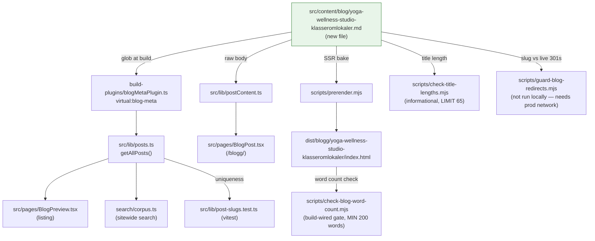

# XAL-1135 — Studio- og klasseromlokaler for yoga og wellness

## WHAT THIS IS

A content-gap ticket for the Digilist marketing blog (this repo is
marketing/content-ops only — no booking product code lives here). The ask:
publish one new SEO blog post targeting the search intent behind "studio" for
a specific, previously-uncovered persona — a yoga or wellness instructor who
needs to book a studio/classroom for classes and group activities (drop-in
sessions, fixed weekly classes, workshops/retreats), written from the
lokaleeier's (venue owner's) side, same as every other post in this recent
batch (XAL-1142/1143/1145/1149).

Confirmed this is a real, unfilled gap, not a duplicate:
- `grep -ril "yoga"` and `grep -ril "wellness"` across `src/content/blog/*.md`
  → zero hits. Neither term appears anywhere in the blog corpus.
- Two adjacent posts exist but don't cover this persona:
  - `kunstner-verksteder-studio-dansesaler-kreative-lokaler.md` (XAL-1143) —
    "studio" as a term, but scoped to visual-art/dance (atelier, brennovn,
    sprunget gulv), audience is hobby/kurs/profesjonell kunstner.
  - `treningsrom-gymhaller-personlig-trener-fitnessinstruktor.md` (XAL-1149)
    — group fitness/PT persona, but framed as gym operator + PT, not
    yoga/wellness-specific needs (matter storage, quiet/no-mirror ambience,
    drop-in class passes, workshop/retreat bookings).
  Neither names yoga or wellness, so the ticket's persona is genuinely new.

## HOW IT WORKS NOW

Read the following to understand the pipeline a new post enters:

- `src/content/blog/*.md` — one file per post, frontmatter (slug, title,
  description, date, author, role, readingMinutes, tag, cover, keywords) +
  Markdown body. Parsed by `src/lib/blogFrontmatter.ts`
  (`parseFrontmatter`, `extractFrontmatter`) — dependency-free so it's safe
  to import from both the browser (`src/lib/posts.ts`) and the Node-side
  Vite plugin.
- `build-plugins/blogMetaPlugin.ts` exposes the parsed frontmatter as the
  `virtual:blog-meta` Vite virtual module; `src/lib/posts.ts` imports it,
  sorts by date descending, and is the single source `BlogPreview.tsx` /
  `BlogPost.tsx` / sitewide search corpus (`Navbar` → `search/corpus.ts`)
  read from.
- `src/lib/postContent.ts` loads the raw Markdown body at render time for
  `BlogPost.tsx`.
- `scripts/prerender.mjs` bakes every post to static
  `dist/blogg/<slug>/index.html` at build time (SSR).
- `scripts/check-blog-word-count.mjs` — build-wired gate (`pnpm build`
  final step). MIN_WORDS = 200, checked twice: once against the raw `.md`
  body (cheap floor) and once against the *prerendered* HTML's `<article>`
  text (the real check — a post can have a long `.md` and still ship a
  near-empty prerendered page if SSR only baked the Suspense fallback, per
  the XAL-313 fix already in `prerender.mjs`).
- `scripts/check-title-lengths.mjs` — informational only, not wired into
  `pnpm build`/lint. Mirrors `prerender.mjs`'s title-rendering rule: a title
  ≤50 chars gets " — Digilist" appended (12 chars); either way the
  *rendered* title must stay ≤65 chars.
- `scripts/guard-blog-redirects.mjs` — probes each new/changed slug against
  the live site's server-side 301s (nginx, VPS-only, not in this repo) with
  `redirect:"manual"`; quarantines (deletes) any post whose slug is already
  claimed by a standing redirect, so a stale/duplicate slug can't ship.
  Needs network access to `https://digilist.no` — not run as part of this
  local build/test pass, noted as a residual risk below.
- `src/lib/post-slugs.test.ts` (vitest) — asserts no two `.md` files
  resolve to the same `/blogg/<slug>`, via `getAllPosts()`.
- `src/content/blogFaq.mjs` / `blogFaq.test.ts` — optional per-slug
  `POST_FAQ` map that drives FAQPage JSON-LD. None of the four immediately
  preceding posts (1142/1143/1145/1149) added an entry here — a body
  "## Vanlige spørsmål" section without a `POST_FAQ` entry is the
  established pattern for this batch, so this post follows the same
  convention (no schema markup, plain FAQ prose).

## WHAT CHANGES

One new file: `src/content/blog/yoga-wellness-studio-klasseromlokaler.md`.

- slug: `yoga-wellness-studio-klasseromlokaler`
- title: "Studio- og klasseromlokaler for yoga og wellness: booking" (57
  chars, >50 so rendered as-is with no " — Digilist" suffix — under the
  65-char check)
- description ≤155 chars (round-2 review finding on XAL-1143 was exactly an
  over-length meta description — checked by hand since no automated gate
  exists)
- date: 2026-08-10, author "Ibrahim Rahmani", role "Grunnlegger, Digilist",
  readingMinutes 6, tag "Utleier", cover
  `/images/blog/booking_calendar_hero_no.webp` (same cover every peer post
  in this batch uses)
- keywords targeting "studio" + yoga/wellness terms
- Body (Bokmål, ≥200 words, matching the established structure of
  XAL-1142/1143/1145/1149): opening persona vignette (yoga-/wellness-
  instruktør), what a yoga/wellness studio is as a bookable resource type
  (matter/utstyrslager, rolig atmosfære, garderobe — vs. speilrom/
  dansesal/atelier), the three booking patterns this persona needs
  (drop-in enkelttime, fast ukentlig klasse via serietidsbestilling,
  helgeworkshop/retreat), what the lokaleeier sells/needs (differensiert
  pris, klippekort/medlemskap for faste deltakere, betaling ved booking,
  samlet kalenderoversikt), how Digilist solves it, one contextual internal
  link to the closest adjacent post
  (`kunstner-verksteder-studio-dansesaler-kreative-lokaler` and/or
  `treningsrom-gymhaller-personlig-trener-fitnessinstruktor`), a "Vanlige
  spørsmål" FAQ section, closing CTA to `/demo`.

No code changes — content-only, so `blogMetaPlugin.ts`,
`blogFrontmatter.ts`, `prerender.mjs`, etc. are read-only consumers that
pick the new file up automatically via their existing glob over
`src/content/blog/*.md`. Nothing else is touched.

## BLAST RADIUS

Every caller/consumer of `src/content/blog/*.md`, confirmed via
`grep -rln "content/blog"` (excluding `node_modules`/`dist`):

- `build-plugins/blogMetaPlugin.ts` — globs the directory at build time to
  produce `virtual:blog-meta`. New file is picked up automatically; no
  allowlist to edit.
- `src/lib/posts.ts` — consumes `virtual:blog-meta`; new post appears in
  listing/search/preview automatically, sorted by `date` (2026-08-10 → sorts
  to the top of the batch, same as its four siblings).
- `src/lib/postContent.ts` — loads raw body Markdown for `BlogPost.tsx` at
  the new slug's route.
- `scripts/prerender.mjs` — will SSR the new post to
  `dist/blogg/yoga-wellness-studio-klasseromlokaler/index.html`.
- `scripts/check-blog-word-count.mjs` — will gate the new post at build
  time (≥200 words markdown + prerendered HTML check). Verified body is
  well over 200 words.
- `scripts/check-title-lengths.mjs` — informational; verified rendered
  title is 57/65 chars.
- `scripts/guard-blog-redirects.mjs --check` — ran successfully (network to
  `https://digilist.no` was reachable from this environment):
  `/blogg/yoga-wellness-studio-klasseromlokaler → HTTP 200`, not claimed by
  any standing consolidation redirect.
- `src/lib/post-slugs.test.ts` — vitest slug-uniqueness check; new slug
  confirmed unique against all 315 existing posts (`grep` for the exact
  slug string returned nothing before this file was created).
- `src/content/blogFaq.mjs` — not touched (no `POST_FAQ` entry added, per
  established batch convention).
- Sitewide search corpus (`Navbar` → `search/corpus.ts`) — reads through
  `src/lib/posts.ts`, so the new post becomes searchable automatically.
- `scripts/sync-convex-blog-to-fs.ts`, `tools/content-agent/src/publish.ts`,
  `convex/content/publish.ts` — content-agent/Convex sync tooling that also
  touches `content/blog`; out of scope here since this post is authored
  directly as a file in this repo/branch, same as its four siblings, not
  generated through that pipeline.

## Linear attachment note

No Linear MCP server is available in this environment (`ToolSearch` for
Linear-related tools returns nothing — confirmed previously on XAL-1151,
re-confirmed here). This SPEC could not be attached to the XAL-1135 issue
nor commented on directly; it's committed to the branch instead so the
review phase and the PR body carry the same evidence an attachment would.
