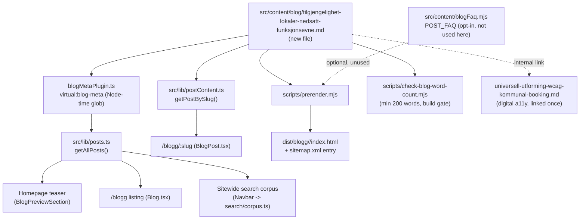

# XAL-1142: Content gap — Tilgjengelighet for mennesker med nedsatt funksjonsevne

## WHAT THIS IS

A new Norwegian Bokmål blog post that fills a confirmed content gap: no
existing post on `digilist.no` covers the **physical accessibility of a
bookable venue** (rullestoltilgang, trinnfri adkomst, tilgjengelig toalett,
teleslynge, HC-parkering) as its own subject, framed around the two legal
obligations the ticket names — inclusion and the **legal requirements for
public and commercial venues** — and how a lokaleeier documents and surfaces
that information so a booker can filter and trust it before showing up. The
persona is the **operator** (kommune og privat/kommersiell lokaleeier) who
must both comply with the law and make compliance visible and searchable in
the booking flow, matching how sibling gap-fill posts (XAL-1149 treningsrom,
XAL-1145 teambuilding, XAL-1143 kunstner-verksteder) are written for the
person who owns/administers the space.

Note on terminology: Norwegian "tilgjengelighet" is overloaded in this
codebase — most existing hits mean **calendar availability** ("ledig
tid"), not **accessibility for disabled people**. This post is explicitly
about the latter (fysisk tilgjengelighet / universell utforming av
lokaler), distinct from `tilgjengelighetskalender-innbygger.md` (calendar
UX) and from `universell-utforming-wcag-kommunal-booking.md` (WCAG 2.1 AA
compliance of the *booking website itself*, a digital-accessibility topic,
not the physical venue).

## HOW IT WORKS NOW (files/functions read)

- `package.json` — `"build"` script: `vite build && vite build --ssr
  src/entry-server.tsx --outDir dist-server ... && node
  scripts/prerender.mjs && node scripts/check-blog-word-count.mjs`. No
  dedicated typecheck/lint gate for content; content is verified by building
  and by `pnpm test` (vitest).
- `src/lib/blogFrontmatter.ts` — defines `BlogFrontmatter` (`slug, title,
  description, date, updated?, author, role?, readingMinutes?, tag?, cover?,
  keywords?[]`) and a hand-rolled `parseFrontmatter`/`extractFrontmatter`
  parser shared by the browser (`src/lib/posts.ts`) and the Node-time Vite
  plugin.
- `build-plugins/blogMetaPlugin.ts` — the `virtual:blog-meta` Vite plugin
  (imported by `vite.config.ts:5,25`), globs `src/content/blog/*.md` at
  build time in Node and extracts only the frontmatter, keeping article
  bodies out of the browser bundle.
- `src/lib/posts.ts` — imports `virtual:blog-meta`, exposes `getAllPosts()`.
  Feeds the homepage teaser (`BlogPreviewSection`), the `/blogg` listing,
  and the sitewide search corpus (`Navbar` → `search/corpus.ts`). A new file
  with valid frontmatter is picked up automatically, no registration step.
- `src/lib/postContent.ts` — separate `import.meta.glob(..., {query:
  "?raw", eager: true})` of the same directory, parses frontmatter again and
  maps `slug → body markdown`. Only imported by `BlogPost.tsx` (article
  page).
- `scripts/prerender.mjs` — reads `src/content/blog/*.md` off disk directly,
  renders each post to static HTML at `dist/blogg/<slug>/index.html`, adds a
  sitemap entry, and optionally emits FAQPage JSON-LD via
  `POST_FAQ[post.slug]` in `src/content/blogFaq.mjs` (opt-in — sibling posts
  XAL-1143/1145/1149 all shipped without registering there, so this is not
  required for a plain gap-fill post).
- `scripts/check-blog-word-count.mjs` — build-time `content.thin` guard:
  fails if a post's rendered body is under 200 words.
- `scripts/check-title-lengths.mjs` — informational only, flags rendered
  titles over 65 chars.
- `scripts/guard-blog-redirects.mjs` — only fires on removed/renamed slugs;
  a pure addition doesn't trigger it.
- Confirmed the gap is real via:
  - `grep -rli "TEK17\|diskriminerings- og tilgjengelighetsloven\|teleslynge\|rullestolrampe\|tilgjengelighetskrav\|HC-toalett" src/content/blog/*.md`
    → **zero hits**. No post frames physical venue accessibility as a legal
    requirement or names the governing law.
  - `grep -n "trinnfri\|rullestol\|tilgjengelig toalett\|teleslynge\|nedsatt" src/content/blog/*.md`
    → 6 hits, each a single sentence/bullet inside a broader checklist post
    (`leie-lokale-sammenligne-egenskaper-kapasitet-utstyr.md`,
    `m-terom.md`, `ledige-moterom-i-kommunen.md`,
    `bryllupslokale-guide-kapasitet-ledighet-og-krav.md`,
    `leie-sal-kommune-typer-pris-guide.md`,
    `leie-bryllupslokale-beliggenhet-regnplan-tilgjengelighet.md`). None
    treats accessibility as its own topic, names the legal basis, or is
    written for the operator who has to document/market it.
  - Read `universell-utforming-wcag-kommunal-booking.md` in full: it is
    about **WCAG 2.1 AA compliance of the Digilist booking website itself**
    (skjermleser, tastaturnavigasjon, kontrast) under Likestillings- og
    diskrimineringsloven §17a — a digital-accessibility topic, not the
    physical accessibility of the venues being booked. This post is the
    deliberate physical-venue complement and links to it once for the
    reader who also wants the digital-accessibility angle.
  - Read `tilgjengelighetskalender-innbygger.md` in full: confirmed it means
    calendar *availability* UX, unrelated to disability accessibility.

## WHAT CHANGES

- Add one new file:
  `src/content/blog/tilgjengelighet-lokaler-nedsatt-funksjonsevne.md`.
  - `tag: "Utleier"` — matches the operator persona (kommune og
    privat/kommersiell lokaleeier deciding how to document and surface
    accessibility), consistent with how XAL-1149/1145/1143 used `Utleier`
    for the same shape of ticket.
  - `cover: "/images/blog/accessibility_hero_no.webp"` — reused from the
    WCAG post; this repo reuses cover images across many posts (5 posts
    already share this exact cover).
  - Targets `tilgjengelighet` as the primary keyword (per the ticket's
    stated SEO goal), plus `tilgjengelighet lokaler`, `nedsatt
    funksjonsevne`, `universell utforming lokale`, `tilgjengelighetskrav
    booking`, `rullestoltilgang lokale`.
  - Covers, per the ticket: what "tilgjengelighetskrav" means for a
    bookable lokale in practice (trinnfri adkomst, rullestolrampe, HC-
    toalett, teleslynge, bredde på dører/åpninger, HC-parkering); the legal
    basis and why it differs for offentlige lokaler (plikt etter
    diskriminerings- og tilgjengelighetsloven / TEK17 §12) versus
    kommersielle lokaler (byggteknisk krav ved nybygg/hovedombygging, pluss
    forbud mot diskriminering i tilgang til tjenester); why this matters for
    inclusion, not only compliance; and how a lokaleeier gjør denne
    informasjonen bookbar og filtrerbar i Digilist i stedet for å la den
    forsvinne i en e-postutveksling eller en visning på stedet.
  - No other files touched. All build/render consumers of
    `src/content/blog/*.md` key off the directory generically, so a new
    well-formed file is a strict addition.

## BLAST RADIUS (callers/consumers of `src/content/blog/*.md`, grepped)

```
build-plugins/blogMetaPlugin.ts   -> virtual:blog-meta (Node-time glob)  -> src/lib/posts.ts
src/lib/posts.ts    (getAllPosts) -> homepage teaser (BlogPreviewSection), /blogg listing (Blog.tsx), search corpus (Navbar -> search/corpus.ts)
src/lib/postContent.ts            -> import.meta.glob raw, eager         -> BlogPost.tsx (article page body)
scripts/prerender.mjs             -> fs.readdir/readFile on the directory -> dist/blogg/<slug>/index.html, sitemap.xml
scripts/check-blog-word-count.mjs -> same directory                      -> build-time content.thin guard (min 200 words)
scripts/check-title-lengths.mjs   -> same directory                      -> informational title-length report (not a build gate)
scripts/guard-blog-redirects.mjs  -> git status on the directory         -> only fires on removed/renamed slugs
src/content/blogFaq.mjs           -> POST_FAQ[slug], opt-in              -> FAQPage JSON-LD in prerender + BlogPost.tsx (not used here, matching siblings)
```

None of the eight consumers hard-code a slug list; all key off directory
contents. Adding one file with valid frontmatter requires no other edits.



## Verdict

Ticket is valid and not already done. Physical venue accessibility for
people with disabilities is mentioned only as scattered single sentences
inside unrelated checklist posts, never as its own topic, never naming the
legal basis, and never framed for the operator who must document and
surface it. The prior commit on this branch (`3d869fb`, "chore(XAL-1142):
Content gap...") is an empty commit with no file changes — treating this as
the starting point. Proceeding to write and publish the post as a pure
content addition.
