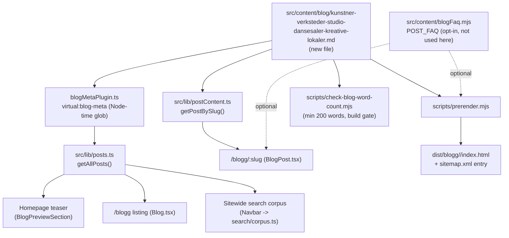

# XAL-1143: Content gap — Kunstner-verksteder, studio og dansesaler

## WHAT THIS IS

A new Norwegian Bokmål blog post that fills a confirmed content gap:
`digilist.no` has zero pages targeting the keyword **"kunstner"** or the
resource type **kunstner-verksted** (a bookable room/space for visual-art
practice: maleri, keramikk, skulptur, tekstilkunst, grafikk), and no post
frames booking of **studio og dansesaler for kreative formål** across the
three use cases the ticket names: hobby (enkeltpersoner som vil male eller
lage keramikk på fritiden), kurs (en instruktør som holder et kurs over
flere uker/en sesong), og profesjonell bruk (en kunstner som leier fast
atelierplass eller en danser/koreograf som bruker en dansesal til produksjon
eller øving). The angle is the **operator** side — a kulturhus, kommune eller
privat lokaleeier som eier slike spesialiserte rom og trenger å gjøre dem
bookbare per time/kurs/sesong for tre forskjellige brukergrupper i samme
kalender — matching how sibling posts (XAL-1149 for treningsrom, XAL-1145
for teambuilding) are written for the person who owns/administers the space,
not only the end-booker.

## HOW IT WORKS NOW (files/functions read)

- `package.json` — `"build"` script: `vite build && vite build --ssr
  src/entry-server.tsx --outDir dist-server ... && node
  scripts/prerender.mjs && node scripts/check-blog-word-count.mjs`. No
  dedicated typecheck/lint gate for content; content is verified by building
  and by `pnpm test` (vitest).
- `src/lib/blogFrontmatter.ts` — defines `BlogFrontmatter` (`slug, title,
  description, date, updated?, author, role?, readingMinutes?, tag?, cover?,
  keywords?[]`) and a hand-rolled `parseFrontmatter`/`extractFrontmatter`
  parser (regex-based, no zod/schema validation) shared by the browser
  (`src/lib/posts.ts`) and the Node-time Vite plugin.
- `build-plugins/blogMetaPlugin.ts` — the `virtual:blog-meta` Vite plugin
  (imported by `vite.config.ts:5,25`), globs `src/content/blog/*.md` at
  build time in Node and extracts only the frontmatter, keeping the ~560KB
  combined article-body text out of the browser bundle.
- `src/lib/posts.ts` — imports `virtual:blog-meta`, exposes `getAllPosts()`.
  Feeds the homepage teaser (`BlogPreviewSection`), the `/blogg` listing,
  and the sitewide search corpus (`Navbar` → `search/corpus.ts`). A new file
  with valid frontmatter is picked up automatically, no registration step.
- `src/lib/postContent.ts` — separate `import.meta.glob(..., {query:
  "?raw", eager: true})` of the same directory, parses frontmatter again via
  `parseFrontmatter` and maps `slug → body markdown`. Only imported by
  `BlogPost.tsx` (article page), kept out of the main bundle by that route's
  lazy loading.
- `scripts/prerender.mjs` — reads `src/content/blog/*.md` off disk directly
  (not through Vite), renders each post to static HTML at
  `dist/blogg/<slug>/index.html`, adds a sitemap entry, and optionally emits
  FAQPage JSON-LD by looking up `POST_FAQ[post.slug]` in
  `src/content/blogFaq.mjs` (opt-in, only if the post's inline FAQ section is
  also registered there).
- `scripts/check-blog-word-count.mjs` — build-time `content.thin` guard:
  fails if any post's markdown body is under 200 words (and, once
  `dist/blogg` exists, checks the rendered HTML body too).
- `scripts/check-title-lengths.mjs` — informational only, not wired into
  `build`/`lint`; flags rendered titles over 65 chars.
- `scripts/guard-blog-redirects.mjs` — only fires on removed/renamed slugs
  (git-status diff on the directory); a pure addition doesn't trigger it.
- Confirmed the gap is real, not already covered, via:
  - `grep -rli "kunstner" src/content/blog/*.md` → **zero hits**.
  - `grep -rli "atelier\|keramikk\|maleri\|skulptur\|dansesal" src/content/blog/*.md`
    → **zero hits**.
  - `grep -rli "verksted" src/content/blog/*.md` → 2 hits, both passing
    mentions of "verksted" as one room among many in an ungdomshus
    (`booking-ungdomshus-fritidsklubb-medlemsaktiviteter.md`) or one bullet
    in a generic "private utleiere" list
    (`beste-plattform-for-private-utleiere-som-vil-leie-ut-lokalet-sitt.md`);
    neither is about a kunstner-verksted as its own resource type.
  - Read `src/content/blog/leie-ovingsrom-musikk-dans-studio.md` in full
    (closest neighbor, matched the `studio`/`dansesal`-adjacent grep because
    of the word "studio"). It's tag `Privatperson`, written for the
    **renter** (musikklærer/danseinstruktør/band) searching for and renting
    øvingsrom/øvesal/danse-studio, with a price table and a step-by-step
    "search near you" flow. It never mentions visual art (maleri, keramikk,
    skulptur, atelier, kunstner) and is not written from the operator side.
    This ticket's post is deliberately the operator-facing complement:
    covers the **owner** who has to make a kunstner-verksted, studio or
    dansesal bookable for hobby/kurs/profesjonell bruk simultaneously — a
    different persona and a different keyword target, so it doesn't
    cannibalize this post. The new post links to it once, for the reader who
    wants the renter-side price/how-to-book guide for dance/music
    specifically.

## WHAT CHANGES

- Add one new file:
  `src/content/blog/kunstner-verksteder-studio-dansesaler-kreative-lokaler.md`.
  - `tag: "Utleier"` — matches the operator persona (kulturhus/kommune/privat
    lokaleeier deciding to run bookable creative spaces through Digilist),
    consistent with how XAL-1149 (treningsrom) used `Utleier` for the same
    shape of ticket.
  - Targets `kunstner` as the primary keyword (per the ticket's stated
    intent), plus `kunstner-verksted`, `dansesal booking`, `leie atelier`,
    `booke kurslokale kunst`, `verksted for kunstnere`.
  - Covers, per the ticket: what a kunstner-verksted/dansesal/studio is as a
    bookable resource type; the three use cases (hobby, kurs, profesjonell
    bruk) and how their booking needs differ (drop-in enkelttime vs.
    kursserie over flere uker vs. fast atelierplass/produksjonstid); how
    Digilist lets an operator make the same room bookable for all three
    without double-booking or manual coordination (sanntidskalender,
    serietidsbestilling for kurs og faste avtaler, differensiert pris per
    bruksformål).
  - No other files touched. All build/render consumers of
    `src/content/blog/*.md` key off the directory generically (glob/readdir
    or an eager `import.meta.glob`), so a new well-formed file is a strict
    addition.

## BLAST RADIUS (callers/consumers of `src/content/blog/*.md`, grepped)

```
build-plugins/blogMetaPlugin.ts   -> virtual:blog-meta (Node-time glob)  -> src/lib/posts.ts
src/lib/posts.ts    (getAllPosts) -> homepage teaser (BlogPreviewSection), /blogg listing (Blog.tsx), search corpus (Navbar -> search/corpus.ts)
src/lib/postContent.ts            -> import.meta.glob raw, eager         -> BlogPost.tsx (article page body)
scripts/prerender.mjs             -> fs.readdir/readFile on the directory -> dist/blogg/<slug>/index.html, sitemap.xml
scripts/check-blog-word-count.mjs -> same directory                      -> build-time content.thin guard (min 200 words)
scripts/check-title-lengths.mjs   -> same directory                      -> informational title-length report (not a build gate)
scripts/guard-blog-redirects.mjs  -> git status on the directory         -> only fires on removed/renamed slugs
src/content/blogFaq.mjs           -> POST_FAQ[slug], opt-in              -> FAQPage JSON-LD in prerender + BlogPost.tsx (only if registered)
```

None of the eight consumers hard-code a slug list; all key off directory
contents. Adding one file with valid frontmatter requires no other edits.



## Verdict

Ticket is valid and not already done — no post covers kunstner-verksteder,
atelier, or dansesal as a resource type, and the closest neighbor
(`leie-ovingsrom-musikk-dans-studio.md`) is a different persona (renter,
music/dance only, no visual art). Proceeding to write and publish the post
as a pure content addition.
