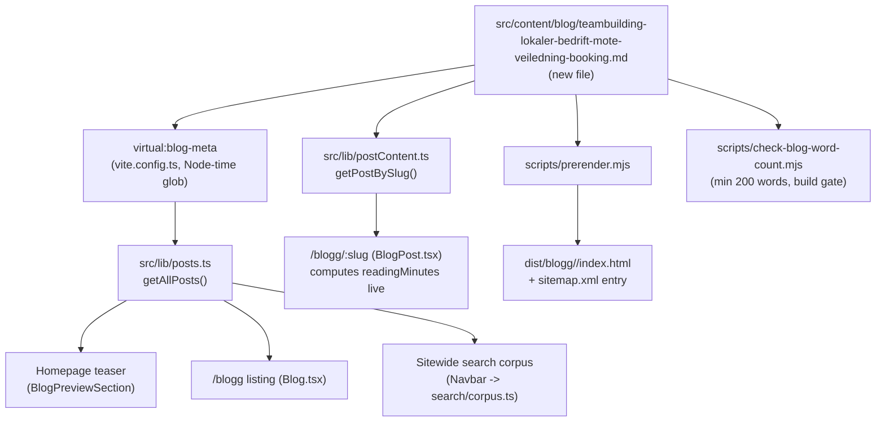

# XAL-1145: Content gap — Teambuilding og arrangement for bedrifter

## WHAT THIS IS

A new Norwegian Bokmål blog post that fills a confirmed content gap:
`digilist.no` has zero pages targeting the keyword **"teambuilding"** or the
combined need behind it — a business (SMB or larger organization) that has
to book **several lokaltyper for one event on the same day**: an
activity/aktivitetslokale (gymsal, idrettshall, uteområde), a møterom, and a
veiledningsrom (coaching/mentoring space), often from different utleiere.
Existing "Bedrift"-tagged posts cover adjacent but distinct needs — see BLAST
RADIUS below for the verification that none of them already own this
keyword or this specific multi-lokaltype teambuilding scenario.

## HOW IT WORKS NOW (files/functions read)

- `package.json` — `pnpm build` runs `node scripts/optimize-images.mjs &&
  vite build && vite build --ssr src/entry-server.tsx --outDir dist-server
  --ssrManifest false && node scripts/prerender.mjs && node
  scripts/check-blog-word-count.mjs`. No dedicated typecheck/lint step for
  content; content is verified by building. `content:check-word-count` runs
  the same word-count gate standalone.
- `src/content/blog/*.md` — one file per post. Frontmatter shape is defined
  by `src/lib/blogFrontmatter.ts` (`BlogFrontmatter` interface + hand-rolled
  `parseFrontmatter`/`extractFrontmatter`, no schema/zod validation):
  `slug, title, description, date, updated?, author, role?,
  readingMinutes?, tag?, cover?, keywords?[]`.
- `src/lib/posts.ts` — imports `virtual:blog-meta` (a Vite plugin in
  `vite.config.ts` that globs `src/content/blog/*.md` at build time in Node
  and extracts just the frontmatter, keeping article bodies out of the
  browser bundle). Feeds the homepage teaser (`BlogPreviewSection`), the
  `/blogg` listing, and the sitewide search corpus (`Navbar` →
  `search/corpus.ts`). A new file with valid frontmatter is picked up
  automatically — no registration step.
- `src/lib/postContent.ts` — a separate `import.meta.glob(..., {raw: true,
  eager: true})` of the same directory, parses frontmatter again and maps
  `slug → body markdown`. Only imported by `BlogPost.tsx` (the article
  page), lazy-loaded so it stays out of the main bundle.
- `src/pages/BlogPost.tsx:100` — computed reading time is
  `Math.round(post.content.split(/\s+/).filter(Boolean).length / 200)`
  (words in the markdown body / 200 wpm, rounded). This must match the
  frontmatter `readingMinutes` or the teaser/listing and the article page
  show different numbers for the same post (exact bug XAL-1149 review round
  1 caught and fixed).
- `scripts/prerender.mjs` — reads `src/content/blog/*.md` directly off disk
  (not through Vite), renders each post to static HTML at
  `dist/blogg/<slug>/index.html`, adds a sitemap entry
  (`${BASE_URL}/blogg/${slug}`), and optionally looks up
  `POST_FAQ[post.slug]` from `src/content/blogFaq.mjs` to emit FAQPage
  JSON-LD (no FAQ entry required — most posts, including the closest
  neighbor `idrettshall-bedrift-firmaturnering-sanntid-samlefaktura`, ship
  without one).
- `scripts/check-blog-word-count.mjs` — `MIN_WORDS = 200`; fails the build
  if any post's markdown body is under 200 words (`content.thin` guard),
  and (if `dist/blogg` already exists) also checks the rendered HTML body.
- `scripts/check-title-lengths.mjs` — informational only, not wired into
  `build`/`lint`.
- `scripts/guard-blog-redirects.mjs` — checks git status of
  `src/content/blog` for removed/renamed slugs needing a redirect; a pure
  addition doesn't trigger it.
- Existing near-neighbor posts checked to confirm no duplicate/cannibalizing
  content:
  - `src/content/blog/idrettshall-bedrift-firmaturnering-sanntid-samlefaktura.md`
    (`tag: "Bedrift"`) — company sports tournaments/kick-offs booked in a
    single idrettshall type, sanntidskalender + samlefaktura framing. No
    møterom/veiledningsrom angle, no multi-lokaltype-same-day scenario.
  - `src/content/blog/moterom-kurslokale-leie-billig-dagtid-bedrift.md`
    (`tag: "Bedrift"`) — møterom/kurslokale/sal for courses and internal
    training, dagtidspris framing. No aktivitetslokale, no teambuilding, no
    veiledning angle.
  - `src/content/blog/leie-lokale-privat-fest-og-bedriftsevent.md`
    (`tag: "Privatperson"`) — julebord/firmafest venues for private parties
    and company celebrations, not teambuilding/coaching.
  - `grep -rli "teambuilding\|team building\|team-building"
    src/content/blog/*.md` → **correction (round 2 regression review): this
    claim was wrong.** The command actually returns four pre-existing hits
    (`idrettshall-booking-flere-haller-samlefaktura-bedrift.md`,
    `idrettshall-ledige-tider-book-enkelttime-privatperson.md`,
    `idrettshall-ledige-tider-booke-uten-lag-privatperson.md`,
    `idrettshall-privat-utleier-ledige-tider-booking-drift.md`, all on
    `origin/main` since 2026-08-09, commit `e5c74c9`). In every one,
    "teambuilding" is a passing example use-case in body/description text
    only — never in the title, H1, slug, or `keywords:` frontmatter. This
    post is still the only one targeting "teambuilding" as a *primary*
    keyword (title, slug, URL, keywords list), so the no-duplicate verdict
    below holds; see `.agent/XAL-1145/REVIEW.md` Round 2 for the full
    severity assessment.
  - `grep -rli "arrangement" src/content/blog/*.md` → many hits, but all in
    wedding (`bryllupslokale-*`), municipal event (`billettlosning-*`,
    `uterom-grontareal-arrangementer-kommune`), or general-venue posts —
    none combine business teambuilding + møter + veiledning.
  - Confirms the gap is real, not already covered.

## WHAT CHANGES

- Add one new file:
  `src/content/blog/teambuilding-lokaler-bedrift-mote-veiledning-booking.md`.
  - `tag: "Bedrift"`, matching the sibling posts aimed at businesses booking
    for their organization rather than a private individual.
  - Targets `teambuilding` as the primary keyword, plus long-tail variants
    (`booke lokale teambuilding`, `teambuilding bedrift`, `lokale til
    teambuilding og møter`, `aktivitetslokale bedrift booking`, `møterom og
    veiledningsrom bedrift`).
  - Covers, per the ticket: booking lokaler and områder for bedrifters
    teambuilding, møter og veiledning, for both SMB and larger
    organizations — specifically the multi-lokaltype-same-day problem
    (aktivitetslokale + møterom + veiledningsrom), real-time availability,
    multi-location booking in one order, indicative pricing, samlefaktura,
    avbud/ombooking, equipment, and kommunalt vs. privat lokale.
  - `readingMinutes: 6`, verified against the markdown body word count
    (1220 words / 200 wpm rounds to 6) so it matches
    `BlogPost.tsx:100`'s live computation.
  - Reuses an existing cover image (`booking_calendar_hero_no.webp`,
    already used by other Bedrift/Privatperson posts) — no new asset added.
  - No other files touched — nothing in `scripts/`, `vite.config.ts`, or
    routing needs to change for a new post to build, render, and appear in
    the sitemap/listing/search.

## BLAST RADIUS (callers/consumers of `src/content/blog/*.md`, grepped)

```
src/lib/posts.ts                  -> virtual:blog-meta (vite.config.ts glob) -> homepage teaser, /blogg listing, search corpus
src/lib/postContent.ts            -> import.meta.glob raw                    -> BlogPost.tsx (article page body + readingMinutes cross-check)
scripts/prerender.mjs             -> fs.readdir/readFile on the directory    -> dist/blogg/<slug>/index.html, sitemap.xml
scripts/check-blog-word-count.mjs -> same directory                         -> build-time content.thin guard (min 200 words)
scripts/check-title-lengths.mjs   -> same directory                         -> informational title-length report
scripts/guard-blog-redirects.mjs  -> git status on the directory            -> only fires on removed/renamed slugs
```

All six consumers key off the directory contents generically (glob/readdir);
none hard-code a list of slugs. Adding one well-formed file is a strict
addition with no edits required elsewhere. No route, no component, no test
file references a fixed set of posts.



## Verdict

Ticket is valid and not already done. Proceeding to write and publish the
post as a pure content addition.
