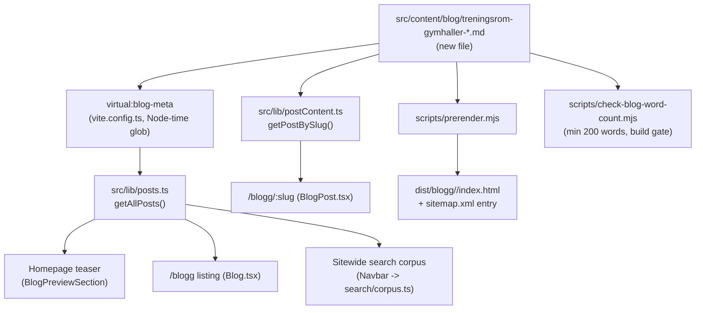

# XAL-1149: Content gap — Treningsrom og gymhaller

## WHAT THIS IS

A new Norwegian Bokmål blog post that fills a confirmed content gap: `digilist.no`
has zero pages targeting the keyword **"treningsrom"** or the persona of a
**personal trainer / fitness instructor who needs to book a flexible training
room**, and zero pages framing Digilist as a booking system for **private gym
operators** (studio owners renting out rooms/time slots to freelance PTs and
instructors). Existing fitness-adjacent posts target a different persona
(municipal facilities booked by sports clubs/teams), not this one — see BLAST
RADIUS below for the verification.

## HOW IT WORKS NOW (files/functions read)

- `package.json` — `pnpm build` runs `vite build` → SSR build →
  `node scripts/prerender.mjs` → `node scripts/check-blog-word-count.mjs`.
  No dedicated word-count/typecheck script; content changes are verified by
  building.
- `src/content/blog/*.md` — one file per post. Frontmatter fields are defined
  by `src/lib/blogFrontmatter.ts` (`BlogFrontmatter` interface + hand-rolled
  `parseFrontmatter`/`extractFrontmatter` parser, no schema/zod validation):
  `slug, title, description, date, updated?, author, role?, readingMinutes?,
  tag?, cover?, keywords?[]`.
- `src/lib/posts.ts` — imports `virtual:blog-meta` (a Vite plugin defined in
  `vite.config.ts` that globs `src/content/blog/*.md` at build time in Node
  and extracts just the frontmatter, keeping the ~560KB of combined article
  bodies out of the browser bundle). Feeds the homepage teaser
  (`BlogPreviewSection`), the `/blogg` listing, and the sitewide search
  corpus (`Navbar` → `search/corpus.ts`). A new file with valid frontmatter
  is picked up automatically — no registration step.
- `src/lib/postContent.ts` — separate `import.meta.glob(..., {raw: true,
  eager: true})` of the same directory, parses frontmatter again and maps
  `slug → body markdown`. Only imported by `BlogPost.tsx` (the article page),
  kept out of the main bundle by lazy-loading that route.
- `scripts/prerender.mjs` — reads `src/content/blog/*.md` directly off disk
  (not through Vite), renders each post to static HTML at
  `dist/blogg/<slug>/index.html`, adds a sitemap entry
  (`${BASE_URL}/blogg/${slug}`), and optionally looks up
  `POST_FAQ[post.slug]` from `src/content/blogFaq.mjs` to emit FAQPage
  JSON-LD (post has no FAQ entry today — optional, not required for a
  post to build/ship).
- `scripts/check-blog-word-count.mjs` — guards against `content.thin`: fails
  the build if any post's markdown body is under 200 words, and (if
  `dist/blogg` already exists) also checks the *rendered* HTML article body.
- `scripts/check-title-lengths.mjs` — informational only (not wired into
  `build`/`lint`); reports titles whose rendered form (title, or
  `"{title} — Digilist"` if ≤50 chars) exceeds 65 chars.
- `scripts/guard-blog-redirects.mjs` — checks git status of
  `src/content/blog` for **removed/renamed** slugs needing a redirect; a
  pure addition doesn't trigger it.
- Existing near-neighbor posts checked to confirm no duplicate/cannibalizing
  content:
  - `src/content/blog/trenings-og-badeanlegg-booking-treningsgrupper-svommeklubber.md`
    (tag `Lag og foreninger`) — gym/styrkerom/basseng booking for **municipal
    facilities**, audience is sports clubs/swim clubs booking group rates and
    season slots. No PT/instructor angle, no private-operator angle.
  - `src/content/blog/idrettshall-kommunal-og-privat-hall-ledige-tider-samlet.md`
    (tag `Lag og foreninger`) — finding available time across municipal +
    private halls, audience is teams/clubs/individuals. Mentions private
    halls/"fitnesskjeder" only in passing re: booking mechanics, not as a
    Digilist customer (operator) persona.
  - `grep -rli "treningsrom" src/content/blog/*.md` → no hits anywhere.
  - `grep -rli "personlig trener\|fitnessinstruktør\|treningssenter" src/content/blog/*.md`
    → no hits. Confirms the gap is real, not already covered.

## WHAT CHANGES

- Add one new file: `src/content/blog/treningsrom-gymhaller-personlig-trener-fitnessinstruktor.md`.
  - `tag: "Utleier"` (audience for the CTA is the private gym operator
    deciding to run bookable rooms through Digilist; the PT/instructor is the
    end-booker described inside the post, matching how `Lag og foreninger`
    posts are tagged for the club persona even though individual members are
    also discussed).
  - Targets `treningsrom` as primary keyword, plus long-tail variants
    (`booke treningsrom`, `leie treningsrom time`, `gymhall booking`,
    `bookingsystem for gym`, `private gymoperatører`).
  - Covers, per the ticket: PTs/instructors needing flexible room booking for
    classes and 1:1 sessions, and Digilist as the booking layer private gym
    operators use to sell that room time (calendar, per-slot pricing,
    payment, cancellation rules, multi-instructor scheduling).
  - No other files touched — nothing in `scripts/`, `vite.config.ts`, or
    routing needs to change for a new post to build, render, and appear in
    the sitemap/listing/search (per "Not included" in the ticket: no
    build/render script edits).

## BLAST RADIUS (callers/consumers of `src/content/blog/*.md`, grepped)

```
src/lib/posts.ts            -> virtual:blog-meta (vite.config.ts glob)  -> homepage teaser, /blogg listing, search corpus
src/lib/postContent.ts      -> import.meta.glob raw                    -> BlogPost.tsx (article page body)
scripts/prerender.mjs       -> fs.readdir/readFile on the directory    -> dist/blogg/<slug>/index.html, sitemap.xml
scripts/check-blog-word-count.mjs -> same directory                    -> build-time content.thin guard (min 200 words)
scripts/check-title-lengths.mjs   -> same directory                    -> informational title-length report
scripts/guard-blog-redirects.mjs  -> git status on the directory       -> only fires on removed/renamed slugs
```

All six consumers key off the directory contents generically (glob/readdir);
none hard-code a list of slugs. Adding one well-formed file is a strict
addition with no edits required elsewhere. No route, no component, no test
file references a fixed set of posts.



## Verdict

Ticket is valid and not already done. Proceeding to write and publish the
post as a pure content addition.
