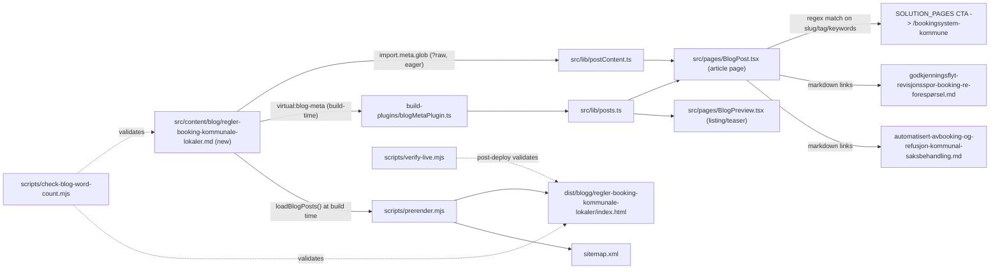

# AGENT-SPEC: XAL-1152 — Regler, prosedyrer og krav for booking av kommunale lokaler

## WHAT THIS IS

A new Norwegian-Bokmål blog post on digilist.no that answers, from the applicant's
point of view, "what rules apply when I book a municipal facility?" — who is allowed
to book, what documentation is required before a request is approved, what the
approval/rejection procedure looks like, what rules apply while using the facility,
what the cancellation rules are, and what recourse (klagerett) a rejected applicant
has. It targets the search term "regler" together with "prosedyrer" and "krav" for
booking kommunale lokaler, for two personas the ticket names explicitly: **søkere**
(citizens, lag/foreninger, bedrifter who want to book) and **kommunale ansatte**
(saksbehandlere who administer the rules on the other side of the same request).
It is a pure content addition: one new Markdown file, nothing else.

## HOW IT WORKS NOW

- Blog posts are flat Markdown files in `src/content/blog/*.md` (264 files today,
  confirmed via `ls src/content/blog | wc -l`). There is no manual registration
  step — I read `src/lib/posts.ts`, `src/lib/postContent.ts` and
  `src/lib/blogFrontmatter.ts` directly:
  - `src/lib/posts.ts` imports metadata eagerly from a Vite virtual module
    `virtual:blog-meta` (built by `build-plugins/blogMetaPlugin.ts` at build time)
    — this feeds the blog list, homepage teaser and sitewide search.
  - `src/lib/postContent.ts` lazy-loads the full Markdown body via
    `import.meta.glob("/src/content/blog/*.md", { query: "?raw", eager: true })`,
    only from `BlogPost.tsx`'s own route chunk.
  - `src/lib/blogFrontmatter.ts` defines the frontmatter shape (`slug`, `title`,
    `description`, `date`, `author`, `role`, `readingMinutes`, `tag`, `cover`,
    `keywords`) and a hand-rolled parser (not a real YAML lib).
  - `scripts/prerender.mjs` (`loadBlogPosts()` ~line 179) reads the same directory
    at build time to SSR each post to `dist/blogg/<slug>/index.html`, inject
    Article JSON-LD, and regenerate `sitemap.xml` (~line 2599). Titles ≤50 chars
    get " – Digilist" appended (~line 2530-2532); longer titles are used as-is.
  - So dropping a correctly-formatted `.md` file into `src/content/blog/` is the
    entire publish mechanism — no index file, no route file, no sitemap file to
    touch by hand.
- I read the closest existing posts in full to check for overlap before writing:
  - `src/content/blog/praktisk-guide-prosedyrer-krav-prising-booking.md` (XAL-1139,
    merged PR #233, same day 2026-08-09) covers krav/prosedyrer/prising but from
    the **bookingansvarlig/admin** side — "how do I configure requirements,
    approval flow and pricing in my own system." Tag: `Bookingansvarlig`.
  - `src/content/blog/leie-sal-kommune-guide-fra-sok-til-booking.md` covers a
    citizen's end-to-end journey renting a **sal** specifically (search → book →
    pay → cancel), tag `Innbygger`, but is not framed as a rules reference and is
    scoped to "sal", not "kommunale lokaler" generally.
  - `src/content/blog/godkjenningsflyt-revisjonsspor-booking-re-forespørsel.md`
    covers the approval/audit-trail mechanism in depth (why a rejection is
    re-requested, not overridden) — I link to it rather than repeating it.
  - `src/content/blog/automatisert-avbooking-og-refusjon-kommunal-saksbehandling.md`
    covers cancellation/refund automation from the saksbehandler side — I link to
    it rather than repeating it.
  - Grepped `src/content/blog/*.md` titles/descriptions for "regler for" +
    "krav til (den som/søker/leietaker)" — zero hits. No existing post is framed
    as a rules reference for the applicant.
  - Checked open PRs (`gh pr list --state open`) and this branch's own PR
    (`gh pr list --head agent/xal-1152-...`) for a competing in-flight post on
    this exact topic — none found; XAL-1153/1150/1140 are unrelated topics.
- Validation the new post must pass, without editing the scripts themselves
  (explicitly out of scope per AGENT-GOAL.md, shared across every SEO branch):
  - `scripts/check-blog-word-count.mjs` — ≥200 words in the Markdown source, and
    separately the rendered `<article>` in `dist/blogg/<slug>/index.html` must
    not be thin.
  - `scripts/verify-live.mjs` / `verify-live-posts.sh` — post-deploy check that
    title isn't a generic shell, og:image resolves, prerendered article body
    ≥1200 chars.
  - `src/content/blog-xal739-aeo.test.ts`, `src/content/blogFaq.test.ts` — Vitest
    specs I must not break.

## WHAT CHANGES

Add one file: `src/content/blog/regler-booking-kommunale-lokaler.md`
(slug: `regler-booking-kommunale-lokaler`, tag `Innbygger`, cover reuses
`digdir_designsystemet_hero_no.webp`, the least-reused cover image in the corpus
and thematically apt for a public-sector rules post).

Content, written for the applicant with an eye to the kommunalt-ansatt reader too:
1. Hvem kan booke et kommunalt lokale — eligibility categories (innbygger, lag og
   foreninger, bedrift/kommersiell) and how rules differ between them.
2. Krav til dokumentasjon før søknaden godkjennes.
3. Prosedyren fra søknad til bekreftet booking, including what happens on
   rejection (link out to the approval/audit-trail post rather than repeating it).
4. Regler for bruk av lokalet under selve arrangementet (ordensregler, rydding,
   ansvar for skader).
5. Avbestilling og endring — the cancellation rules that apply (link out to the
   refund/cancellation post rather than repeating it).
6. Hva skjer ved avslag — klageadgang, forvaltningsloven angle, aimed at the
   kommunalt-ansatt persona who has to explain this to an applicant.
7. Sjekkliste + CTA to book a demo.

This is the smallest valid change: one new content file, no code changes, no
edits to shared build/render/verify scripts, no registry file to touch.

## BLAST RADIUS

- **Build**: `scripts/prerender.mjs` picks the new file up automatically on the
  next build (SSR route, Article JSON-LD, sitemap entry) — no other file needs
  editing for that to happen.
- **Blog list / search / homepage teaser**: `src/lib/posts.ts` via
  `virtual:blog-meta` will include the new post automatically; no consumer of
  that list needs changes.
- **Internal links**: I link to 2 existing posts (godkjenningsflyt..., automatisert-
  avbooking-og-refusjon...) — additive, doesn't change those files.
- **SOLUTION_PAGES matcher in `src/pages/BlogPost.tsx`**: the regex for
  "Bookingsystem for kommuner" matches on `kommun`, which appears in my slug/tag/
  keywords, so the related-solution CTA block will auto-attach — no code change
  needed, purely a side-effect of existing regex matching.
- **Nothing else reads `src/content/blog/*.md` by filename** — confirmed via the
  explore pass above; the only consumers are the two lib files and the two build
  scripts, all read-only/glob-based, none require a per-file registration edit.
- **Out of scope, confirmed not touched**: `scripts/prerender.mjs`,
  `src/entry-server.tsx`, `scripts/verify-live.mjs` (explicitly forbidden by
  AGENT-GOAL.md to avoid fleet-wide merge conflicts across concurrent SEO
  branches).

## Out of scope

No edits to `scripts/prerender.mjs`, `src/entry-server.tsx`,
`scripts/verify-live.mjs`, or any other shared build/render script. No new
tag/persona/solution-page category. No opportunistic edits to the two posts I
link out to.
