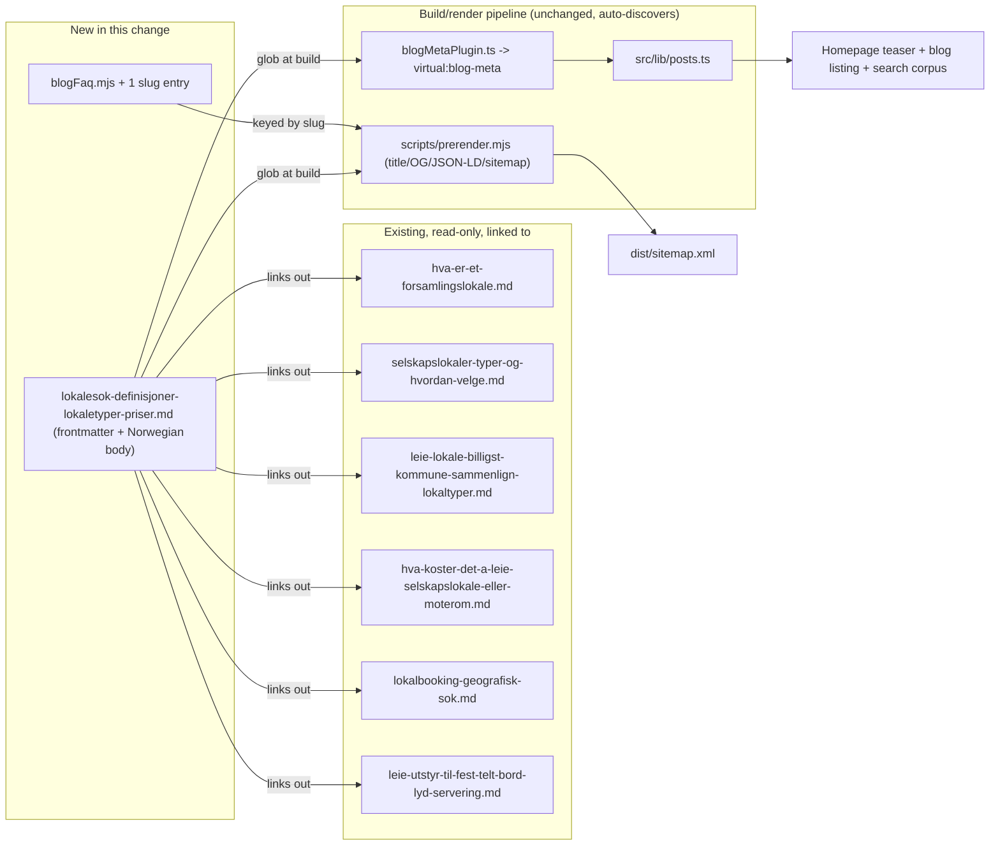

# XAL-1155: Content gap — Lokalesøk, definisjoner og informasjon

## WHAT THIS IS
The SEO agent flagged that no page on digilist.no targets "lokalesøk" itself —
the generic, top-of-funnel query from someone who hasn't decided what kind of
venue they need yet, and is really asking three things at once: what do these
words even mean (forsamlingslokale vs. selskapslokale vs. møterom), what
"comes with" a rented venue (equipment, catering, technical gear), and what
should this roughly cost. Digilist has deep, persona-specific answers to each
of those three sub-questions already (see below), but nothing that sits above
them and says "here's the vocabulary, here's the landscape, here's where to
go deeper" — the page a reader lands on before they know which specific guide
they need. That's the gap: a definitional/orientation post for "lokalesøk",
not a new deep-dive on venue types or pricing (those already exist and this
must not duplicate them).

## HOW IT WORKS NOW
- Blog posts are plain markdown files in `src/content/blog/*.md`, one file
  per page. Frontmatter shape is defined in `src/lib/blogFrontmatter.ts`
  (`BlogFrontmatter`: slug, title, description, date, author, role,
  readingMinutes, tag, cover, keywords).
- Discovery is fully automatic: `build-plugins/blogMetaPlugin.ts` (imported
  by `vite.config.ts:5,25`) globs every `.md` file's frontmatter at build
  time into the `virtual:blog-meta` virtual module, which `src/lib/posts.ts`
  reads and sorts by `date` (newest first). **Dropping a new `.md` file into
  `src/content/blog/` is the entire integration** — no index, router, or nav
  file needs editing.
- `scripts/prerender.mjs` (`CONTENT_DIR` at line 130, blog-post loop from
  line 177) reads the same directory at build time to pre-render each post's
  HTML (title/description/OG/canonical/JSON-LD) and to regenerate
  `dist/sitemap.xml` (sitemap block starting line 2599). Again, no manual
  registration — any file in the directory is picked up.
- `src/content/blogFaq.mjs` is an **opt-in** map, keyed by slug, of
  Q&A pairs that get rendered as `FAQPage` JSON-LD both client-side
  (`src/pages/BlogPost.tsx` → `SEO.tsx`'s `faq` prop) and in the static
  prerender. A post only gets an entry here if its body actually contains a
  matching "Vanlige spørsmål" section — the file's own comment says the Q/A
  text must mirror what the reader sees on the page.
- I confirmed by reading `src/content/blog/hva-er-et-forsamlingslokale.md`,
  `selskapslokaler-typer-og-hvordan-velge.md`,
  `leie-lokale-billigst-kommune-sammenlign-lokaltyper.md`,
  `hva-koster-det-a-leie-selskapslokale-eller-moterom.md`,
  `lokalbooking-geografisk-sok.md`, and
  `leie-utstyr-til-fest-telt-bord-lyd-servering.md` that Digilist already
  has thorough, specific coverage of: what a forsamlingslokale/venue type
  is, how the many venue types compare, what a rental costs, how to filter
  a search geographically, and what add-on products (utstyr/catering) are
  available. `grep -rl "lokalesøk" src/content/blog/` returns nothing — no
  existing post targets that exact query or plays the orientation/glossary
  role.

## WHAT CHANGES
- One new file: `src/content/blog/lokalesok-definisjoner-lokaletyper-priser.md`.
  A Norwegian Bokmål orientation/glossary post that:
  1. Answers "hva er lokalesøk" directly.
  2. Defines the core vocabulary a first-time searcher runs into (lokale,
     lokaletype, forsamlingslokale, kapasitet, depositum, prisregulativ,
     sesongleie/tildelingsrunde) in plain language.
  3. Surveys, at overview depth only, the three things the ticket names —
     lokaletyper, produkter (utstyr/tjenester), priser — each with 2-3
     sentences and a link out to the existing deep-dive post that already
     owns that sub-topic in full.
  4. Closes with a "Vanlige spørsmål" (FAQ) section answering the
     informational long-tail (e.g. "hva er forskjellen på forsamlingslokale
     og selskapslokale", "hva koster det å leie et lokale", "kan jeg søke
     uten å vite nøyaktig sted").
  This is the smallest change that satisfies the ticket: it fills the
  vocabulary/orientation gap without re-writing content that already exists
  and already ranks for its own specific terms.
- One small addition to `src/content/blogFaq.mjs`: a
  `lokalesok-definisjoner-lokaletyper-priser` entry mirroring the post's own
  FAQ section, so the FAQPage JSON-LD matches what a search agent renders —
  this is the existing, established pattern (opt-in, keyed by slug) every
  other FAQ-bearing post already follows.
- Nothing else. No shared build/render script is touched
  (`scripts/prerender.mjs`, `src/entry-server.tsx`,
  `scripts/verify-live.mjs` are all read-only reference here, per the
  ticket's explicit instruction that those are the files every SEO branch
  collides on).

## BLAST RADIUS
- **Auto-discovery consumers** (no code change, but they will pick the new
  post up automatically the moment the file exists): `src/lib/posts.ts`
  (homepage teaser + blog listing + sitewide search corpus), `virtual:blog-meta`
  (`build-plugins/blogMetaPlugin.ts`), `scripts/prerender.mjs` (adds one more
  route + sitemap entry + JSON-LD block), `public/sitemap.xml` /
  `dist/sitemap.xml` (regenerated at build, not hand-edited).
- **`src/content/blogFaq.mjs`**: adding a new top-level key is additive and
  keyed by slug — cannot collide with or change any other post's entry.
  Consumed by `src/pages/BlogPost.tsx` (client) and `scripts/prerender.mjs`
  (static JSON-LD bake).
- **Internal links out**: the new post links to
  `hva-er-et-forsamlingslokale`, `selskapslokaler-typer-og-hvordan-velge`,
  `leie-lokale-billigst-kommune-sammenlign-lokaltyper`,
  `hva-koster-det-a-leie-selskapslokale-eller-moterom`,
  `lokalbooking-geografisk-sok`, and
  `leie-utstyr-til-fest-telt-bord-lyd-servering` — all six confirmed to
  exist with those exact slugs by grepping their frontmatter before writing
  this spec. None of those files are modified, so nothing about them can
  break; the new post is purely an additional inbound linker.
- **No other post links to or depends on this new slug** (it doesn't exist
  yet), so there is no existing content to update.
- **Out of scope, confirmed unaffected**: `scripts/prerender.mjs`,
  `src/entry-server.tsx`, `scripts/verify-live.mjs` — read for context only,
  not edited, per the ticket's explicit instruction that shared
  build/render files are where concurrent SEO branches collide.

## SCOPE
- **In scope:** one new blog markdown file; one additive entry in
  `src/content/blogFaq.mjs`.
- **Out of scope:** any edit to `scripts/prerender.mjs`,
  `src/entry-server.tsx`, `scripts/verify-live.mjs`, or any existing blog
  post. No new guard/validation logic. No nav or index changes (not needed
  — auto-discovery).
- **Acceptance criteria:** a new post exists at
  `/blogg/lokalesok-definisjoner-lokaletyper-priser`, in Norwegian Bokmål,
  that (a) directly answers "hva er lokalesøk", (b) defines the core
  vocabulary, (c) surveys lokaletyper/produkter/priser with links to the
  existing deep-dive posts, (d) includes a FAQ section, (e) builds and
  pre-renders cleanly (`dist/blogg/lokalesok-definisjoner-lokaletyper-priser/index.html`
  has a real `<title>`, `og:image`, and JSON-LD, not the generic SPA shell).
