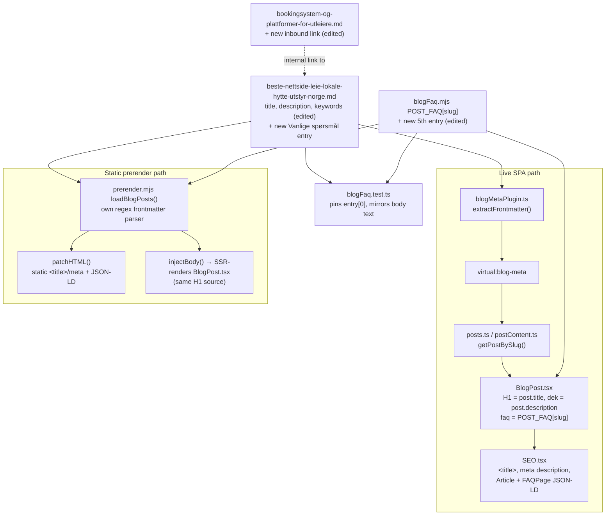

# XAL-1159 — Rank-mulighet: «airbnb hytte utstyr» på plass 13.2 (10 visninger)

## 1. WHAT THIS IS

Google Search Console shows the query «airbnb hytte utstyr» ranking at an
average position of 13.2 (10 impressions, 0 clicks, 0.0% CTR over the last
28 days) — page 2, one solid push from page 1. The page already ranking for
it is `/blogg/beste-nettside-leie-lokale-hytte-utstyr-norge`, a Digilist-vs-
Airbnb/Hygglo/norgesbooking.no comparison post (confirmed: its `keywords`
frontmatter already lists `"Digilist vs Airbnb"`, and its body already
covers "hytte" and "utstyr" extensively). The task is to strengthen that
existing page for this specific query — sharper title/meta (the query term
"Airbnb" wasn't in either), added depth on the compound intent (equipment
*for* a cabin, not just cabin rental), an inbound internal link from a
related article, and a schema addition — not a new page or a template
change.

Same page, different query than XAL-1161 (which sharpened title/meta/CTA
for the page's primary query "beste nettside for å leie lokale", pos 6.4,
136 impressions, shipped earlier today in commit 8c9a111). That change is
already live; this one targets a second, smaller-tail query the same page
also ranks for, without undoing XAL-1161's work.

## 2. HOW IT WORKS NOW (files/functions read)

- `src/content/blog/beste-nettside-leie-lokale-hytte-utstyr-norge.md` — the
  page's sole content/metadata source. Frontmatter: `title`, `description`,
  `keywords`, `updated` (already `2026-08-10` from XAL-1161's edit today).
  Body already has an `## Vanlige spørsmål` section and a comparison table.
- `src/lib/blogFrontmatter.ts:59-82` (`extractFrontmatter`) parses the `.md`
  frontmatter for the live SPA; sole call site
  `build-plugins/blogMetaPlugin.ts:21-39` (Vite plugin resolving
  `virtual:blog-meta`).
- `src/lib/posts.ts` (`getAllPosts`) / `src/lib/postContent.ts`
  (`getPostBySlug`) merge that metadata with the re-parsed markdown body.
- `src/pages/BlogPost.tsx:199-207` renders `post.title` as the sole `<h1>`
  and `post.description` as the subhead; line 132-134 passes both into
  `<SEO .../>`; line 161 passes `POST_FAQ[post.slug]` as the `faq` prop.
- `src/components/SEO.tsx:98` sets `document.title`; `:112` sets
  `<meta name="keywords">` from `DEFAULT_KEYWORDS`, not `post.keywords`
  (unaffected by any `keywords` array edit here); `:318` uses
  `article.keywords` for `Article` JSON-LD only.
- `src/content/blogFaq.mjs` — `POST_FAQ`, keyed by slug, is what actually
  drives the `FAQPage` JSON-LD (both live, via `SEO.tsx`'s `faq` prop, and
  static, via `scripts/prerender.mjs:2518`). The frontmatter's
  `faqQuestion`/`faqAnswer` fields are cosmetic and unparsed (confirmed by
  XAL-1161's SPEC and by `blogFaq.test.ts`'s own docstring, XAL-758).
  Currently has 4 Q/A entries for this slug, mirrored verbatim in the
  markdown body's `## Vanlige spørsmål` section.
- `src/content/blogFaq.test.ts` — pins `POST_FAQ[slug][0].question` exactly,
  and asserts every `{question, answer}` string in `POST_FAQ[slug]`
  `toContain`-matches the raw markdown body. New entries must be appended
  (not reordered) and mirrored verbatim in the body.
- `scripts/prerender.mjs` — independent regex frontmatter parser
  (`loadBlogPosts()`), writes the static `<title>`/meta description via
  `patchHTML()`, builds `Article` + `FAQPage` JSON-LD, then SSR-renders the
  real `BlogPost.tsx` tree via `injectBody()` so the static H1 matches.
- Internal links: no other blog post currently links to this slug (grepped
  `beste-nettside-leie-lokale-hytte-utstyr-norge` across
  `src/content/blog/*.md` — only the post itself matches). Found one
  strong, topically-honest candidate:
  `src/content/blog/bookingsystem-og-plattformer-for-utleiere.md:46`,
  which already discusses "En **markedsplass** som Airbnb eller Hygglo..."
  as one of three rental-platform models — the natural anchor for a link to
  the Airbnb/Hygglo/Digilist comparison post.
- `relatedSolutions()` (`BlogPost.tsx:29-53`) matches on
  `slug/title/tag/keywords` against a fixed regex list (kommune, idrettshall,
  møterom, selskapslokale, kulturhus) — none match "hytte"/"utstyr"/"airbnb",
  so adding a keyword there has no effect on this function; confirmed by
  re-reading the regexes.

## 3. WHAT CHANGES

All within `beste-nettside-leie-lokale-hytte-utstyr-norge.md` plus one
inbound link from `bookingsystem-og-plattformer-for-utleiere.md`, plus the
matching `blogFaq.mjs` entry:

- **Title**: "Beste nettside for å leie lokale, hytte og utstyr: 4
  alternativer" → "Digilist vs. Airbnb: beste nettside for lokale, hytte og
  utstyr" — puts the one query term that was missing ("Airbnb") into the
  title so Google can bold it for this query, while keeping "beste
  nettside", "hytte" and "utstyr" (all already present and working for the
  other query XAL-1161 targeted).
- **Meta description**: rewritten to name Airbnb and Hygglo explicitly
  (previously implied only via the keywords array, never surfaced in the
  actual snippet text) while keeping the "4 nettsteder" concrete-number
  hook: "4 nettsteder, inkl. Airbnb og Hygglo, sammenlignet for å leie
  lokale, hytte eller utstyr i Norge: pris, funksjoner, hvem de passer for.
  Se tabellen."
- **Keywords frontmatter**: append `"airbnb hytte utstyr"` (the exact GSC
  query) to the existing array — feeds `Article` JSON-LD `keywords`
  (`SEO.tsx:318`); confirmed no effect on `relatedSolutions()` matching.
- **Depth**: expanded the existing "### Kan jeg leie hytte via Digilist?"
  section with a new paragraph addressing the compound intent behind
  "airbnb hytte utstyr" directly — that Airbnb doesn't rent out equipment
  alongside the cabin, Hygglo is the dedicated marketplace for that, and
  Digilist is the third case (an owner that has both a cabin and equipment
  to administer under one calendar).
- **New FAQ entry** (schema): added a 5th `POST_FAQ` entry — question "Har
  Airbnb utstyr til hytta i tillegg til overnatting?" — mirrored verbatim
  as a new `###` heading + paragraph in the body's `## Vanlige spørsmål`
  section, so it's eligible for the `FAQPage` rich result and directly
  answers the query intent.
- **Internal link**: added one link from
  `bookingsystem-og-plattformer-for-utleiere.md`'s existing Airbnb/Hygglo
  sentence (line 46) to `/blogg/beste-nettside-leie-lokale-hytte-utstyr-norge`
  — an honest, topically-relevant inbound link from a related article, per
  the ticket's "interne lenker fra relaterte artikler".
- `updated` frontmatter left at `2026-08-10` (already today's date from
  XAL-1161's edit).

Out of scope, deliberately not touched: `scripts/prerender.mjs`,
`src/entry-server.tsx`, any shared build script (per the ticket's own
warning that every SEO branch funnels through those and guards there
conflict on merge); the comparison table structure; XAL-1161's other
copy (intro, "I korte trekk" bullets, CTA) — untouched, already tuned for
the other query.

## 4. BLAST RADIUS

- `src/pages/BlogPost.tsx` — renders the new title as H1, new description
  as dek and `<meta name="description">`, new `POST_FAQ` entry as part of
  the `faq` prop.
- `src/components/SEO.tsx` — new title/description flow into
  `document.title`, meta description, `Article` JSON-LD `headline`/
  `description`/`keywords`; new FAQ entry flows into `FAQPage` JSON-LD.
- `scripts/prerender.mjs` — its own frontmatter parser picks up the same
  new title/description for the static `<title>`/meta tags and `Article`
  JSON-LD; its `POST_FAQ` import picks up the new FAQ entry for the static
  `FAQPage` JSON-LD; SSR body render reuses `BlogPost.tsx` so the static H1
  matches automatically.
- `src/content/blogFaq.test.ts` — re-run after the edit; asserts the new
  entry's question/answer text is present verbatim in the markdown body.
- `bookingsystem-og-plattformer-for-utleiere.md` — one added link, no
  frontmatter/metadata change, no test coverage for its body prose.
- Sitemap (`prerender.mjs` `sitemapEntries`) — unaffected, keyed on
  slug/date only.
- No other file references this slug (re-grepped after XAL-1161's SPEC;
  still only the post itself, until this change adds the one inbound link
  above).

## Verification plan

- `npx vitest run` (full suite, including `blogFaq.test.ts` and
  `entry-server.h1.test.tsx`) before and after the edit.
- `npx tsc --noEmit`.
- Manually confirm the linked route (`/blogg/beste-nettside-leie-lokale-hytte-utstyr-norge`)
  is a live route (already confirmed by XAL-1161: `App.tsx:362`).

## Note: Linear attachment step

No Linear MCP tools are available in this environment (`ToolSearch` finds
no `prepare_attachment_upload`/`create_attachment_from_upload`-equivalent —
same finding as XAL-1151, XAL-1155, and XAL-1161 in this same worktree
today). This SPEC is committed to the branch per the escalation path but
cannot be attached to the Linear issue or commented on from this session.
