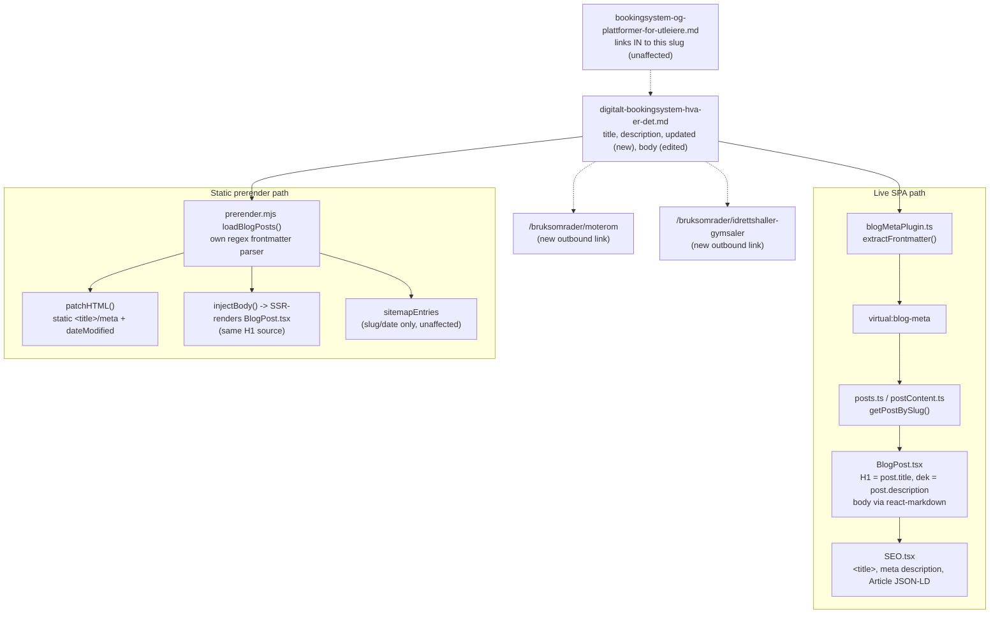

# XAL-1160 — Lav CTR: /blogg/digitalt-bookingsystem-hva-er-det (243 visninger, 0.4% CTR, plass 17.2)

## 1. WHAT THIS IS

Google Search Console shows `/blogg/digitalt-bookingsystem-hva-er-det` ranking
at an average position of 17.2 with 243 impressions, but only 0.4% CTR
against an expected ~1% for that position. The page answers a legitimate
definitional query ("digitalt bookingsystem hva er det") and gets shown, but
the SERP snippet (title + meta description) is generic — a plain "what is
X, and how does it work?" phrasing with no concrete number or promise — so
it doesn't stand out enough to earn the click. This is a content/metadata
rewrite of one existing blog post: sharper title, sharper meta description,
a scannable stats box, two new internal links, and a stronger "next step"
close. No template, component, or build-script change.

## 2. HOW IT WORKS NOW (files/functions read)

- `src/content/blog/digitalt-bookingsystem-hva-er-det.md` — the page's sole
  source of truth. Frontmatter: `title`, `description`, `date`, `author`,
  `role`, `readingMinutes`, `tag`, `cover`, `keywords`. No `updated` field
  existed before this change (unlike some other posts) and no `schema`/FAQ
  frontmatter fields.
- `src/lib/blogFrontmatter.ts` (`parseFrontmatter` line 19, `extractFrontmatter`
  line 60) — parses a raw `.md` file into `{slug, title, description, date,
  updated, author, role, readingMinutes, tag, cover, keywords}` for the live
  SPA. Sole call site: `build-plugins/blogMetaPlugin.ts`, a Vite plugin
  resolving the `virtual:blog-meta` module from every `src/content/blog/*.md`
  file at build time. `updated` is optional — `extractFrontmatter` returns
  `undefined` when the field is absent (was the case here before this edit).
- `src/lib/posts.ts` — imports `virtual:blog-meta`, exposes `getAllPosts()`.
  `src/lib/postContent.ts` (`getPostBySlug`, lines 20-36) — merges that
  metadata with the markdown body (re-parsed separately for `content` only,
  via `parseFrontmatter`).
- **H1 / dek**: `src/pages/BlogPost.tsx:89` calls `getPostBySlug(slug)`;
  line 199-201 renders `post.title` as the sole `<h1>` (`EditorialHeading
  as="h1"`); line 202-207 renders `post.description` as the italic subhead
  under the H1. Body markdown is rendered via `react-markdown` +
  `remarkGfm` (line 232) — standard markdown links/bold, nothing custom.
- **`<title>` / `<meta name="description">`**: `BlogPost.tsx:132-134` passes
  `title`/`description` into `<SEO .../>`. `src/components/SEO.tsx:97-98`
  sets `document.title`; line 111 sets `<meta name="description">`.
  `BlogPost.tsx:133` only appends " · Digilist" when
  `post.title.length <= 50` — the old title (60 chars) and the new title
  (~56 chars) both exceed that, so in both cases `document.title` is the
  raw post title with no suffix (behaviour unchanged by this edit).
  `keywords` (unchanged by this branch) has no meta-tag effect for blog
  posts (`SEO.tsx:112` uses `DEFAULT_KEYWORDS`, not `post.keywords`); it's
  still read for `Article` JSON-LD `keywords` (`SEO.tsx:318`) and for
  `relatedSolutions()` link-matching (`BlogPost.tsx:29-53`), both untouched.
- **Static prerender**: `scripts/prerender.mjs` has its own regex
  frontmatter parser in `loadBlogPosts()` (lines 179-213), independent of
  `blogFrontmatter.ts`, extracting `slug, title, description, date,
  updated, author, tag, cover` (no `keywords`). It already reads
  `fm.updated` (line 203) even though this post never set it before.
  Lines ~2494-2557 build the `Article` JSON-LD (`dateModified:
  post.updated || post.date`, so the new `updated` field now drives that
  field for the first time on this post) and call `patchHTML()` with the
  same `title`/`description` for the static `<title>`/meta tags (line
  2531-2532: only appends " – Digilist" when `title.length <= 50`, same
  threshold logic as `BlogPost.tsx`, kept in sync). `injectBody()`
  SSR-renders the real `BlogPost.tsx` tree so the static H1 matches the
  live one automatically. Regex frontmatter matcher
  (`/^(\w+):\s*"?([^"]+)"?$/`) has no issue with the new title's en-dash
  or question mark — neither is a `"`, the only character the capture
  group excludes.
- **FAQ schema** (unaffected, verified): this slug has no entry in
  `src/content/blogFaq.mjs`'s `POST_FAQ` map, so no `FAQPage` JSON-LD is
  emitted for this post either before or after this change; `blogFaq.test.ts`
  doesn't reference this slug.
- Reproduced the "what's true today" baseline first: ran `npx vitest run`
  and `npx tsc --noEmit` before editing anything (17 files / 36 tests
  green, clean typecheck) so any later failure would be attributable to
  this change, not pre-existing state.

## 3. WHAT CHANGES

Content/metadata only, in `digitalt-bookingsystem-hva-er-det.md`:

- **Title**: "Digitalt bookingsystem: hva er det, og hvordan fungerer det?"
  → "Digitalt bookingsystem – hva er det? Forklart i 6 steg" — keeps the
  exact-match query phrase up front, replaces the vague double-question
  with a concrete number (the article's own 6-step "how it works in
  practice" section), and shortens from ~60 to ~56 chars.
- **Meta description**: rewritten to name what's covered (the 6 steps, who
  uses it, what to check before choosing) instead of a flat restatement of
  the title.
- **Intro paragraph**: last clause tightened to promise "de 6 stegene det
  styrer i praksis" so the intro matches the new title/description promise
  instead of only "hva det er".
- **New "I korte trekk" bullet box** right under the intro: four concrete
  numbers sourced directly from the article's own sections — 3 resource
  types (§"Hvilke ressurser kan bookes digitalt"), 4 user groups
  (§"Hvem bruker digitale bookingsystemer"), 6 steps (§"Hvordan fungerer...
  i praksis"), and the one differentiator vs. a shared calendar — gives
  skimmers and AI-snippet extraction an immediate scannable answer.
- **Two new internal links** in the "Hvilke ressurser kan bookes digitalt"
  bullet list, to `/bruksomrader/moterom` and
  `/bruksomrader/idrettshaller-gymsaler` (both confirmed live routes,
  `src/App.tsx:378-379`) — contextually on-topic since that bullet already
  named "møterom, idrettshaller, gymsaler".
- **Closing "Neste steg" section**: reframed from a paragraph into an
  explicit lead-in question ("Hvilken retning passer for deg?") plus a
  3-item bulleted CTA list, using the same three internal links that were
  already there (`/blogg/kommunalt-bookingsystem-hva-er-det`,
  `/bookingsystem-utleie`, `/blogg/bookingsystem-og-plattformer-for-utleiere`
  — all still confirmed live) — no new destinations, just a more scannable
  and decisive close.
- **Frontmatter addition**: `updated: 2026-08-10` — field didn't exist
  before; adding it gives `prerender.mjs`'s `dateModified: post.updated ||
  post.date` an actual "last substantially updated" signal for this post's
  `Article` JSON-LD, and freshens it to match today's content edit.

Out of scope, deliberately not touched: `scripts/prerender.mjs`,
`src/entry-server.tsx`, `src/lib/blogFrontmatter.ts`, `blogFaq.mjs` (this
post has no FAQ entries to touch), `readingMinutes` (left at 7 — the
added content is a 4-line stats box and two link labels, not materially
more reading time), and `keywords` (unchanged; already covers the ranking
query).

## 4. BLAST RADIUS

Grepped for every consumer of this slug and of the touched fields:

- `src/pages/BlogPost.tsx` — renders new title as H1, new description as
  dek and as `<meta name="description">`, new body markdown (stats box,
  two new links, restructured CTA) via `react-markdown`.
- `src/components/SEO.tsx` — new title/description flow into
  `document.title`, meta description, and `Article` JSON-LD `headline`/
  `description`.
- `scripts/prerender.mjs` — its independent frontmatter parser picks up
  the same new title/description/updated fields for the static HTML
  `<title>`/meta tags and `Article` JSON-LD `dateModified`; SSR body
  render reuses `BlogPost.tsx` so the static H1 matches automatically.
- `src/content/blog/bookingsystem-og-plattformer-for-utleiere.md` — the
  only other content file linking *to* this slug (inbound link, in its
  intro paragraph); unaffected, still resolves to the same route.
- No test file references this slug
  (`grep -rn "digitalt-bookingsystem-hva-er-det" src --include="*.test.*"`
  returns nothing) — no pinned snapshot to update.
- `src/content/blogFaq.mjs` / `blogFaq.test.ts` — unaffected, this slug has
  no FAQ entry either before or after.
- Sitemap (`prerender.mjs`, keyed on slug/date only) — unaffected.
- `relatedSolutions()` (`BlogPost.tsx:29-53`) — unaffected, `keywords`
  array untouched.
- `/bruksomrader/moterom` and `/bruksomrader/idrettshaller-gymsaler`
  (new link targets) — confirmed live routes in `src/App.tsx:378-379`,
  unaffected by this branch (linked to, not modified).

## Verification run in this worktree

- `npx vitest run` — 17 test files, 36 tests, all passing (baseline before
  edit and after edit are identical: no test references this slug).
- `npx tsc --noEmit` — clean, no errors.
- Manually confirmed all five link targets (2 new, 3 pre-existing) exist as
  live routes: `/bruksomrader/moterom`, `/bruksomrader/idrettshaller-gymsaler`
  (`src/App.tsx:378-379`), `/bookingsystem-utleie` (`src/App.tsx:305`), plus
  the two blog-post routes (`/blogg/:slug` is a generic route,
  `src/App.tsx:362`, and both target `.md` files exist in
  `src/content/blog/`).

## Note: Linear attachment step

No Linear MCP tools are available in this environment (confirmed via
`ToolSearch` for both "linear attachment upload create issue" and
"prepare_attachment_upload create_attachment_from_upload linear" — no
matching tools found, consistent with the prior finding for XAL-1151/
XAL-1161). This SPEC is committed to the branch per the escalation path but
could not be attached to the Linear issue or commented on it from this
session.
