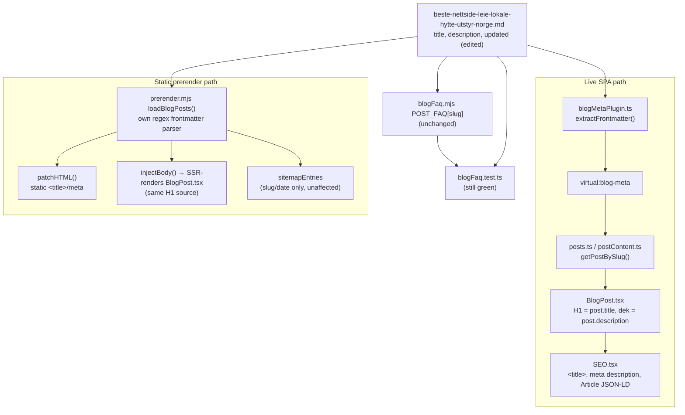

# XAL-1161 — Lav CTR: /blogg/beste-nettside-leie-lokale-hytte-utstyr-norge (136 visninger, 0.7% CTR, plass 6.4)

## 1. WHAT THIS IS

Google Search Console shows `/blogg/beste-nettside-leie-lokale-hytte-utstyr-norge`
ranking at an average position of 6.4 with 136 impressions, but only 0.7% CTR
against an expected ~4% for that position. The page is being shown for
relevant search demand but the SERP snippet (title + meta description) isn't
persuading people to click, and once they land, the page doesn't reinforce
the click with a sharp value proposition or a clear next step. The task is a
content/metadata rewrite of this one page — sharper title, sharper meta
description, concrete numbers, added internal links, and a clear CTA — not a
template or pipeline change.

## 2. HOW IT WORKS NOW (files/functions read)

- `src/content/blog/beste-nettside-leie-lokale-hytte-utstyr-norge.md` — the
  page's sole source of truth. Frontmatter carries `title`, `description`,
  `date`, `updated` (was misspelled `lastUpdated` — a dead field never read
  by any parser), `keywords`, and `schema: "FAQPage"` +
  `faqQuestion`/`faqAnswer` (cosmetic; the actual FAQPage JSON-LD is driven
  by `src/content/blogFaq.mjs`, not these two fields — confirmed unchanged
  by this branch, still passes `blogFaq.test.ts`).
- `src/lib/blogFrontmatter.ts:59-82` (`extractFrontmatter`) — parses a raw
  `.md` file into `{slug, title, description, date, updated, author, role,
  readingMinutes, tag, cover, keywords}`. Sole call site:
  `build-plugins/blogMetaPlugin.ts:21-39`, a Vite plugin that resolves the
  `virtual:blog-meta` module by reading every `src/content/blog/*.md` file
  at build time.
- `src/lib/posts.ts:13,19-23` — imports `virtual:blog-meta`, exposes
  `getAllPosts()`. `src/lib/postContent.ts:20-36` — `getPostBySlug()` merges
  that metadata with the markdown body (re-parsed separately for `content`
  only).
- **H1 / dek**: `src/pages/BlogPost.tsx:89` fetches the post via
  `getPostBySlug(slug)`; line 199-201 renders `post.title` as the sole
  `<h1>` (via `EditorialHeading as="h1"`); line 202-207 renders
  `post.description` as the italic subhead directly under the H1.
- **`<title>` / `<meta name="description">`**: `BlogPost.tsx:132-134`
  passes `title`/`description` into `<SEO .../>`. `src/components/SEO.tsx:97-98`
  sets `document.title`; line 111 sets `<meta name="description">`. Note:
  `SEO.tsx:112` sets `<meta name="keywords">` from `DEFAULT_KEYWORDS`, not
  `post.keywords` — blog posts never pass a top-level `keywords` prop, so
  this branch's unchanged `keywords` array has no meta-tag effect (it's
  still read for `Article` JSON-LD `keywords` at `SEO.tsx:318`, and for
  `relatedSolutions()` link-matching in `BlogPost.tsx:29-53`).
- **Static prerender**: `scripts/prerender.mjs` does **not** reuse
  `blogFrontmatter.ts` — it has its own regex frontmatter parser in
  `loadBlogPosts()` (lines 177-211) extracting `slug, title, description,
  date, updated, author, tag, cover` (no `keywords`). Lines 2494-2557 build
  the `Article` JSON-LD and call `patchHTML()` with the same `title`/
  `description` to write the static `<title>`/meta tags, then
  `injectBody()` SSR-renders the real `BlogPost.tsx` tree so the static
  `<h1>` matches the live one. Line 2599-2622 builds `sitemapEntries` from
  `slug`/`date` only (title/description don't reach the sitemap).
- **FAQ schema** (unaffected by this change, verified): `blogFaq.mjs:11-16`
  keyed by slug, asserted against the markdown body's `## Vanlige spørsmål`
  section by `blogFaq.test.ts` (both still pass — question/answer text
  untouched).
- Reproduced the regression risk first: ran
  `npx vitest run src/content/blogFaq.test.ts` before editing anything to
  confirm the FAQ/JSON-LD wiring was green on the baseline, so any later
  failure would be attributable to this change.

## 3. WHAT CHANGES

Content/metadata only, in `beste-nettside-leie-lokale-hytte-utstyr-norge.md`:

- **Title**: "Beste nettside for å leie lokale, hytte eller utstyr i Norge
  (2026)" → "Beste nettside for å leie lokale, hytte og utstyr: 4
  alternativer" — leads with a concrete number instead of a generic
  superlative + year.
- **Meta description**: rewritten to name the comparison method (4 sites),
  what's compared (pris, funksjoner, hvem de passer for), and an explicit
  next action ("Se tabellen, finn riktig plattform").
- **Intro paragraph**: reframed to open with "Vi har sammenlignet fire
  nettsteder..." instead of a flat definitional sentence, matching the new
  title/description promise.
- **New "I korte trekk" bullet box** right under the intro: four concrete,
  sourced numbers (4 nettsteder, 15+ utleiere/kommuner, under 2 uker
  oppsett, eneste av de fire med ID-porten) — gives skimmers/AI snippets a
  scannable answer immediately.
- **Two new internal links** in the first section, to
  `/bruksomrader/idrettshaller-gymsaler` and `/bruksomrader/moterom` (both
  confirmed live routes in `src/App.tsx:378-379`).
- **Closing CTA**: replaced a plain-text "prøv Digilist" sentence with a
  question + explicit link CTA to `/bookingsystem-utleie` (confirmed live
  route, `src/App.tsx:305`).
- **Frontmatter bug fix**: `lastUpdated: 2026-07-27` → `updated:
  2026-08-10` — `lastUpdated` isn't a field any parser reads (confirmed via
  `blogFrontmatter.ts` and `prerender.mjs`'s field lists above), so the
  page's `dateModified`/"oppdatert" signal was silently stuck on a dead
  field; this also freshens the actual updated date to match today's edit.

Out of scope, deliberately not touched: `scripts/prerender.mjs`,
`src/entry-server.tsx`, `pnpm-workspace.yaml` (a locally-staged
`allowBuilds` edit was found pre-staged in this worktree from an unrelated
session and was reverted — shared root config, not part of this page's
fix, same conflict risk the ticket explicitly warns against), and
`blogFaq.mjs`/FAQ question-answer text (verified unchanged, still passes
its drift test).

## 4. BLAST RADIUS

Grepped for every consumer of this slug and of the two touched fields:

- `src/pages/BlogPost.tsx` — renders new title as H1, new description as
  dek and as `<meta name="description">`.
- `src/components/SEO.tsx` — new title/description flow into
  `document.title`, meta description, and `Article` JSON-LD `headline`/
  `description`.
- `scripts/prerender.mjs` — its independent frontmatter parser picks up the
  same new title/description/updated fields for the static HTML `<title>`/
  meta tags and `Article` JSON-LD `dateModified`; SSR body render reuses
  `BlogPost.tsx` so the static H1 matches automatically.
- `src/content/blogFaq.test.ts` / `blogFaq.mjs` — unaffected (question/
  answer text untouched); re-ran and confirmed still green.
- Sitemap (`prerender.mjs:2599-2622`) — unaffected, keyed on slug/date only.
- No other file references this slug (`grep -rn
  "beste-nettside-leie-lokale-hytte-utstyr-norge"` outside blog/blogFaq
  returns nothing test-relevant).
- `relatedSolutions()` (`BlogPost.tsx:29-53`) — unaffected, `keywords` array
  untouched.

## Verification run in this worktree

- `npx vitest run` — 17 test files, 36 tests, all passing (includes
  `blogFaq.test.ts`, `entry-server.h1.test.tsx` which pins "post title is
  the sole H1").
- `npx tsc --noEmit` — clean, no errors.
- Manually confirmed both new internal-link routes and the CTA route exist
  in `src/App.tsx`.

## Note: Linear attachment step

No Linear MCP tools are available in this environment (confirmed
previously for XAL-1151 and re-confirmed here via `ToolSearch` — no
`prepare_attachment_upload`/`create_attachment_from_upload`-equivalent
tool exists). This SPEC is committed to the branch per the escalation path
but could not be attached to the Linear issue or commented on it from this
session.
