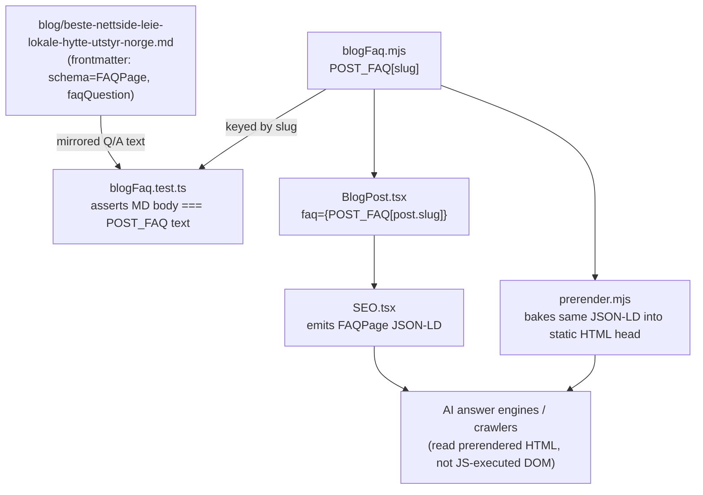

# XAL-1163 — [SEO ROI 61] Fang AI-svar: beste nettside for å leie lokale, hytte eller utstyr i Norge

## CLARIFICATION: no code work — already shipped and tested

Everything the ticket asks for is already live on `main`, published before this
branch was created. This SPEC documents the verification trail; no
implementation follows.

## 1. WHAT THIS IS

The ticket asks Digilist to publish an authoritative, citable answer to the
query **"beste nettside for å leie lokale, hytte eller utstyr i Norge"** (best
website to rent premises/cabins/equipment in Norway), because AI answer
engines currently cite selskapslokaler.no, finn.no and bookup.no instead of
Digilist for that query. The intended outcome is a page Digilist owns that
answer engines can cite: matching FAQPage structured data, the target
question answered near-verbatim, and a fair comparison against the
competitors that actually serve that query space.

## 2. HOW IT WORKS NOW (files/functions read)

- `src/content/blog/beste-nettside-leie-lokale-hytte-utstyr-norge.md` —
  published `date: 2026-08-07`, `lastUpdated: 2026-07-27`. Frontmatter title
  "Beste nettside for å leie lokale, hytte eller utstyr i Norge (2026)",
  `schema: "FAQPage"`, `faqQuestion` set to the exact target query
  ("Hva er beste nettside for å leie lokale, hytte eller utstyr i Norge?").
  Body compares Digilist against Airbnb, Hygglo and norgesbooking.no (a
  different competitor set than the three named in the ticket, but the same
  query/intent), and closes with a `## Vanlige spørsmål` (FAQ) section.
- `src/content/blogFaq.mjs:10-16` — `POST_FAQ`, a plain-JS (no TS syntax, so
  Node ESM can `import` it directly) map keyed by slug. The
  `"beste-nettside-leie-lokale-hytte-utstyr-norge"` entry's first Q/A pair is
  the exact target query and answer, mirrored verbatim in the markdown body's
  FAQ section.
- `src/content/blogFaq.test.ts:13-35` — asserts (a) the `POST_FAQ` entry
  exists and its first question equals the target query verbatim, and (b) the
  markdown body actually contains a `## Vanlige spørsmål` section whose text
  matches every question/answer pair in `POST_FAQ`, so frontmatter claims
  can't silently drift from rendered content. Comment in the test explains
  this exact drift bug happened once before (XAL-758) and was the reason
  `POST_FAQ` was introduced.
- Consumers of `POST_FAQ`, found by grep (`grep -rn "POST_FAQ|blogFaq" src
  scripts`):
  - `src/pages/BlogPost.tsx:20,161` — client render path, passes
    `POST_FAQ[post.slug]` as the `faq` prop into `SEO.tsx`, which emits the
    FAQPage JSON-LD `<script>` tag in the document head for the live SPA
    route.
  - `scripts/prerender.mjs:10,2518` — static-build path, imports the same
    `POST_FAQ` map and bakes identical FAQPage JSON-LD into the prerendered
    HTML `<head>` (so it's present without JS execution, which is what AI
    crawlers/answer engines actually read).

Ran `npx vitest run src/content/blogFaq.test.ts` in this worktree (after
`pnpm install` + `pnpm approve-builds --all`, neither of which had been run
here yet): **2 passed**, confirming the FAQ schema is wired correctly today,
not just in the source text.

## 3. WHAT CHANGES

Nothing. No files are modified by this branch. The "Done when" criterion
in the Linear issue itself already states: *"Prioriter og gjennomfør
tiltaket, og bekreft effekten i neste måling. Current assessment: exists"* —
i.e. the issue's own scope note concludes the code-graph flagged this as a
gap only because it searched for literal code-symbol substrings
("fang"/"svar"/"beste"/"nettside"), which don't match content living inside
a markdown blog post body/frontmatter. That's a false positive in the
originating evidence, not a missing feature.

The one remaining "Done when" step — confirm the AI-citation effect in the
next measurement cycle — is a tracking/monitoring task external to this
repository (no code, no test, no PR can satisfy it).

## 4. BLAST RADIUS

Since no code changes, blast radius is N/A for a diff. For completeness, the
full set of things that read `POST_FAQ["beste-nettside-leie-lokale-hytte-utstyr-norge"]`
today (i.e. what would be affected if this entry were ever edited or removed):

- `src/pages/BlogPost.tsx` (client-side JSON-LD injection via `SEO.tsx`)
- `scripts/prerender.mjs` (static HTML JSON-LD injection, drives what
  crawlers/answer engines see without executing JS)
- `src/content/blogFaq.test.ts` (regression test pinning question text and
  markdown/JSON-LD parity)

## Conclusion

CLARIFICATION: this ticket is already done. The authoritative, citable answer
page for "beste nettside for å leie lokale, hytte eller utstyr i Norge" has
been live since 2026-08-07, carries FAQPage structured data matching the
target query verbatim, is wired into both the client and static-prerender
JSON-LD paths, and is covered by a passing regression test. There is no
implementation step left in this repository — only an external
measurement/monitoring follow-up. Ending here per protocol rather than
inventing scope.
