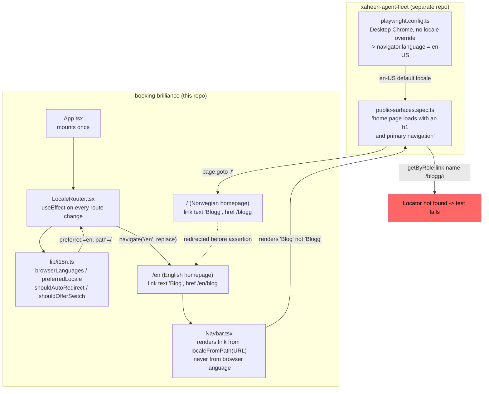

# XAL-1214 — E2E failure: "home page loads with an h1 and primary navigation"

## Verdict: CLARIFICATION — not a booking-brilliance code defect

The reported failure is a direct, deterministic consequence of a deliberately
shipped, unit-tested i18n feature (landed 2026-08-12/13, the day before this
ticket was auto-prepared). There is no bug to fix in this repository. The
mismatch is between the E2E assertion (written 2026-07-11, before English
support existed) and the site's new — and correct — locale-redirect behaviour.

## WHAT THIS IS

The failing journey is `public-surfaces.spec.ts` → `"home page loads with an
h1 and primary navigation"`, run from a **separate repository**
(`/root/xaheen-agent-fleet/tools/e2e-agent`, not booking-brilliance) against
the live site `https://digilist.no`:

```ts
test("home page loads with an h1 and primary navigation", async ({ page }) => {
  const health = trackPageHealth(page);
  await visitPublicPage(page, "/", health);
  await expect(page.getByRole("link", { name: /blogg/i }).first()).toBeVisible();
});
```

It asserts a link whose accessible name matches the Norwegian word "blogg".

## HOW IT WORKS NOW

Read `src/lib/i18n.ts`, `src/components/LocaleRouter.tsx`, `src/App.tsx`
(mount point), `src/components/Navbar.tsx`, and `src/lib/i18n.test.ts`.

- `src/lib/i18n.ts` defines the whole locale model. Two rules, both stated in
  its top-of-file doc comment: (1) a URL is one language, always — content is
  never swapped based on who's asking, only by redirect; (2) a locale exists
  for a page only once that page is actually translated (`TRANSLATED_PATHS`
  whitelist, currently `/`, `/priser`, `/faq`, `/blogg`).
- `browserLanguages()` (i18n.ts:241) reads `navigator.languages`, returning
  `null` under SSR/prerender (guarded on `window`, not `navigator`, because
  Node 22 ships a global `navigator.language === "en-US"` that would otherwise
  poison the static build).
- `preferredLocale()` (i18n.ts:250) maps browser language tags to `"nb"` or
  `"en"` — anything not recognisably Norwegian (`nb`/`nn`/`no`) becomes
  `"en"`, since English is the only other published language.
- `shouldAutoRedirect()` (i18n.ts:299) — **homepage only**
  (`path !== "/" && path !== "/en"` short-circuits to `null` for every other
  route). If the visitor's stored-or-preferred locale differs from the
  current path's locale, it returns the path to redirect to
  (`alternatePath`), e.g. `"/"` → `"/en"`. This exact case
  (`{ pathname: "/", preferred: "en", stored: null }` → `"/en"`) has its own
  named unit test in `src/lib/i18n.test.ts:120`:
  `describe("shouldAutoRedirect — a visitor in the UK gets English", ...)`.
- `LocaleRouter` (`src/components/LocaleRouter.tsx`, mounted once in
  `src/App.tsx:523` inside the router) runs this on every route change via
  `useEffect`, and calls `navigate(to, { replace: true })` client-side when
  `shouldAutoRedirect` returns a path. Off the homepage it shows a dismissible
  banner (`shouldOfferSwitch`) instead of redirecting, specifically to avoid
  bouncing Googlebot off 335+ Norwegian blog posts and deep pages — the
  file's doc comment calls this out explicitly, including that Googlebot
  itself crawls with an English `Accept-Language` and executes JS, so it
  *is* expected to be redirected on the homepage.
- `Navbar.tsx` renders the primary nav (`aria-label` is itself
  locale-dependent — "Hovednavigasjon" in Norwegian, "Main navigation" in
  English, via `t()` from `src/lib/copy.ts`) purely from `localeFromPath()`
  (URL-derived, never from browser language directly) — rule #1 above. The
  Blogg/Blog link text and `href` (`/blogg` vs `/en/blog`) both come from the
  current path's locale, not from any client-side swap.

### Reproduction

Playwright's `devices["Desktop Chrome"]` (used by both the fleet's
`playwright.config.ts` and my own repro script) reports `navigator.language
= "en-US"` unless a context `locale` is explicitly set. Confirmed live against
`https://digilist.no`:

| Context locale | URL after load | Primary-nav blog link |
|---|---|---|
| *(default, i.e. what the E2E suite uses)* | `https://digilist.no/en` | `href="/en/blog"`, text **"Blog"** |
| `nb-NO` (explicit) | `https://digilist.no/` | `href="/blogg"`, text **"Blogg"** |

`getByRole('link', { name: /blogg/i })` never matches "Blog" (missing the
second "g"), so the test fails 100% of the time under the suite's actual
(default-locale) browser config — not flakily, not intermittently.

Also ran `npx playwright test --project=regression -g "home page loads with
an h1 and primary navigation"` from the fleet repo directly: reproduces the
exact reported error (locator not found, both the initial attempt and the
retry).

### Timeline

- `src/lib/i18n.ts` / `LocaleRouter.tsx` / the whole `/en` mirror: commits
  `7e2fffa`…`79a9899`, all dated **2026-08-12/13**.
- The failing assertion in `tools/e2e-agent/tests/public-surfaces.spec.ts`:
  last touched **2026-07-11**, a month before English support existed — it
  was written when the homepage had exactly one language and could never
  redirect.
- This ticket (XAL-1214) was auto-prepared **2026-08-13T00:56Z**, i.e. the
  first scheduled E2E run after the i18n feature shipped.

## WHAT CHANGES

Nothing, in this repository. `src/lib/i18n.ts` and `LocaleRouter.tsx` are
working exactly as designed and as their own unit tests (`i18n.test.ts`)
specify — reversing or narrowing the homepage auto-redirect would be a
product/SEO decision (the file's doc comments describe real tradeoffs
already deliberately made across 8 commits), not a bug fix, and is out of
scope for an E2E-failure ticket.

The actual fix belongs in the **other** repository
(`/root/xaheen-agent-fleet/tools/e2e-agent`), which is outside this
worktree/branch and this PR's reach: either pin the `regression` project's
browser `locale` to `nb-NO` (matching the site's actual default market), or
make the assertion locale-agnostic (e.g. `getByRole('link', { name:
/blogg|blog/i })`, or assert on `a[href$="/blogg"], a[href$="/en/blog"]`
instead of visible text).

## BLAST RADIUS

- `src/App.tsx:523` — sole mount point of `<LocaleRouter />`; every route
  renders it once via the app-level router.
- `src/components/Navbar.tsx`, `src/components/MobileMenu.tsx`,
  `src/components/Footer.tsx`, `src/components/LanguageSwitcher.tsx` — all
  consume `localeFromPath`/`alternatePath`/`t()` for locale-aware links; none
  of them read browser language directly (confirmed via grep — only
  `i18n.ts` and `LocaleRouter.tsx` call `browserLanguages`/`preferredLocale`).
- `src/pages/Index.tsx`, `Blog.tsx`, `BlogPost.tsx`, `Priser.tsx`, `FAQ.tsx`
  — the four translated routes plus blog, all gated by `TRANSLATED_PATHS`/
  `isIndexableEnglish` for `noindex` correctness; untouched by this
  investigation.
- `src/lib/i18n.test.ts` — already pins the exact redirect behaviour this
  ticket's E2E test collided with; no change needed.
- `/root/xaheen-agent-fleet/tools/e2e-agent/tests/public-surfaces.spec.ts`
  and `playwright.config.ts` — outside this repo; this is where the real fix
  belongs (see [[project_e2e_agent_lives_in_fleet]] in memory for the
  general pattern of this suite living in a separate repo).
- No other ticket in `.agent/` touches `i18n.ts`/`LocaleRouter.tsx` as of
  this writing (checked `.agent/*/SPEC.md` for references — none found), so
  no sibling-branch collision risk here, unlike the XAL-3xx `entry-server.tsx`
  family.

## Diagram


