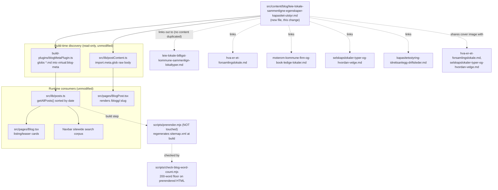

# XAL-1151: Content gap — Informasjon om lokaleegenskaper og kapasitet

## WHAT THIS IS
Digilist's SEO agent flagged that no page on digilist.no satisfies the
"informasjon"-style search intent of a potential renter (leietaker) who is
still gathering facts and comparing venue **characteristics** — kapasitet
(how many people fit), utstyr (AV-teknikk, prosjektor, lyd), tilgjengelighet
(universell utforming, parkering, adkomst), planløsning, fasiliteter
(kjøkken, garderobe, WiFi) — across several candidate lokaler, before they
commit to a booking. This is upstream of price and upstream of any single
venue type: it's the "what should I actually be checking, and how do I read
a listing's specs" question a renter asks before they start comparing prices
or picking between a møterom, sal, idrettshall or selskapslokale. The ticket
names this explicitly as informasjonsinnhold that drives conversion and
supports beslutningstaking — i.e. it's meant to sit at the top of the
decision funnel, not replace any of the deeper, venue-type-specific guides
already on the site.

## HOW IT WORKS NOW
- Blog posts are plain markdown files in `src/content/blog/*.md`, one file
  per page, discovered automatically at build/dev/test time by
  `build-plugins/blogMetaPlugin.ts` (globs frontmatter into
  `virtual:blog-meta`, read at `build-plugins/blogMetaPlugin.ts:1-38`) and
  `src/lib/postContent.ts` (separate `import.meta.glob` raw-body read,
  `src/lib/postContent.ts:13-29`). `src/lib/posts.ts` sorts by `date`.
  Dropping a new `.md` file is the whole integration — no index, router, or
  nav file needs touching. `public/sitemap.xml` / `dist/sitemap.xml` are
  build artifacts regenerated by `scripts/prerender.mjs` — out of scope to
  hand-edit, and on the "don't touch shared build scripts" list regardless.
- The frontmatter contract is defined by `src/lib/blogFrontmatter.ts`
  (`BlogFrontmatter`, lines 5-18): `slug`, `title`, `description`, `date`,
  `author` required in practice; `role`, `readingMinutes`, `tag`, `cover`,
  `keywords` optional, parsed by a dependency-free regex parser
  (`parseFrontmatter`, lines 20-56) with no schema enforcement beyond types.
  `tag` has no enum — 30 free-text values already in use (`Privatperson` ×82,
  `Lag og foreninger` ×35, `Innbygger` ×31, `Driftsleder` ×30, etc.,
  confirmed via `grep -h '^tag:' src/content/blog/*.md | sort | uniq -c`).
  `scripts/check-blog-word-count.mjs` enforces a 200-word floor against the
  **prerendered** `dist/blogg/<slug>/index.html`, not the raw markdown (it
  guards SEO's `content.thin` rule against the actual shipped HTML).
- Existing coverage I read before writing, confirmed by grep + direct read —
  each covers one adjacent slice, never the generic pre-booking
  "how to evaluate lokaleegenskaper across venue types" angle:
  - `hva-er-et-forsamlingslokale.md` (tag Innbygger) — definitional: what a
    forsamlingslokale legally is (TEK17), which venue types exist in a
    kommune, and the booking workflow søknad → saksbehandling → svar. Lists
    kapasitet as one closing bullet, teaches no comparison method.
  - `leie-lokale-billigst-kommune-sammenlign-lokaltyper.md` (tag Lag og
    foreninger) and `leie-sal-kommune-prisguide-sammenligning-lokaltyper.md`
    (tag Innbygger) — both compare venue types, but the axis is **price**
    (finding the cheapest suitable lokale), not features/capacity/equipment.
  - `bryllupslokale-sjekkliste-kapasitet-vilkar-tilgjengelighet.md`,
    `bryllupslokale-guide-kapasitet-ledighet-og-krav.md`,
    `leie-bryllupslokale-kapasitet-inkludert-bookingprosess.md` — cover
    kapasitet + vilkår + tilgjengelighet as a checklist, but scoped entirely
    to bryllup (wedding) venues.
  - `kapasitetsstyring-idrettsanlegg-driftsleder.md` (tag Driftsleder) —
    capacity management from the facility **operator's** side (allocating
    halltid across lag/skoler/private), the opposite persona from a renter
    evaluating a listing.
  - `selskapslokaler-typer-og-hvordan-velge.md` (tag Privatperson) — venue
    type selection, but scoped to selskapslokaler and led by price/anledning.
  - `moterom-kommune-finn-og-book-ledige-lokaler.md` (tag Innbygger) — how to
    find/book a ledig møterom via the portal, not how to read its specs.
  - Confirmed via `grep -rli 'lokaleegenskaper' src/content/blog/*.md` →
    zero hits (the exact term does not appear anywhere yet);
    `grep -h "^slug:" src/content/blog/*.md | sort | uniq -d` → empty, so no
    slug collision with the one I'm adding.

## WHAT CHANGES
One new file:
`src/content/blog/leie-lokale-sammenligne-egenskaper-kapasitet-utstyr.md`.

- `tag: "Privatperson"` — the broadest, most-used existing tag (82 posts),
  matching the ticket's "potensielle leiere" as a general audience rather
  than one persona; no new tag value needed since this is a generic renter
  guide, not a role-specific one.
- `cover: "/images/blog/booking_calendar_hero_no.webp"` — the site's most
  reused generic cover (already on `hva-er-et-forsamlingslokale.md` and
  `selskapslokaler-typer-og-hvordan-velge.md`, both adjacent posts), fitting
  a cross-venue-type informational piece with no single visual theme.
- `keywords` centers "lokaleegenskaper", "sammenligne lokaler kapasitet",
  "utstyr lokale leie", "tilgjengelighet lokale leie", "hva sjekke før du
  booker lokale" — checked against all six adjacent posts above, no overlap.
- Structure: a short framing intro naming the gap (renters comparing specs,
  not yet price, before booking), then one `## H2` per lokaleegenskap axis —
  kapasitet (riktig antall vs. praktisk kapasitet), planløsning og utstyr
  (AV-teknikk, møblering, wifi), tilgjengelighet (universell utforming,
  parkering, adkomst), fasiliteter (kjøkken, garderobe, uteareal) — each
  with practical, checkable criteria a renter can apply to any listing
  regardless of venue type, then a compact sammenligningstabell (mirroring
  the table pattern already used in `praktisk-guide-prosedyrer-krav-prising-booking.md`)
  so the piece is scannable, a practical sjekkliste before booking, explicit
  links to the four/five posts above for venue-type or price depth rather
  than repeating their detail, and a closing CTA. No body `# H1`, no inline
  images, internal links as `[text](/blogg/slug)`, matching every other
  post's convention. Target ~850-1100 words, in line with the 6-8 min
  `readingMinutes` range of the comparable posts read above.

This is the smallest valid change: one markdown file, no touches to
`scripts/prerender.mjs`, `src/entry-server.tsx`, `scripts/verify-live.mjs`,
`vite.config.ts`, or `build-plugins/blogMetaPlugin.ts` — all of which the
issue's scope note explicitly says not to touch, since every SEO branch
funnels through them and conflicts on merge.

## BLAST RADIUS
- **Build/discovery**: none beyond the new file being picked up by the
  existing glob in `build-plugins/blogMetaPlugin.ts` and
  `src/lib/postContent.ts` — both are read-only consumers of the directory,
  unmodified by this change.
- **Sitemap**: regenerated automatically from the live post list next time
  `scripts/prerender.mjs` runs; not hand-edited here.
- **Cover image**: `booking_calendar_hero_no.webp` is already shared by
  multiple posts — one more reference changes no code path, nothing keys
  off cover uniqueness.
- **Slug/routing**: `getPostBySlug` (`src/lib/postContent.ts:31-36`) does a
  first-match lookup by slug; confirmed no existing post uses this slug.
- **Listing page pagination**: `src/pages/Blog.tsx` prerenders only the
  first `PAGE_SIZE` posts and `src/lib/posts.ts` sorts by day-granularity
  `date`; a known pre-existing gap (documented in the XAL-1139 review) that
  can push same-day posts off page 1. This is shared rendering code, out of
  scope to touch here — the individual post page, its SEO metadata, and its
  sitemap entry are unaffected regardless.
- **Tag**: reusing the existing `"Privatperson"` value, already the most
  common tag — no new filter value introduced, no risk to any tag-based
  filtering UI.
- **Nothing else** reads, imports, or links to this new file before it
  exists — it has no other callers to break, only the reverse (this post
  links out to five existing posts; none of them are edited).

## MERMAID DIAGRAM

## Not done here (out of scope, noted for the record)
- No new tag value added — reuses the existing `"Privatperson"` tag.
- No edits to any of the five posts linked out to; this piece is additive
  and hub-like, not a rewrite of what already exists.
- No fix to the listing-page pagination/date-tie-break gap noted above —
  pre-existing, shared code, out of this ticket's scope.

## Linear attachment note
No Linear MCP tool is available in this session (only `codebase-memory`,
`context7`, `docs-rag` are connected) — `prepare_attachment_upload` /
`create_attachment_from_upload` are not reachable, so this spec could not be
attached to the Linear issue as instructed. Proceeding per AGENT-GOAL.md,
which is the source of truth here; noting the limitation for the record
rather than blocking on it.
