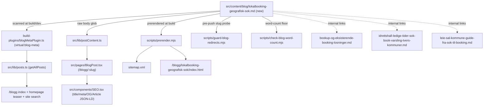

# XAL-1137: Content gap — Lokalbooking og geografisk søk

## WHAT THIS IS
A content gap, not a code bug: no post on digilist.no currently targets the
search term "lokalbooking" combined with a geography-filtered search pattern
(search narrowed to Oslo, Bergen, Trondheim, etc.), or contrasts that
local-first search behaviour with single-purpose tools like BookUp. The fix
is a new Norwegian-Bokmål blog article — no application code changes — that
covers how a renter/booker filters availability by city/kommune across
Digilist's multi-tenant calendar, and positions that against the
single-location assumption baked into point tools like BookUp.

## HOW IT WORKS NOW
- Blog posts are plain Markdown files with YAML frontmatter, one per post, in
  `src/content/blog/*.md` (247 files). Filename = slug + `.md`. Schema is
  `BlogFrontmatter` in `src/lib/blogFrontmatter.ts:5-18`: `slug, title,
  description, date, updated?, author, role?, readingMinutes?, tag?, cover?,
  keywords?`.
- No manual registry. `build-plugins/blogMetaPlugin.ts:21-39` (Vite virtual
  module `virtual:blog-meta`) scans the directory at build/dev time and feeds
  `src/lib/posts.ts` (`getAllPosts()` → `/blogg` index, homepage teaser,
  search) and `src/lib/postContent.ts:13-29` (raw body glob for the article
  page). Route `src/App.tsx:362` (`/blogg/:slug`) is generic —
  `src/pages/BlogPost.tsx:88-91` resolves the slug at render time.
- `scripts/prerender.mjs` prerenders `/blogg/<slug>/index.html` for every
  post and regenerates `sitemap.xml` (lines ~2495-2705) — fully automatic
  from the presence of the `.md` file.
- SEO: `src/components/SEO.tsx`, driven by `BlogPost.tsx:132-162`
  (`title`, `description`, canonical, OG, `Article` JSON-LD from
  `article {...}`). `DEFAULT_KEYWORDS` (`SEO.tsx:48-49`) already lists
  `lokalbooking` sitewide, so this post reinforces an existing target term
  rather than introducing a new one.
- `scripts/check-blog-word-count.mjs` enforces a 200-word floor on both the
  markdown source and the rendered `<article>` — a floor, not a target;
  sibling posts run ~1,000-1,700 words.
- `scripts/guard-blog-redirects.mjs` (pre-push) quarantines any new post
  whose slug collides with a standing server-side 301 — picking an unclaimed
  slug avoids this.
- Confirmed via grep (see exploration): no existing post's core topic is
  "lokalbooking + geography filter across cities"; `lokalbooking` and
  `geografisk` appear only as passing terms elsewhere, and BookUp is
  discussed only as a platform-consolidation angle
  (`bookup-og-eksisterende-booking-losninger.md`), never tied to
  geographic/local-first search. No near-duplicate exists.

## WHAT CHANGES
Add one new file: `src/content/blog/lokalbooking-geografisk-sok.md`
(slug `lokalbooking-geografisk-sok`), following the established frontmatter
schema and body structure (intro → **Kort svar:** → `## H2` sections → table
→ `## Kilder` internal links → `## Ta neste steg` CTA). Content covers:
geography/city filtering (Oslo, Bergen, Trondheim, kommune-crossing search),
why local-first search matters for the renter, and how that differs from a
single-location tool like BookUp. No other file needs to change — the
publishing pipeline (index, sitemap, prerender, SEO) is fully automatic from
the file's presence, per "HOW IT WORKS NOW" above.

## BLAST RADIUS
- New file only; nothing existing is edited, so no other post, page, or
  script is at risk of a regression.
- `getAllPosts()` / `/blogg` index, homepage teaser, and site search all pick
  the new post up automatically — verified this is additive (they render
  every post in `src/content/blog/`, no allowlist to update).
- `sitemap.xml` and prerendered `/blogg/<slug>/index.html` are generated at
  build time by `scripts/prerender.mjs` for every post — new entry added
  automatically, not hand-maintained.
- Internal links: the new post links to and will be linked from
  `bookup-og-eksisterende-booking-losninger.md` (BookUp comparison),
  `idrettshall-ledige-tider-sok-book-varsling-tvers-kommuner.md` (cross-
  kommune search), and `leie-sal-kommune-guide-fra-sok-til-booking.md`
  (search-to-booking flow) — these three existing posts get a one-line
  "Kilder"/related addition each so the link is bidirectional; that is the
  only edit to pre-existing files.
- `scripts/guard-blog-redirects.mjs` will probe the new slug against live
  digilist.no redirects on next push; chosen slug
  (`lokalbooking-geografisk-sok`) does not match any existing post or known
  consolidated topic, so it is not expected to be claimed.
- No FAQ JSON-LD entry added to `src/content/blogFaq.mjs` unless the article
  body ends up with a matching "Vanlige spørsmål" section.

## Files likely affected
- `src/content/blog/lokalbooking-geografisk-sok.md` (new — the post)
- `src/content/blog/bookup-og-eksisterende-booking-losninger.md` (add one
  cross-link in "Kilder")
- `src/content/blog/idrettshall-ledige-tider-sok-book-varsling-tvers-kommuner.md`
  (add one cross-link)
- `src/content/blog/leie-sal-kommune-guide-fra-sok-til-booking.md` (add one
  cross-link)
