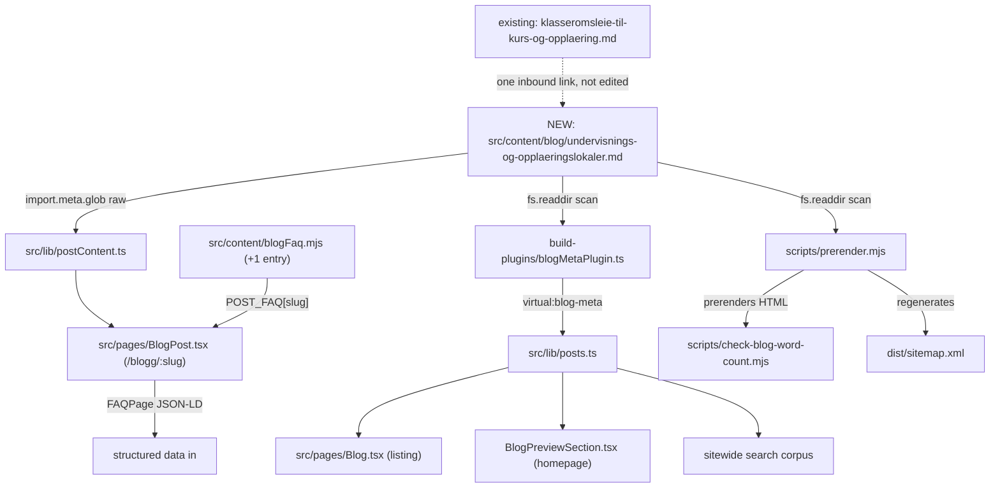

# AGENT-SPEC: XAL-1150 — Content gap: Undervisnings- og Opplæringslokaler

## WHAT THIS IS

Digilist's marketing site publishes one Markdown blog post per SEO angle to
rank for narrow, high-intent search queries (260 posts already exist, many
of them near-duplicate variants of the same theme aimed at different
personas or keywords — e.g. a dozen `sal-kommune-*` posts). This ticket asks
for a new post targeting the query cluster around **"undervisningslokaler"**
/ "opplæringslokaler", written for three personas the ticket names
explicitly: **kursarrangører** (course organizers), **språkskoler**
(language schools) and **opplæringsleverandører** (corporate/vocational
training providers). The angle the ticket asks for is **rimelige,
lett-bookbare** lokaler — affordability and low-friction self-service
booking — which is a different emphasis from what already exists (see
below).

## HOW IT WORKS NOW

Blog content is plain Markdown, one file per post, auto-discovered — there
is no manual registry to update:

- `src/content/blog/*.md` — 260 files, each with YAML frontmatter
  (`slug, title, description, date, author, role, readingMinutes, tag,
  cover, keywords`) matching the `BlogFrontmatter` interface in
  `src/lib/blogFrontmatter.ts` (read in full), plus a Markdown body.
- `build-plugins/blogMetaPlugin.ts` (registered in `vite.config.ts`) globs
  every `.md` file at build/dev time and exposes frontmatter-only metadata
  as the virtual module `virtual:blog-meta`.
- `src/lib/posts.ts` imports `virtual:blog-meta`, sorts by date, and feeds
  the blog listing (`src/pages/Blog.tsx`), the homepage teaser
  (`BlogPreviewSection.tsx`) and the sitewide search corpus — metadata only,
  kept out of the full article body to keep those bundles small (read the
  comment at the top of the file).
- `src/lib/postContent.ts` separately globs the raw `.md` files (`import.meta.glob(..., {raw: true})`)
  for the full article body, consumed only by `src/pages/BlogPost.tsx`
  (route `/blogg/:slug`), which also pulls a matching `POST_FAQ[slug]`
  entry from `src/content/blogFaq.mjs` if one exists (opt-in — only posts
  with a literal "## Vanlige spørsmål" section in the body should have one;
  `src/content/blogFaq.test.ts` enforces per-slug that `POST_FAQ` entries
  are non-empty and appear verbatim in that post's body — read in full).
- At build time, `scripts/prerender.mjs` (`loadBlogPosts()`, read) re-reads
  every `.md` file itself (independent minimal frontmatter parser, by
  design — see file header) to prerender each post to static HTML and
  regenerate `dist/sitemap.xml` from the live post list.
  `scripts/check-blog-word-count.mjs` then gates the build: it re-reads the
  **prerendered HTML** `<article>` content (not the source `.md`) and fails
  the build if any post is under 200 words, per the file's comment on
  `content.thin`.
- `public/sitemap.xml` is a stale committed snapshot only — the real
  sitemap is regenerated into `dist/` at build time and is not part of this
  change.

**Does this already (partly) exist?** Yes, partially.
`src/content/blog/klasseromsleie-til-kurs-og-opplaering.md` (dated
2026-07-25, tag `"Kurs"`, read in full) already covers klasserom/kurslokale
booking for kurs, opplæring and workshops, and explicitly mentions
voksenopplæring/norskkurs and private kursarrangører. It does **not**
mention språkskoler as a named persona, does not use "undervisningslokaler"
as a keyword, and its emphasis is flerdagers/gjentakende booking + praktiske
krav (ansvarlig booker, ryddefrist, avbestillingsfrist) — not price
comparison or "lett-bookbare" self-service framing. To avoid keyword
cannibalization against that post, the new post targets a distinct primary
keyword (`undervisningslokaler` / `opplæringslokaler`, not `klasseromsleie`),
leads with the affordability/self-service angle the ticket asks for, and
explicitly covers språkskoler and opplæringsleverandører as personas, with
one inbound link to the klasserom post for readers who want the
classroom-specific deep dive (one-directional; the existing post is not
edited).

## WHAT CHANGES

- **New file:** `src/content/blog/undervisnings-og-opplaeringslokaler.md` —
  a new Bokmål blog post (frontmatter + ~1000-1200 word body) targeting
  "undervisningslokaler"/"opplæringslokaler", covering kursarrangører,
  språkskoler and opplæringsleverandører, emphasizing affordable pricing
  (foreningsrabatt vs. næringssats) and self-service/no-phone-call booking,
  with a "## Vanlige spørsmål" section for AEO/FAQPage schema.
  Reuses the existing `"Kurs"` tag (already used by the klasserom post) and
  an existing cover image (no new asset).
- **`src/content/blogFaq.mjs`:** add one new keyed entry,
  `POST_FAQ["undervisnings-og-opplaeringslokaler"]`, whose question/answer
  text mirrors the new post's "Vanlige spørsmål" section verbatim (required
  by `blogFaq.test.ts`'s pattern, even though that test only pins the one
  slug it names today).
- No other file is touched. No registry, sitemap, route, or shared
  build/render script (`scripts/prerender.mjs`, `src/entry-server.tsx`,
  `scripts/verify-live.mjs`) is edited, per the ticket's explicit scope
  guard against SEO branches colliding on those shared files.

## BLAST RADIUS

- **Build:** `scripts/prerender.mjs` will pick up the new file automatically
  (directory scan) and prerender `/blogg/undervisnings-og-opplaeringslokaler`
  + add it to the generated sitemap — no code change needed there, but the
  build step must be run to confirm the new post doesn't fail the 200-word
  gate (`scripts/check-blog-word-count.mjs`) or break the SSR prerender.
- **`src/lib/posts.ts` consumers:** the blog listing page, the homepage
  teaser section, and the sitewide search corpus will all list the new post
  once built — this is the intended effect, not a side effect.
- **`src/pages/BlogPost.tsx`:** its `SOLUTION_PAGES` keyword-matching table
  (read in full) doesn't have a regex for "undervisning"/"kurs"/"opplæring",
  so the new post will fall back to the generic
  `/booking-av-lokaler-og-moterom` internal link — same as most other posts
  today. Not edited, since adding a new regex there is a shared-file change
  the ticket scope explicitly warns against, and is unnecessary for this
  ticket's acceptance criteria.
- **`src/content/blogFaq.test.ts`:** only pins the one slug it already names
  (`beste-nettside-leie-lokale-hytte-utstyr-norge`); adding a new
  `POST_FAQ` key doesn't affect that test, but the new key must itself
  satisfy the same shape the test enforces (question text and answer text
  appearing verbatim in the post body) or a future test extending that
  pattern would fail.
- **No other page, component, script, or test reads `src/content/blog/*.md`
  by filename or count** (confirmed via grep for `content/blog` across
  `src/`, `scripts/`, `build-plugins/`) — the only two entry points are the
  metadata glob (`blogMetaPlugin.ts` → `posts.ts`) and the raw-content glob
  (`postContent.ts`), both directory-scan-based.

## Notes

- Linear MCP in this environment may be bound to the wrong workspace per
  standing instructions — this spec is attached via the Linear MCP tools as
  directed; if that fails, the spec still lives at the worktree root and
  travels with the PR.
- No CLARIFICATION or BLOCKED trigger: the ticket is unambiguous, the gap is
  real (a distinct persona/keyword angle not covered by the closest existing
  post), and the acceptance criterion ("create or expand content") is met by
  adding the new post.
