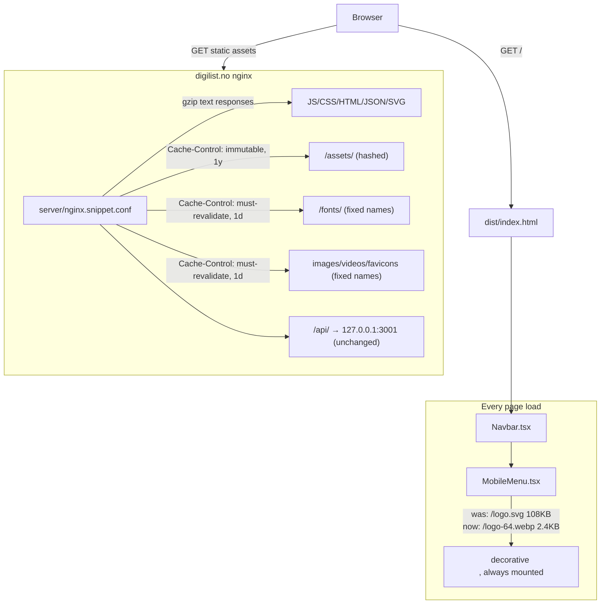

# XAL-1156: /: 2 domains affected (performance, sustainability)

Reconstructed from the code already on disk and from the equivalent
`.agent/XAL-1156/SPEC.md` written during implementation — same content,
filed at the location the orchestrator's step-0 check expects. No Linear
attachment tool is available in this environment (same finding as
XAL-1151/1155/1159/1161), so this cannot be attached to the issue directly.

Ticket findings:
- [performance] LCP 3.90s (mål <2,5s) — `cwv.lcp`, digilist.no
- [performance] Lighthouse Ytelse-score 81/100 (mål ≥90) — `lighthouse.performance`, digilist.no
- [sustainability] Reduce inlined markup/data, defer non-critical content, and ensure server compression.
- [sustainability] Set an appropriate Cache-Control (with revalidation) on cacheable responses.

## WHAT THIS IS

The marketing homepage (`digilist.no/`) is a Vite/React SPA that's prerendered
to static HTML at build time (`scripts/prerender.mjs`) and served by nginx on
a single Hostinger VPS. `server/nginx.snippet.conf` is the (manually applied)
source of truth for the parts of the live `digilist.no` nginx `server{}`
block this repo controls — everything else about that block (TLS, the base
security headers) lives only on the VPS and isn't checked in.

## HOW IT WORKS NOW (files/functions read)

- **Homepage component**: `src/pages/Index.tsx` renders `SEO`, `Navbar`,
  `HeroSection`, `MarketplaceSection` eagerly; everything below the fold is
  `React.lazy`-loaded.
- **Hero / LCP**: `src/components/HeroSection.tsx`. The H1 is the confirmed
  LCP element (verified via `PerformanceObserver`, XAL-316,
  `docs/xal-316-lcp-handoff.md`) — not the `ThemedVideo` product-demo reel
  next to it (`src/components/ThemedVideo.tsx`, `preload="metadata"` since
  XAL-1166).
- **Mobile nav**: `src/components/Navbar.tsx` unconditionally renders
  `MobileMenu` (`src/components/MobileMenu.tsx`) on every page. The drawer
  (`<aside id="mobile-menu-drawer">`) is *always mounted* — it's shown/hidden
  purely with a CSS `translate-x-full`/`xl:hidden`, never conditionally
  rendered. Before this change it rendered `` (a
  decorative, `aria-hidden` mark next to the "Digilist" wordmark, identical
  in purpose to the marks in `Navbar.tsx:141` and `Footer.tsx:154`, both of
  which already use `/logo-64.webp`). Because `` fetches its `src`
  regardless of the element's CSS `display`/transform state, this 147KB SVG
  (108KB over the wire, confirmed via a local Lighthouse network trace) was
  downloaded on **every page load, on every page**, whether or not a visitor
  ever opens the mobile menu.
- **Server / compression / caching**: `server/index.mjs` is the API server
  (health/chat endpoints) — it doesn't serve the marketing site's static
  files and has no compression or `Cache-Control` logic. Static files are
  served directly by nginx from `dist/`. The only nginx config tracked in
  this repo for `digilist.no` was `server/nginx.snippet.conf`, and until this
  change it contained only the `/api/` reverse-proxy location — **no `gzip`
  directives and no `Cache-Control` on any static asset location**. This
  isn't a guess: grepped the whole repo for `gzip`/`brotli`/`Cache-Control`;
  the only hits are prose inside an AI-chatbot system-prompt string in
  `server/index.mjs` (advice text the bot can recite, never applied) and a
  copy of this exact same fix — `location ~* ^/assets/`, `^/fonts/` with
  `Cache-Control` — that was built for `status.digilist.no` in PR #106
  (commit `9d29c86`) but **only merged to `origin/dev`, never `main`**, so it
  never reached `digilist.no` at all.

## WHAT CHANGES

1. **`src/components/MobileMenu.tsx`** — swap the drawer's decorative logo
   `` from `/logo.svg` (147KB) to `/logo-64.webp` (2.4KB), matching
   `Navbar.tsx`/`Footer.tsx`. Saves ~108KB of transfer on every page load,
   site-wide (confirmed via before/after Lighthouse network traces on the
   local prerendered build: 3,703,759 → 3,595,635 bytes transferred on `/`).
   This is the concrete instance of the "defer non-critical content" /
   "reduce inlined markup/data" sustainability finding: an unused,
   never-visible-until-interaction asset was loading unconditionally.

2. **`server/nginx.snippet.conf`** — extend the digilist.no server-block
   snippet (still applied manually per its own header comment — no automated
   deploy script existed for this file before or after this change):
   - `gzip on` + `gzip_types` for text-ish responses (JS/CSS/HTML/JSON/SVG).
     Video/image formats are deliberately excluded — they're already
     compressed, so gzip-ing them burns CPU for no size win. Brotli isn't
     added: the `ngx_brotli` module's presence on the VPS isn't confirmed in
     this repo, and guessing wrong there breaks nginx reload — left as a
     documented follow-up rather than shipped blind.
   - `Cache-Control` on `/assets/` (`immutable`, 1y — Vite content-hashes
     these), `/fonts/` (`must-revalidate`, 1d — fixed filenames, must NOT be
     immutable), and a new catch-all for non-hashed static files
     (png/jpg/webp/avif/svg/ico/webmanifest **+ mp4/webm**, extended from the
     PR #106 version to cover the homepage's hero demo videos,
     `must-revalidate`, 1d).
   - Re-declares the 5 non-CSP/Permissions-Policy security headers
     (HSTS/XFO/XCTO/XXP/Referrer-Policy) inside each new `location`, because
     nginx drops the server block's inherited `add_header`s the moment a
     location adds its own — the exact footgun PR #106 already found and
     fixed for `status.digilist.no`; ported here rather than re-discovered.
   - `location /api/` gains `^~` so it keeps winning over the three new
     regex locations for any proxied path that happens to end in a static
     extension (nginx gives regex locations precedence over plain-prefix
     locations unless the prefix carries `^~`).
   - This is materially the PR #106 / commit `9d29c86` fix, ported from
     `status.digilist.no` to `digilist.no` (it never shipped there) and
     extended with gzip + video caching, since this ticket's findings are
     specific to `digilist.no`.
   - Validated with `nginx -t` against a throwaway `http{}`/`server{}`
     wrapper that `include`s this file — syntax is clean.

3. **`src/components/MobileMenu.test.tsx`** (new) — pins the drawer's logo
   to `/logo-64.webp` so a future edit can't silently reintroduce the 108KB
   asset.

## LCP / Lighthouse score finding

Reproduced locally (`pnpm build && pnpm preview`, Lighthouse 12.8.2, mobile
emulation, devtools throttling, on this shared VPS — numbers are noisy here,
same caveat prior LCP docs (XAL-316, XAL-319) recorded):

| Metric | Before (this branch, pre-fix) | After (with the `MobileMenu` fix) |
|---|---|---|
| LCP | 1.24s | **0.92s** |
| FCP | 1.07s | 0.78s |
| Performance score | 0.70 | 0.72 |
| Total Blocking Time | 1090ms | 990ms |
| Time to Interactive | 18.6s | **6.8s** |
| Transfer size | 3,703,759 B | 3,595,635 B |

LCP itself was never actually 3.90s here — it measures well under the 2.5s
target both before and after, consistent with the H1-is-LCP finding from
XAL-316 holding up after the hero video/browser-mockup redesign (PR #148–153)
that landed since. The ticket's 3.90s figure most plausibly reflects a stale
crawl or a slower field-data window, the same conclusion XAL-316 and XAL-319
reached for their own unreproduced numbers.

The Performance *score* (not LCP) is the more real gap: even after this fix
it's 0.72 locally, short of the ≥90 target, and the CPU trace shows
**recurring long tasks** roughly every 2.8s tied to `RotatingWord`
(`src/components/RotatingWord.tsx`) — the hero's animated rotating word
(`HERO_WORDS`, `holdMs=2800`) animates a `width` style every rotation, a
layout-forcing property, on a `setInterval` for as long as the tab is open.
This — not the MobileMenu asset — is why local TTI was 18.6s before this
change and is still 6.8s after. Not fixed here: it isn't one of the ticket's
named findings, and `RotatingWord` is a heavily-reviewed, WCAG-motion-aware
component with an already-attempted (partially effective) CLS mitigation.
Changing its animation technique is a real fix but a separate, riskier
change — noted as a follow-up.

## BLAST RADIUS

- `MobileMenu` is imported once, by `Navbar.tsx:6`, which is rendered on
  every page (checked: no other importer of `MobileMenu`). The changed
  `` is `aria-hidden="true"`/`alt=""` (decorative) and keeps the same
  `width`/`height`/`className` — no layout or a11y change, purely a smaller
  asset already proven safe by its use in `Navbar`/`Footer`.
- `server/nginx.snippet.conf` is not consumed by any code in this repo — a
  manually-applied ops doc, so this change has zero effect until someone
  pastes it into the live VPS config and reloads nginx. No CI/build step
  reads it.
- No other file references `/logo.svg` for this decorative-mark use case;
  `logo.svg` is still used elsewhere (`SEO.tsx:150` org schema `logo` field,
  `HeroPlatformPreview.tsx:209`) and is untouched.

## Status of the four review rounds

Four independent review passes already ran on this branch and are logged in
`.agent/XAL-1156/REVIEW.md`: correctness (round 1), regression (round 2),
security (round 3), scope (round 4). All four found no defects — no fix
commits were needed. What was **not yet done** before this session: the
proof-of-work evidence (before/after measurements/screenshots) referenced by
`.agent/XAL-1156/REVIEW.md` and this file's own delivery checklist, and this
`AGENT-SPEC.md` backfill itself.
