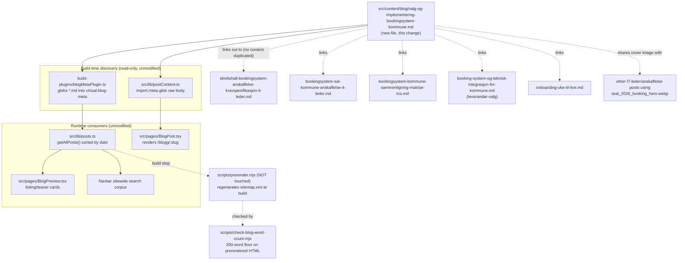

# XAL-1153: Content gap — Valg og implementering av bokingsystem for kommune

## WHAT THIS IS
Digilist's SEO agent flagged that no page on digilist.no satisfies the "valg"
search intent for kommunalt bookingsystem framed as a full decision process.
The named audience is "IT-ledere og kommunale beslutningstakere" — not just
the IT department, but the people who jointly own a B2B software decision in
a kommune: IT, the department that actually runs the bookable resource
(kultur/idrett/eiendom), økonomi/innkjøp, and the kommunedirektør/rådmann who
signs off on larger contracts. The ask is content that walks that group
through the whole journey — evaluere, velge, og implementere — as one
sequence, with guidance and practical bruk-cases, not another feature
checklist for a single role.

This is NOT a case of writing about "hvordan velge bookingsystem" from
scratch: individual pieces of this journey are already covered in deep,
IT-leder-scoped guides (see below). What's missing is the piece that (a)
explicitly addresses the multi-role decision group named in the ticket
rather than IT-leder alone, and (b) treats valg and implementering as one
continuous process — who decides, in what order, and what happens after the
contract is signed — linking to the existing deep dives instead of
repeating them.

## HOW IT WORKS NOW
- Blog posts are plain markdown files in `src/content/blog/*.md`, one file
  per page, discovered automatically at build/dev/test time by
  `build-plugins/blogMetaPlugin.ts` (globs frontmatter into
  `virtual:blog-meta`) and `src/lib/postContent.ts` (separate raw-body
  glob). `src/lib/posts.ts` sorts by `date`. Dropping a new `.md` file is
  the whole integration — no index, router, or nav file needs touching.
  `public/sitemap.xml` / `dist/sitemap.xml` are build artifacts regenerated
  by `scripts/prerender.mjs` — out of scope to hand-edit, and off the
  "don't touch shared build scripts" list regardless.
- The frontmatter contract is `src/lib/blogFrontmatter.ts` (`BlogFrontmatter`,
  lines 5-16): `slug`, `title`, `description`, `date`, `author` required in
  practice; `role`, `readingMinutes`, `tag`, `cover`, `keywords` optional.
  `tag` has no enum — 30 free-text values already in use (`IT-leder` ×25,
  `Anskaffelse` ×4, `Bookingansvarlig` ×1, etc., confirmed via
  `grep -h '^tag:' src/content/blog/*.md | sort | uniq -c`). `cover` is
  reused across posts with no uniqueness constraint;
  `ssal_2026_booking_hero.webp` is the standard cover for IT-leder/
  anskaffelse-themed posts. `scripts/check-blog-word-count.mjs` enforces a
  200-word floor against the prerendered `dist/blogg/<slug>/index.html`,
  not the raw markdown.
- Existing coverage I read before writing, confirmed by grep + direct read —
  each covers one slice of "velge og implementere", scoped to IT-leder as
  the sole audience, never the cross-role decision process named in this
  ticket:
  - `idrettshall-bookingsystem-anskaffelse-kravspesifikasjon-it-leder.md`
    (tag IT-leder) — the deepest single post: symptomer → kravspesifikasjon
    → anskaffelsesregler (terskelverdi, SSA-L, tildelingskriterier) → GDPR →
    WCAG → integrasjon → migrering → drift/SLA → sjekkliste. Scoped
    specifically to idrettshall as the resource type, and written entirely
    to IT-leder; no other stakeholder role, no leadership buy-in / business
    case section, no post-go-live gevinstrealisering.
  - `bookingsystem-sal-kommune-anskaffelse-it-leder.md` (tag IT-leder) —
    same anskaffelse structure applied to sal/kulturhus, same single
    audience.
  - `bookingsystem-kommunale-lokaler-guide-it-leder.md` (tag IT-leder) — a
    pre-anskaffelse checklist ("hva bør stå i kontrakten"), same audience.
  - `booking-system-og-teknisk-integrasjon-for-kommune.md` (slug
    `bookingsystem-kommune-leverandor-valg`, tag IT-leder) — leverandør-
    evaluation questions (økonomiintegrasjon, autentisering, GDPR,
    kostnadsbilde) framed entirely as what "IT-lederen" should ask; ends
    with "å velge bookingsystem er en beslutning" but never says who else is
    part of that beslutning.
  - `bookingsystem-kommune-sammenligning-matrise-tco.md` and
    `bookingsoftware-kommune-sammenligning-pris.md` (tag IT-leder) —
    comparison matrix and five-year TCO, again IT-leder-scoped.
  - `hvilket-bookingsystem-bor-en-norsk-kommune-velge.md` and
    `beste-bookingsystem-for-kommuner-i-norge.md` — FAQPage-schema, direct
    vendor-comparison answer pages (Digilist vs. Aktiv Kommune/Gibbs/
    BookUp), not process guides.
  - `onboarding-uke-til-live.md` (tag Onboarding) — Digilist's own five-day
    onboarding product pitch, post-signing only; no mention of the decision
    that preceded it, no change-management/adoption-risk content.
  - Confirmed via `grep -lri 'beslutningsprosess\|forankring\|stakeholder\|beslutningstaker\|gevinstrealisering\|endringsledelse\|prosjekteier' src/content/blog/*.md`
    → zero hits on any of these terms combined with bookingsystem content —
    the cross-role decision framing and the post-go-live adoption/benefit-
    realisation angle do not exist anywhere yet.
  - `grep -h "^slug:" src/content/blog/*.md | sort | uniq -d` → empty, so no
    slug collision with the one I'm adding.

## WHAT CHANGES
One new file:
`src/content/blog/valg-og-implementering-bookingsystem-kommune.md`.

- `tag: "Beslutningstaker"` — a new but conventional free-text tag value
  (single-use tags are already the norm — 15+ existing tags appear exactly
  once), naming the audience the ticket specifies (IT-ledere og kommunale
  beslutningstakere) rather than reusing `IT-leder`, which would misrepresent
  this as another IT-only checklist.
- `cover: "/images/blog/ssal_2026_booking_hero.webp"` — the established
  cover for anskaffelse/IT-leder-themed posts on this site, already reused
  across multiple posts.
- `keywords` centers "valg av bookingsystem kommune", "implementering
  bookingsystem kommune", "bookingsystem beslutningsprosess kommune", plus
  supporting terms, checked against every keyword list of the seven posts
  above for collisions — none found.
- Structure: framing intro naming the audience and the gap (the pieces of
  this decision are usually written for IT alone; this is the sequence the
  whole beslutningsgruppe uses), then H2 sections in decision order:
  1. **Hvem bør sitte ved bordet** — the roles (IT, virksomhetsområdet som
     eier ressursen, økonomi/innkjøp, kommunedirektør/rådmann for større
     kontrakter) and why leaving one out is the most common cause of a
     stalled or reversed beslutning. Net-new content.
  2. **Behovskartlegging og business case** — how to build the case for
     leadership (driftskostnad i dag vs. forventet gevinst), net-new framing
     not present elsewhere; links to the idrettshall/sal posts for the
     detailed symptom lists rather than repeating them.
  3. **Kravspesifikasjon og anskaffelsesprosedyre** — one short paragraph
     summarizing terskelverdi/SSA-L, explicitly linking to the two deep
     anskaffelse posts for the full detail instead of repeating it.
  4. **Sammenligning og leverandørvalg** — one short paragraph, linking to
     the TCO/sammenligning/leverandør-valg posts.
  5. **Implementering: fra signering til drift** — brief link-out to
     `onboarding-uke-til-live.md` for the mechanical week-by-week plan, plus
     net-new content this ticket asks for and no existing post covers:
     concrete change-management risks (lav bruk blant saksbehandlere,
     manglende opplæring, dårlig kommunikasjon til innbyggere) and how to
     avoid them.
  6. **Gevinstrealisering: mål effekten etter go-live** — net-new; what to
     measure 3-6 months after go-live to show the business case held up.
  Two short "bruk-case" boxes (a liten kommune with one idrettshall, and a
  mellomstor kommune with sal + møterom + idrettshall across flere
  virksomhetsområder) illustrating how the roles/timeline differ by scale,
  answering the ticket's explicit "bruk-cases" ask. Closing CTA to
  `/book-demo` (the real route per `src/App.tsx:299`, not the `/demo` 404
  several older posts still use). No body `# H1`, no inline images,
  internal links as `[text](/blogg/slug)`, matching every other post's
  convention. Target ~1100-1400 words — longer than a single-topic deep
  dive since this is an overview that spans six stages, still within the
  site's existing range (six other posts already run 7-8 reading minutes).

This is the smallest valid change: one markdown file, no touches to
`scripts/prerender.mjs`, `src/entry-server.tsx`, `scripts/verify-live.mjs`,
`vite.config.ts`, or `build-plugins/blogMetaPlugin.ts` — all of which the
issue's scope note explicitly says not to touch.

## BLAST RADIUS
- **Build/discovery**: none beyond the new file being picked up by the
  existing glob in `build-plugins/blogMetaPlugin.ts` and
  `src/lib/postContent.ts` — both are read-only consumers of the directory,
  unmodified by this change.
- **Sitemap**: regenerated automatically from the live post list next time
  `scripts/prerender.mjs` runs; not hand-edited here.
- **Cover image**: `ssal_2026_booking_hero.webp` is already shared by
  several other posts — one more reference changes no code path.
- **Slug/routing**: `getPostBySlug` (`src/lib/postContent.ts`) does a
  first-match lookup by slug; confirmed no existing post uses
  `valg-og-implementering-bookingsystem-kommune`.
- **New tag value**: `"Beslutningstaker"` is a new string in a free-text
  field with no enum/validator anywhere in the codebase (confirmed by
  reading `BlogFrontmatter` and grepping for any `tag` allowlist) — nothing
  breaks by introducing a new value; it becomes a new filter option
  wherever tags are rendered as filters.
- **Nothing else** reads, imports, or links to this new file before it
  exists — it has no other callers to break. This post links out to six
  existing posts (read-only references by relative URL; those files are not
  edited).

## MERMAID DIAGRAM

## Not done here (out of scope, noted for the record)
- No new tag enum/registry added anywhere — `tag` stays free text, per the
  existing convention.
- No edits to any of the six posts linked out to; this piece is additive
  and hub-like, not a rewrite of what already exists.
- No case-study/testimonial format added — "bruk-cases" is answered with
  two short illustrative scenario boxes inside the post, not a new content
  type or template.
