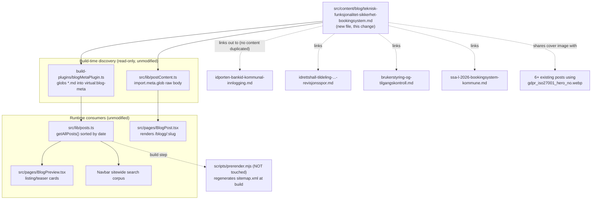

# XAL-1141: Content gap — Teknisk funksjonalitet og sikkerhet i bookingsystem

## WHAT THIS IS
Digilist's SEO agent flagged that no page on digilist.no targets the search term
"teknisk" combined with "funksjonalitet og sikkerhet i bookingsystem" — the query
a kommune IT-leder or administrator uses when evaluating a booking vendor's
technical/security posture before procurement. The ask is a new Norwegian blog
post that consolidates three specific capabilities — secure public-sector login
(ID-porten/BankID), audit trail (revisjonsspor), and advanced administration
(role-based access) — and frames them as what makes Digilist certifiable
(ISO 27001/27701, SSA-L 2026) and differentiated from generic booking tools.

This is NOT a case of writing something from scratch: each of the three named
capabilities already has deep, dedicated coverage elsewhere on the site. What's
missing is a single consolidated "spec sheet" piece that ties functionality +
security together as one evaluation checklist for the procurement/certification
stage of the buyer journey — the exact stage "teknisk" signals — and links out to
the deep-dive posts instead of duplicating them.

## HOW IT WORKS NOW
- Blog posts are plain markdown files in `src/content/blog/*.md`, one per page.
  There is no content-collection schema/zod validator — the frontmatter contract
  is informally defined by `src/lib/blogFrontmatter.ts` (`BlogFrontmatter`
  interface, lines 5-18): `slug`, `title`, `description`, `date`, `author`
  required-in-practice; `updated`, `role`, `readingMinutes`, `tag`, `cover`,
  `keywords` optional. No enum on `tag` (29 free-text values in use, e.g.
  `IT-leder`, `Sikkerhet`). `keywords` is a plain string array (existing posts:
  5-8 items). Nothing validates that `cover` points to a real file, and cover
  images are explicitly reused across many posts (`gdpr_iso27001_hero_no.webp`
  alone appears in 6+ posts already) — reuse is the norm, not an edge case.
- Discovery is fully automatic: `build-plugins/blogMetaPlugin.ts` globs every
  `.md` in `src/content/blog/` at build/dev/test time into the `virtual:blog-meta`
  module; `src/lib/posts.ts` sorts by `date`; `src/lib/postContent.ts` does a
  separate raw-text glob for the article body. **Dropping a new `.md` file is
  the entire integration — no index, router, or nav file needs touching.**
  `public/sitemap.xml` is a stale build artifact regenerated by
  `scripts/prerender.mjs` at build time — out of scope to hand-edit (and off
  the "do not touch shared build scripts" list regardless).
- Existing coverage I read before writing, confirmed by grep + direct read:
  - `src/pages/Sikkerhet.tsx` — the `/sikkerhet` marketing page: FAQ + principle
    list already states all three items (BankID/ID-porten login, audit-logg,
    rollebasert tilgang) plus ISO 27001/27701 and SSA-L 2026 certification, but
    as short FAQ answers, not an article, and not targeting "teknisk".
  - `idporten-bankid-kommunal-innlogging.md` (823 words) — deep dive on how
    ID-porten/BankID integration actually works (SAML/OIDC flow, eID levels).
  - `phishing-resistente-innlogginger-idporten-bankid.md`,
    `magic-link-sms-bankid-sikker-innlogging.md` — login-method deep dives.
  - `idrettshall-tildeling-saksbehandler-godkjenning-revisjonsspor.md`
    (1282 words) — audit trail covered as part of a caseworker-workflow
    narrative, not as a standalone technical capability.
  - `brukerstyring-og-tilgangskontroll.md` (909 words) — RBAC/admin roles,
    deep dive on user types and permissions.
  - `compliance-sikkerhet-og-datavern.md` (slug `datalokasjon-norge-gdpr-kommunal-booking`),
    `ssa-l-2026-bookingsystem-kommune.md`, `penetrasjonstesting-sikkerhetsrevisjon-saas-leverandor.md`,
    `cyberangrep-norske-kommuner-bookingsystem.md`, `ddos-ransomware-beredskap-bookingplattform.md`
    — data location, procurement-contract compliance, pentesting, and incident
    response, each as its own deep dive.
  - Confirmed via `grep -l 'keywords:.*teknisk' src/content/blog/*.md` and
    `grep -rl '"teknisk"' src/content/blog/*.md` — **zero** existing posts
    target "teknisk" as a keyword, and no post's `slug` collides with the one
    I'm about to add (`grep -h "^slug:" src/content/blog/*.md | sort | uniq -d`
    → empty).

## WHAT CHANGES
One new file: `src/content/blog/teknisk-funksjonalitet-sikkerhet-bookingsystem.md`.

- `tag: "IT-leder"` (consistent with other procurement/evaluation-stage posts
  like `bookingsystem-kommunale-lokaler-guide-it-leder.md`).
- `cover: "/images/blog/gdpr_iso27001_hero_no.webp"` — reused, matches the
  certification/security visual theme already established for this cover.
- `keywords` includes `"teknisk funksjonalitet bookingsystem"` and
  `"teknisk sikkerhet bookingsystem"` as primary terms, plus the three
  sub-capabilities and the certification terms (ISO 27001, SSA-L).
- Structure: short framing intro (why "teknisk" is a distinct evaluation stage,
  separate from price/UX), then one `## H2` section each for secure login,
  audit trail, and advanced administration — each 2-3 paragraphs summarizing
  the capability and linking out to the relevant deep-dive post(s) rather than
  repeating their content — then a certification/differentiation section tying
  the three together against ISO 27001/27701 and SSA-L 2026, a practical
  "sjekkliste" (checklist) section an IT-leder can use during vendor evaluation,
  and a closing CTA paragraph, matching the convention seen in
  `brukerstyring-og-tilgangskontroll.md` and `cyberangrep-norske-kommuner-bookingsystem.md`
  (no body `# H1`, no inline images, internal links as `[text](/blogg/slug)`).
  Target ~900-1100 words, in line with the 625-1282 word range of comparable posts.

This is the smallest valid change: one markdown file, no touches to
`scripts/prerender.mjs`, `src/entry-server.tsx`, `scripts/verify-live.mjs`,
`vite.config.ts`, or `build-plugins/blogMetaPlugin.ts` — all of which the
issue's scope note explicitly says not to touch because every SEO branch
funnels through them and conflicts on merge.

## BLAST RADIUS
- **Build/discovery**: none beyond the new file being picked up by the existing
  glob in `build-plugins/blogMetaPlugin.ts` and `src/lib/postContent.ts` — both
  are read-only consumers of the directory, unmodified by this change.
- **Sitemap**: regenerated automatically from the live post list next time
  `scripts/prerender.mjs` runs; not hand-edited here.
- **Cover image**: `gdpr_iso27001_hero_no.webp` is shared with 6+ other posts
  already — adding a 7th reference changes no code path (the file is read
  as-is by whatever renders `cover`; nothing keys off cover uniqueness).
- **Slug/routing**: `getPostBySlug` (`src/lib/postContent.ts`) does a first-match
  lookup by slug; confirmed no existing post uses this slug, so no collision.
- **Nothing else** reads, imports, or links to this new file before it exists —
  it has no other callers to break, only the reverse (once merged, other posts
  could later choose to link to it, but that's out of scope for this change).

## MERMAID DIAGRAM

## Not done here (out of scope, noted for the record)
- No change to `/sikkerhet` page — its FAQ already states the same facts at a
  higher level; this post is the article-length, "teknisk" keyword-targeted
  companion, not a replacement.
- No systemic guard/index/registry added anywhere, per the issue's explicit
  scope note.
