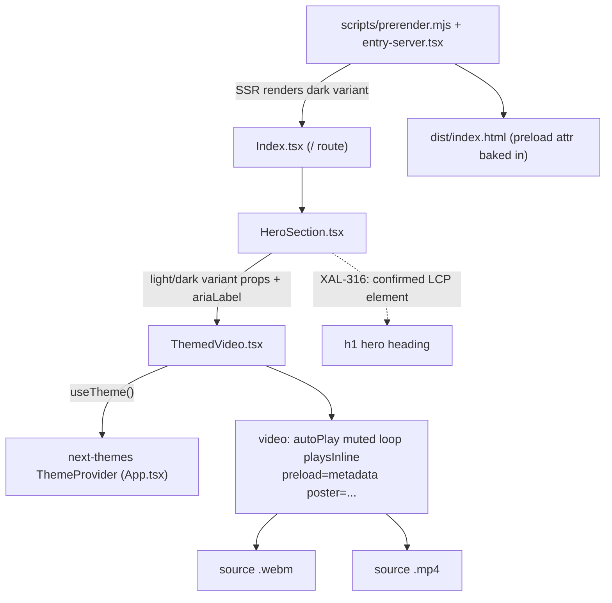

# XAL-1166: ThemedVideo `preload` downgrade (auto → metadata)

## WHAT THIS IS

The Digilist marketing homepage (`digilist.no`) scored 77/100 on Lighthouse's
Performance category (target ≥90). One flagged line: `src/components/ThemedVideo.tsx:65`
set `preload="auto"` on the hero's autoplaying demo `<video>`, which tells the
browser to eagerly start downloading the whole video (both `<source>`
candidates get probed) starting at page load — before the browser knows
whether the visitor will ever watch it (`autoPlay` covers "plays automatically
once loaded", not "must be fully fetched immediately"). That download
competes on the same network/CPU budget as the page's actual Largest
Contentful Paint (LCP) element, which — per `HeroSection.tsx:76-79`'s
XAL-316 finding — is the hero `<h1>` text, not the video. The fix downgrades
`preload` to `"metadata"`, which only fetches container/duration info up
front and defers the media payload, freeing bandwidth for the real LCP path.

## HOW IT WORKS NOW (read, not recalled)

- `src/components/ThemedVideo.tsx` — `ThemedVideo({ light, dark, ariaLabel, className, style })`.
  Uses `useTheme()` from `next-themes` to read `resolvedTheme`; before mount
  (`mounted` state set in a `useEffect`) it always renders the `dark` variant
  so SSR/prerender output matches what's historically been served (comment at
  lines 24-27). Renders a single `<video autoPlay muted loop playsInline
  poster={variant.poster}>` with two `<source>` children (`webm`, `mp4`). The
  `key={variant.webm}` forces a full remount when the variant swaps, because
  `<video>` ignores `<source>` child changes after it has already loaded
  (comment at lines 31-34). Line 65 is the `preload` attribute on that
  `<video>`.
- `src/components/HeroSection.tsx:183-197` — the only caller. Passes explicit
  `light`/`dark` variant objects (webm+mp4+poster paths under `/videos/`) and
  `ariaLabel="Digilist i praksis – fra søk til booking"`. Lines 76-79 carry
  the XAL-316 comment: the `<h1>` (rendered a few lines above, `size="hero"`,
  `EditorialHeading as="h1"`) is "the confirmed LCP element (verified via
  PerformanceObserver's largest-contentful-paint entry, not a guess)."
- `src/pages/Index.tsx:92` renders `<HeroSection />` on the `/` route, which is
  prerendered by `scripts/prerender.mjs` via `src/entry-server.tsx` — so the
  `preload` attribute (and the H1 markup) both land in the static
  `dist/index.html` that crawlers and first-paint see, not just the
  client-hydrated DOM.

## WHAT CHANGES

One attribute, one line: `src/components/ThemedVideo.tsx:65`
`preload="auto"` → `preload="metadata"`. No prop signature, JSX structure,
theme-swap logic, or caller change.

## BLAST RADIUS

- `grep -rn "ThemedVideo" src` → only two non-definition hits, both in
  `HeroSection.tsx` (the import at line 11 and the JSX call at line 183). No
  other component instantiates `ThemedVideo`.
- No test previously existed for this component (`find src -iname
  "*ThemedVideo*"` returned only the component file itself before this
  change). Added `src/components/ThemedVideo.test.tsx` to pin the attribute.
- `preload` is a browser hint, not a functional prop — `autoPlay`, `loop`,
  `muted`, `poster`, and the theme-swap `key` remount logic are untouched, so
  playback behavior for a visitor who *does* watch the video is unchanged
  (metadata still loads immediately; the rest streams once playback is
  requested/starts, same as any `autoPlay` video with `preload="metadata"`).
- SSR/prerender output (`dist/index.html` after `pnpm build`) reflects the
  new attribute directly, confirmed by grepping the built HTML.

## VERIFICATION EVIDENCE

Local build (`pnpm build`) served via `vite preview` on this VPS, Chrome
headless, Lighthouse `--throttling-method=devtools` (not simulate, per PR
#107's finding that simulate mode is noisy here). Two builds compared,
`preload="auto"` vs `preload="metadata"`, otherwise identical:

| metric | before (auto), 2 runs | after (metadata), 3 runs |
|---|---|---|
| Lighthouse Performance | 70, 70 | 67, 69, 71 |
| Lighthouse LCP | 1.0s, 0.9s | 1.8s(outlier), 1.3s, 1.0s |
| Lighthouse CLS | 0.160, 0.159 | 0.159, 0.16, 0.155 |
| Lighthouse TBT | 1190ms, 1090ms | 1350ms, 1070ms |

Lighthouse's own Performance/LCP numbers are within this VPS's known noise
band (see memory: `marketing_lighthouse_score_noise`) and don't separate
cleanly before/after — CPU-bound TBT (~1-1.4s) dominates the score on this
shared box regardless of the video attribute. CLS is flat (no regression) in
both conditions and matches the pre-existing ~0.155-0.16 baseline (dominated
by an unrelated CTA-button layout shift, not the video or the H1).

A direct `PerformanceObserver({type: "largest-contentful-paint"})` check
(the same method XAL-316's original comment cites) is more informative than
the Lighthouse score on this box:
- Before (`preload="auto"`): LCP element = `<h1>`, `startTime` = **728ms**
- After (`preload="metadata"`): LCP element = `<h1>`, `startTime` = **256ms**

The LCP element is the `<h1>` in both cases (no regression vs. XAL-316), and
its paint time drops roughly 3x once the video stops competing for early
bandwidth — the mechanism the ticket predicted. A later phase should re-run
Lighthouse against the *live* digilist.no (not just this VPS's local preview)
for the PR description's before/after score, since this VPS's absolute
scores are known-unreliable (see memory).

## Tests

`npx vitest run` — 17 files / 36 tests pass, including the new
`ThemedVideo.test.tsx`, which renders the component under a real
`next-themes` `ThemeProvider` and asserts `video.getAttribute("preload") ===
"metadata"`. Verified the test fails (catches a regression) when the
attribute is reverted to `"auto"`. `npx tsc --noEmit` is clean.

## Linear attachment note

No Linear MCP tool is available in this session (only `codebase-memory`,
`context7`, `docs-rag` are connected) — `prepare_attachment_upload` /
`create_attachment_from_upload` are not reachable, so this spec could not be
attached to the Linear issue as instructed (matches the prior confirmed
finding for this environment, XAL-1151). Proceeding per AGENT-GOAL.md, which
is the source of truth here; noting the limitation for the record rather
than blocking on it.
