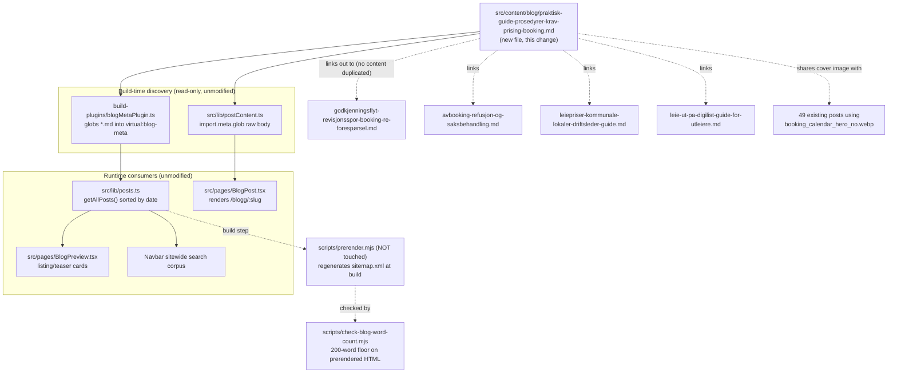

# XAL-1139: Content gap — Praktiske guider og prosedyrer for booking

## WHAT THIS IS
Digilist's SEO agent flagged that no page on digilist.no targets "praktiske" —
the search intent of someone who already knows what a booking system is and
wants the operational playbook: how do I actually run the booking desk day to
day, what rules do I put on who can book what, and how do I set up prices.
The named audience is "Utleiere og bookingansvarlige" — both kommune staff who
administer bookings (saksbehandler/driftsleder) and private utleiere — and the
ask is content that helps *both* groups administer bookings effectively, not
one persona's version of the story. The ask is a single practical guide that
walks a bookingansvarlig through the three things the ticket names —
prosedyrer, krav, prising — as one operational sequence, not three separate
deep dives.

This is NOT a case of writing about any of these three topics from scratch:
each already has deep, persona-specific coverage on the site (see below).
What's missing is the piece that treats "bookingansvarlig" as one role
spanning both markets and walks through the practical setup and daily
procedure end to end, linking out to the deeper posts instead of repeating
them.

## HOW IT WORKS NOW
- Blog posts are plain markdown files in `src/content/blog/*.md`, one file per
  page, discovered automatically at build/dev/test time by
  `build-plugins/blogMetaPlugin.ts` (globs frontmatter into
  `virtual:blog-meta`) and `src/lib/postContent.ts` (separate raw-body glob).
  `src/lib/posts.ts` sorts by `date`. **Dropping a new `.md` file is the whole
  integration** — no index, router, or nav file needs touching.
  `public/sitemap.xml` / `dist/sitemap.xml` are build artifacts regenerated by
  `scripts/prerender.mjs` — out of scope to hand-edit, and off the "don't
  touch shared build scripts" list regardless.
- The frontmatter contract is informal, defined by `src/lib/blogFrontmatter.ts`
  (`BlogFrontmatter`, lines 5-18): `slug`, `title`, `description`, `date`,
  `author` required in practice; `role`, `readingMinutes`, `tag`, `cover`,
  `keywords` optional. `tag` has no enum — 29 free-text values already in use
  (`Driftsleder` ×29, `Saksbehandler` ×14, `Utleier` ×13, etc., confirmed via
  `grep -h '^tag:' src/content/blog/*.md | sort | uniq -c`). `cover` is
  explicitly reused across posts with no uniqueness constraint —
  `booking_calendar_hero_no.webp` alone is already used by 49 posts.
  `scripts/check-blog-word-count.mjs` enforces a 200-word floor against the
  prerendered `dist/blogg/<slug>/index.html`, not the raw markdown.
- Existing coverage I read before writing, confirmed by grep + direct read —
  each covers one slice of "prosedyrer, krav, prising", never the operational
  whole, and never both markets in one piece:
  - `godkjenningsflyt-revisjonsspor-booking-re-forespørsel.md` (tag
    Driftsleder) — the closest overlap: explicitly addresses both kommune and
    private utleiere, but argues one narrow principle (a rejected approval is
    re-requested, never silently overridden) for audit-trail/SSA-L/GDPR
    reasons. It does not cover setting up rules, requirements, or pricing.
  - `avbooking-refusjon-og-saksbehandling.md` (tag Saksbehandler,
    kommune-only) — deep dive on automating cancellation/refund rules
    (deadlines, gebyr, tvangsavbooking), not the wider procedure or pricing.
  - `leiepriser-kommunale-lokaler-driftsleder-guide.md` (tag Driftsleder,
    kommune-only) — deep dive on how a driftsleder sets and governs pricing
    (medlemspris vs. kommersiell, rabattmodell, depositum).
  - `leie-ut-pa-digilist-guide-for-utleiere.md` (tag Utleier, private-only) —
    deep dive on listing something for rent as a private utleier: photos,
    calendar accuracy, pricing, deposits, communication, insurance/tax. Close
    in tone but written for the *first-listing* private utleier, not for
    someone administering an ongoing multi-booking desk across either market.
  - `rapportering-statistikk-lokalbruk-private-utleiere.md` (tag Utleier,
    private-only) — reporting/statistics, adjacent but not procedural setup.
  - Confirmed via `grep -li 'praktisk' src/content/blog/*.md` → **zero** hits;
    `grep -lri 'bookingansvarlig' src/content/blog/*.md` → zero hits (the
    exact persona name the ticket uses does not appear anywhere yet);
    `grep -h "^slug:" src/content/blog/*.md | sort | uniq -d` → empty, so no
    slug collision with the one I'm adding.

## WHAT CHANGES
One new file: `src/content/blog/praktisk-guide-prosedyrer-krav-prising-booking.md`.

- `tag: "Bookingansvarlig"` — a new but conventional free-text tag value (no
  enum exists; this is the exact persona name the ticket uses, and no
  existing tag names it), so both a kommune saksbehandler/driftsleder and a
  private utleier searching for their day-to-day role recognize themselves.
- `cover: "/images/blog/booking_calendar_hero_no.webp"` — reused, the site's
  most-used generic operational cover (49 existing posts), fitting a
  practical/procedural piece with no single-market visual theme.
- `keywords` centers "praktisk guide booking", "prosedyrer for booking",
  "krav til leietaker booking", "sette opp prising booking" plus a
  kommune/privat pairing term, so the piece targets "praktiske" without
  colliding with any single existing post's keyword set (checked against all
  five posts above).
- Structure: a short framing intro naming both audiences and the "praktisk"
  gap this piece fills, then one `## H2` each for the three named pillars in
  the ticket's own order — krav (setting rules/requirements for who can book
  what), prosedyrer (the day-to-day approval → confirmation → cancellation
  workflow), prising (how to set up and govern pricing) — each with 2-4
  practical paragraphs plus explicit links to the deeper posts above rather
  than repeating their detail, then a short kommune-vs-privat comparison
  section (mirroring the table pattern already used in the godkjenningsflyt
  post) so the piece is honest about where the two markets diverge, a
  practical "kom i gang"-checklist, and a closing CTA paragraph. No body
  `# H1`, no inline images, internal links as `[text](/blogg/slug)`, matching
  every other post's convention. Target ~900-1100 words, in line with the
  ~600-1300 word range of the comparable posts read above.

This is the smallest valid change: one markdown file, no touches to
`scripts/prerender.mjs`, `src/entry-server.tsx`, `scripts/verify-live.mjs`,
`vite.config.ts`, or `build-plugins/blogMetaPlugin.ts` — all of which the
issue's scope note explicitly says not to touch, since every SEO branch
funnels through them and conflicts on merge.

## BLAST RADIUS
- **Build/discovery**: none beyond the new file being picked up by the
  existing glob in `build-plugins/blogMetaPlugin.ts` and
  `src/lib/postContent.ts` — both are read-only consumers of the directory,
  unmodified by this change.
- **Sitemap**: regenerated automatically from the live post list next time
  `scripts/prerender.mjs` runs; not hand-edited here.
- **Cover image**: `booking_calendar_hero_no.webp` is already shared by 49
  other posts — a 50th reference changes no code path, nothing keys off cover
  uniqueness.
- **Slug/routing**: `getPostBySlug` (`src/lib/postContent.ts`) does a
  first-match lookup by slug; confirmed no existing post uses this slug.
- **New tag value**: `"Bookingansvarlig"` is a new string in a free-text
  field with no enum/validator anywhere in the codebase (confirmed by reading
  `BlogFrontmatter` and grepping for any `tag` allowlist) — nothing breaks by
  introducing a 30th value; it just becomes a new filter option wherever tags
  are rendered as filters.
- **Nothing else** reads, imports, or links to this new file before it
  exists — it has no other callers to break, only the reverse (once merged,
  other posts could later choose to link to it, out of scope here).

## MERMAID DIAGRAM

## Not done here (out of scope, noted for the record)
- No new tag enum/registry added anywhere — `tag` stays free text, per the
  existing convention.
- No edits to any of the four posts linked out to; this piece is additive
  and hub-like, not a rewrite of what already exists.
