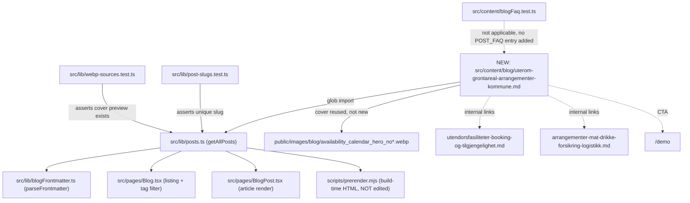

# XAL-1140: Content gap — Uterom og grøntareal for arrangementer

## WHAT THIS IS
Digilist's SEO agent flagged that no page on digilist.no targets the search term
"uterom" combined with booking of outdoor space for events. The concrete pattern
it's pointing at: kommuner and event organizers ("arrangører") book parks, green
areas ("grøntareal") and stretches of beach ("strandavsnitt") for parties,
festivals and other events — a segment the ticket describes as growing, with
both public (kommune-arranged events, national-day celebrations, summer
festivals run by the municipality) and private/commercial (wedding parties,
company events, festival organizers) demand. The task is a new Norwegian blog
post that names this category explicitly, explains why it typically sits
outside a municipality's booking system today, and describes what booking it
properly requires — so the page ranks for "uterom" and related queries and
gives both audiences (kommune saksbehandlere and private arrangører) a reason
to book a demo.

This is a pure content task: no application code changes. The product itself
has no dedicated "uterom" object type — Digilist's booking model is generic
(any bookable object gets a name, capacity, price and rules), so the post's
job is to describe how that generic model applies to this specific, currently
uncovered use case, the way every other blog post in this repo does for its
own facility category.

## HOW IT WORKS NOW
Read `src/content/blog/utendorsfasiliteter-booking-og-tilgjengelighet.md`
(the closest existing post) end to end: it covers grillhytter, paviljonger,
bålplasser and badeplass service buildings — small, fixed, individually-owned
outdoor structures, framed around a family or small-group booker. It does
**not** use the word "uterom", does not mention "grøntareal", does not cover
event-scale bookings, and does not mention private/commercial event
organizers as a booker persona — it only addresses innbyggere (residents).
Confirmed with `grep -rli "uterom" src/content/blog/` (one unrelated hit in
a wedding-venue post's prose) and `grep -rli "grøntareal" src/content/blog/`
(zero hits) — the exact term the ticket wants covered has no page.

Also read `src/content/blog/arrangementer-mat-drikke-forsikring-logistikk.md`
(covers catering/drinks/insurance/logistics for events already booked into
some venue — assumes the venue question is solved) and
`src/content/blog/billettlosning-pamelding-offentlig-arrangement.md` (covers
ticketing/sign-up for an event, same assumption). Neither addresses *finding
and booking the outdoor space itself* — that's the specific gap.

Blog posts are plain markdown files under `src/content/blog/*.md`, each with
a YAML frontmatter block (`slug`, `title`, `description`, `date`, `author`,
`role`, `readingMinutes`, `tag`, `cover`, `keywords`) parsed by
`src/lib/blogFrontmatter.ts` (`parseFrontmatter`/`extractFrontmatter`) and
discovered automatically — confirmed via `src/lib/posts.ts` (imports via
glob, no manual registry file to edit) and `src/lib/post-slugs.test.ts`,
which only asserts every post's resolved slug is unique. `cover` reuses one
of the existing images in `public/images/blog/`; `src/lib/webp-sources.test.ts`
asserts every post's cover has a committed `-preview.webp` sibling, which
existing covers already satisfy. FAQPage JSON-LD is opt-in via
`src/content/blogFaq.mjs` (`POST_FAQ`, keyed by slug) — confirmed via
`src/content/blogFaq.test.ts` that most posts (including both reference
posts above) have no entry and render fine without one, so this post won't
add one either.

`AGENT-SPEC.md`, `AGENT-REVIEW.md` and the `proof/` screenshots currently
sitting in this worktree belong to XAL-1141 (already merged, PR #231) — they
arrived here via the merge-from-main commit `8ab1794` and are already present
on `origin/main` itself (confirmed with `git ls-tree -r origin/main`). That's
existing repo convention: `AGENT-SPEC.md`/`AGENT-REVIEW.md` get overwritten
per ticket, `proof/*.png` accumulate with ticket-specific filenames. This
spec overwrites the stale XAL-1141 content; it is not scope creep.

## WHAT CHANGES
One new file: `src/content/blog/uterom-grontareal-arrangementer-kommune.md`,
a Norwegian Bokmål blog post targeting "uterom" (and "grøntareal",
"strandavsnitt for arrangement") as primary keywords, covering:
- what counts as "uterom og grøntareal for arrangementer" (parks, green
  areas, beach sections, festival grounds) as a category distinct from the
  fixed small structures the existing utendørsfasiliteter post already owns
- why this segment sits outside most municipalities' booking systems today
- the two booker personas by name — kommune (arranging its own public
  events) and private arrangører (festivals, weddings, company events) — to
  match the ticket's "both public and private interest" framing
- what a booking system actually needs to handle for this category:
  capacity/area, permits (bruk av offentlig grunn, skjenkebevilling, lyd),
  cleanup deposit, weather-dependent cancellation, insurance for larger
  gatherings
- a short step-by-step booking flow and a closing CTA to `/demo`, matching
  every other post's structure

Reuses an existing cover image (no new asset). No frontmatter field, schema,
or build script changes — nothing to add to `blogFaq.mjs` since no FAQ
section is included.

Why this shape rather than folding it into the existing utendørsfasiliteter
post: that post's audience, tone and scope (individual/family booking a
grillhytte for an evening) don't fit the ticket's actual ask (kommune AND
commercial arrangører booking larger outdoor space for planned events) — a
separate post targeting the distinct "uterom" query is a smaller, cleaner
change than rewriting a published, already-linked post, and matches how the
rest of the blog already splits by persona/query rather than merging
adjacent topics.

## BLAST RADIUS
- **Build/prerender**: the new `.md` file is picked up automatically by the
  same glob-based discovery every other post uses — no `scripts/prerender.mjs`
  or `src/entry-server.tsx` edits (explicitly out of scope per AGENT-GOAL.md;
  those files are the shared-file merge-conflict trap other SEO branches hit).
- **Slug uniqueness**: `src/lib/post-slugs.test.ts` will catch any collision;
  `uterom-grontareal-arrangementer-kommune` isn't used by any existing file
  (confirmed with `ls src/content/blog/ | grep -i utero`).
- **Cover image test**: `src/lib/webp-sources.test.ts` requires the chosen
  cover to have a committed `-preview.webp` sibling — satisfied by reusing an
  existing cover (`availability_calendar_hero_no.webp`, already used by three
  other posts including the closest sibling post).
- **Blog listing / tag filters**: `src/pages/Blog.tsx` renders posts by tag;
  adding one more post with an existing tag value doesn't change that
  component's logic, only its data.
- **Nothing else reads blog content**: no other page, component, or Convex
  function consumes `src/content/blog/*.md` besides the blog listing/post
  pages and the tests above (confirmed via
  `grep -rl "content/blog" src/**/*.test.ts` and the `find ... blog` sweep
  above) — this is a content-only, additive change with no touch on shared
  render/build code.

