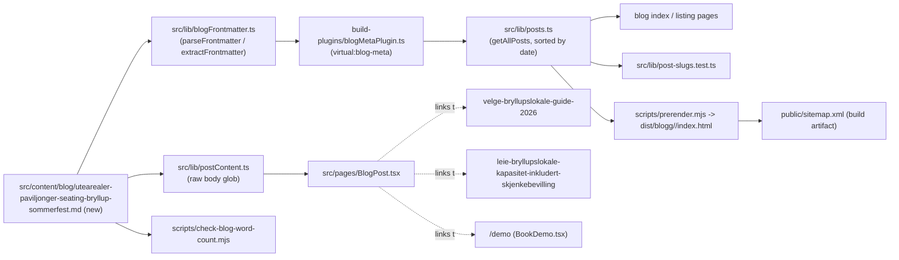

# XAL-1154: Content gap — Utearealer, paviljonger og seating

## WHAT THIS IS
Digilist's SEO agent flagged that no page on digilist.no targets "utearealer"
as a search term in the context of private events: outdoor areas, pavilions
and outdoor seating rented for summer parties and private arrangements, with
weddings and larger private celebrations named as the most common use case.
The ask is a single new blog post, in Norwegian Bokmål, that answers what
someone searching "utearealer" for an event actually wants to know: what
counts as a uteareal/paviljong, when it fits a wedding or sommerfest, what a
good one needs to include (pavilion vs. telt, strøm, toalett, underlag,
skjenkebevilling), how weather risk is handled, and how to check availability
and book one.

## HOW IT WORKS NOW
- Blog posts are plain markdown files in `src/content/blog/*.md`, one file
  per page. Frontmatter is parsed by `src/lib/blogFrontmatter.ts`
  (`parseFrontmatter`/`extractFrontmatter`) and exposed as a single module via
  `build-plugins/blogMetaPlugin.ts` (`virtual:blog-meta`, used by
  `src/lib/posts.ts` for metadata); the raw body is read separately by
  `src/lib/postContent.ts`, only imported by `BlogPost.tsx`. Dropping a new
  `.md` file with valid frontmatter is the whole integration — no index,
  router, or nav file needs touching.
- `src/lib/post-slugs.test.ts` guards that no two posts resolve to the same
  slug (a real incident previously shipped a silent shadow).
- `scripts/check-blog-word-count.mjs` enforces a 200-word floor on the
  markdown source (`MIN_WORDS`), and a second pass on the prerendered
  `dist/blogg/<slug>/index.html` after `vite build`/`prerender.mjs` run,
  since SSR races can ship a near-empty page even with a full source file.
- `scripts/check-title-lengths.mjs` is an informational (non-gating) check on
  rendered title length (~65 char soft limit; the site suffixes titles ≤50
  chars with " — Digilist").
- I read the two closest existing posts to confirm this is a real gap, not a
  duplicate:
  - `src/content/blog/utendorsfasiliteter-booking-og-tilgjengelighet.md`
    covers grillhytter/paviljonger/bålplasser, but for the kommune/innbygger
    persona (municipal facility booking, bålforskrifter, ansvarlig booker) —
    not the private-event angle this ticket asks for.
  - `src/content/blog/velge-bryllupslokale-guide-2026.md` and
    `leie-bryllupslokale-kapasitet-inkludert-skjenkebevilling.md` mention
    outdoor weddings only as a single paragraph/aside ("plan B ved dårlig
    vær"), with no dedicated treatment of utearealer/paviljonger/seating as
    its own topic and no page targeting "utearealer" itself.
  - No existing post title, description, or keyword list targets
    "utearealer".

## WHAT CHANGES
- One new file: `src/content/blog/utearealer-paviljonger-seating-bryllup-sommerfest.md`.
  A Norwegian Bokmål guide covering: what utearealer/paviljonger/utesitteplasser
  are in the private-event rental context, when they fit best (bryllup,
  sommerfest, runde dager), what a good uteareal setup needs (paviljong vs.
  telt, strøm, toalett, underlag, skjenkebevilling, kapasitet), weather/plan-B
  risk (this is Norway), and how to check real-time availability and book via
  Digilist, closed with a checklist and a demo CTA.
- Frontmatter follows the existing schema exactly (`slug`, `title`,
  `description`, `date`, `author`, `role`, `readingMinutes`, `tag:
  "Privatperson"`, `cover`, `keywords`), reusing the same cover image other
  wedding/private-event posts use (`en_plattform_hero_no.webp` — no dedicated
  outdoor/garden hero image exists in `public/images/blog/`, confirmed by
  listing the directory).
- Internally links to the two closest related posts
  (`velge-bryllupslokale-guide-2026`,
  `leie-bryllupslokale-kapasitet-inkludert-skjenkebevilling`) and to
  `/demo`, matching the site's existing internal-link and CTA conventions.
- No other file changes. Per the ticket's own scope note, I am not touching
  `scripts/prerender.mjs`, `src/entry-server.tsx`, or `scripts/verify-live.mjs`.

## BLAST RADIUS
- Adding a `.md` file is additive: no router, nav, sitemap generator, or
  build script needs editing — `sitemap.xml` and the blog index are both
  generated from the directory listing at build time.
- The only shared code this exercises is the frontmatter parser
  (`blogFrontmatter.ts`) and the slug-uniqueness test — both read, both
  unaffected by content, both re-run in step 4.
- No other post links to this new slug yet (nothing to break), and this post
  does not remove or rename anything another post already links to.

