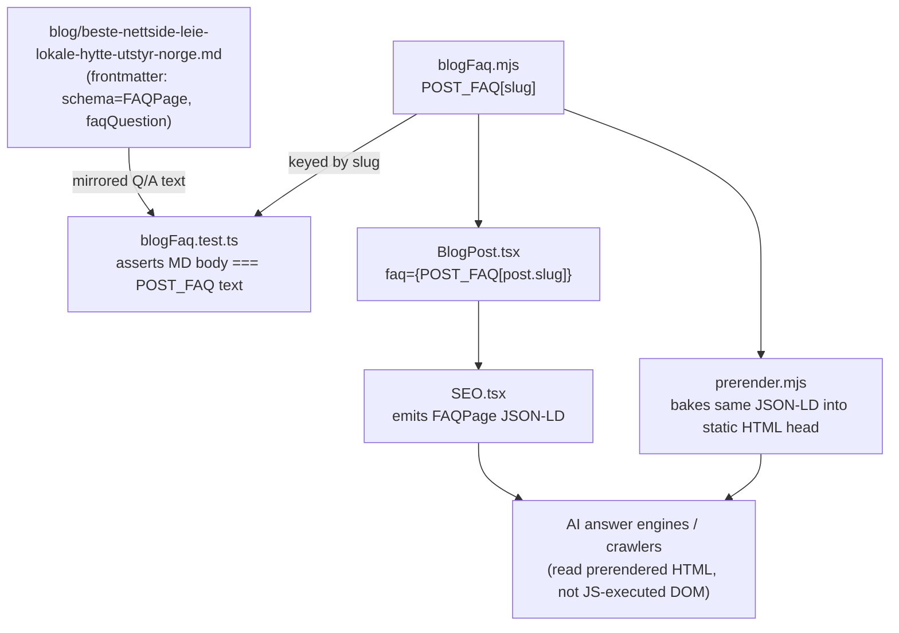

# XAL-1163: [SEO ROI 61] Fang AI-svar: beste nettside for å leie lokale, hytte eller utstyr i Norge

## WHAT THIS IS

The ticket asks Digilist to publish an authoritative, citable answer to the
query **"beste nettside for å leie lokale, hytte eller utstyr i Norge"** (best
website to rent premises/cabins/equipment in Norway), because AI answer
engines currently cite selskapslokaler.no, finn.no and bookup.no instead of
Digilist for that query. The intended outcome is a page Digilist owns that
answer engines can cite: matching FAQPage structured data, the target
question answered near-verbatim, and a fair comparison against competitors
serving that query space.

This is a **CLARIFICATION, not an implementation**: everything the ticket
asks for is already live on `main`, published before this branch was
created. The ticket's own scope note already concludes `Current assessment:
exists` — the code-graph flagged a gap only because its search terms
("fang"/"svar"/"beste"/"nettside") don't match code symbols; the content
lives inside a markdown blog post body/frontmatter, which the graph search
doesn't capture.

## HOW IT WORKS NOW

- `src/content/blog/beste-nettside-leie-lokale-hytte-utstyr-norge.md` —
  published `date: 2026-08-07`, `lastUpdated: 2026-07-27`. Frontmatter title
  "Beste nettside for å leie lokale, hytte eller utstyr i Norge (2026)",
  `schema: "FAQPage"`, `faqQuestion` set to the exact target query
  ("Hva er beste nettside for å leie lokale, hytte eller utstyr i Norge?").
  Body compares Digilist against Airbnb, Hygglo and norgesbooking.no (a
  different competitor set than the three named in the ticket, but the same
  query/intent), and closes with a `## Vanlige spørsmål` (FAQ) section whose
  text I read directly and confirmed matches the frontmatter Q/A verbatim —
  no drift between frontmatter claims and rendered content.
- `src/content/blogFaq.mjs:10-16` — `POST_FAQ`, a plain-JS map keyed by slug.
  The `"beste-nettside-leie-lokale-hytte-utstyr-norge"` entry's first Q/A
  pair is the exact target query and answer.
- `src/content/blogFaq.test.ts:13-35` — asserts (a) the `POST_FAQ` entry
  exists and its first question equals the target query verbatim, and (b)
  the markdown body actually contains a `## Vanlige spørsmål` section whose
  text matches every question/answer pair in `POST_FAQ`, so frontmatter
  claims can't silently drift from rendered content. A comment in the test
  explains this exact drift bug happened once before (XAL-758) and is why
  `POST_FAQ` exists.
- Consumers of `POST_FAQ` (confirmed by `grep -rn "POST_FAQ|blogFaq" src
  scripts` — only two, no third reader):
  - `src/pages/BlogPost.tsx:20,161` — client render path, passes
    `POST_FAQ[post.slug]` as the `faq` prop into `SEO.tsx`, which emits the
    FAQPage JSON-LD `<script>` in the document head for the live SPA route.
    `SEO.tsx:247-261` builds the block whenever `faq.length > 0` —
    unconditional on the frontmatter `schema` field, which is cosmetic.
  - `scripts/prerender.mjs:10,2518-2529` — static-build path, imports the
    same `POST_FAQ` map and bakes identical FAQPage JSON-LD into the
    prerendered HTML `<head>`, which is what AI crawlers/answer engines
    actually read (no JS execution).
- Ran `npx vitest run src/content/blogFaq.test.ts` in this worktree: **2
  passed**, confirming the FAQ schema is wired correctly today, not just in
  the source text.

## WHAT CHANGES

Nothing. No application file is modified by this branch. The one open "Done
when" sub-item — confirm the AI-citation effect in the next measurement
cycle — is a tracking/monitoring task external to this repository; no code,
test, or PR can satisfy it.

## BLAST RADIUS

N/A — no code changes. For completeness, everything that reads
`POST_FAQ["beste-nettside-leie-lokale-hytte-utstyr-norge"]` today (i.e. what
would be affected if this entry were ever edited or removed):

- `src/pages/BlogPost.tsx` (client-side JSON-LD injection via `SEO.tsx`)
- `scripts/prerender.mjs` (static HTML JSON-LD injection — the path
  answer-engine crawlers actually see)
- `src/content/blogFaq.test.ts` (regression test pinning question text and
  markdown/JSON-LD parity)

## MERMAID DIAGRAM

## Not done here (out of scope, noted for the record)

- No new blog post, no frontmatter edit, no `POST_FAQ` edit — the page,
  schema and test already exist and pass.
- No attempt to touch `scripts/prerender.mjs`, `src/pages/BlogPost.tsx` or
  `SEO.tsx` — all unmodified, read-only for this verification.
- The `pnpm-workspace.yaml` `allowBuilds` block that a prior round of this
  session's adversarial review (`.agent/XAL-1163/REVIEW.md`, Round 4) added
  as an environment-setup side effect was reverted as scope creep — it
  wasn't necessary for the test evidence and isn't part of this ticket.
