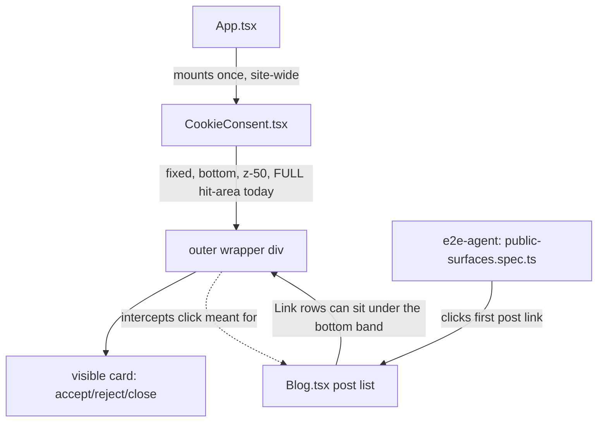

# XAL-1053: E2E failure — blog index click timeout

## WHAT THIS IS
The fleet's E2E test `blog index lists posts and a post opens with its cover + body`
(`/root/xaheen-agent-fleet/tools/e2e-agent/tests/public-surfaces.spec.ts`) goes to
`/blogg` and clicks the first `a[href^="/blogg/"]` link. On a fresh browser session
(no `cookie-consent` localStorage key — exactly what a new Playwright context is),
the site's cookie banner slides up from the bottom of the viewport ~1s after the
page mounts. That banner's outer wrapper is a full-width, ~260px-tall `fixed`
block sitting above everything else (`z-50`) — including the transparent padding
around the visible card, not just the card itself. The first blog post row is tall
(cover image + heading + description) and sits partly inside that bottom band once
scrolled into view, so its click target can be intercepted by the (invisible,
padding-only) part of the banner's hit area. That's an intermittent click-blocker,
not a data or animation problem — it doesn't depend on network speed or the blog
content at all.

## HOW IT WORKS NOW
- `src/components/CookieConsent.tsx` — mounted once, site-wide, in `src/App.tsx:479`.
  `useEffect` (line 9-16) checks `localStorage.getItem("cookie-consent")`; if unset,
  `setTimeout(() => setIsVisible(true), 1000)`. When visible, renders:
  ```
  <div className="fixed bottom-0 left-0 right-0 z-50 p-4 md:p-6 animate-slide-up">
    <div className="container mx-auto ... max-w-6xl">
      <div className="bg-card/95 ... rounded-2xl shadow-2xl p-6 md:p-8"> ...visible card... </div>
    </div>
  </div>
  ```
  Neither the outer `fixed` div nor the `container` div has `pointer-events-none`,
  so the whole rectangle — including the `p-4`/`md:p-6` padding around the card
  and any letterboxing outside `max-w-6xl` — is a live click target, not just the
  visible card.
- `src/pages/Blog.tsx:203-283` — each post is a `<Link>` wrapping a `py-8 lg:py-12`
  row (cover image, meta, heading, description); on desktop this row is ~300-390px
  tall, so part of it can fall inside the banner's bottom band once scrolled to.
- Confirmed live with a throwaway Playwright probe against `https://digilist.no/blogg`
  (viewport 1280×720, fresh context): first-link bounding box after settling was
  `{x:48, y:832, width:1184, height:358}` (i.e. spanning well past the fold), and the
  cookie-consent bounding box was `{x:0, y:457, width:1280, height:263}` — a
  full-width band covering the bottom 37% of the viewport, well beyond the visible
  card's actual footprint.

## WHAT CHANGES
Add `pointer-events-none` to the outer `fixed` wrapper in `CookieConsent.tsx` and
`pointer-events-auto` back on the inner visible card div. `pointer-events` is
inherited, so the card and everything inside it (text links, both buttons, the
close button) keep working exactly as before; only the surrounding transparent
padding/letterboxing stops intercepting clicks meant for the page underneath.
This is the smallest fix that removes the click-blocker without touching layout,
copy, or the consent logic itself.

## BLAST RADIUS
- `CookieConsent` is mounted exactly once, site-wide (`src/App.tsx:479`) — this
  change affects every page while the banner is showing, not just `/blogg`. That's
  intended: the same invisible-hit-area problem exists on any page with content
  reachable near the bottom of the viewport (grep confirms no other page opts out).
- No other component reads or reaches into `CookieConsent`'s DOM (`grep -rl
  CookieConsent src/` → only `App.tsx` and the component itself) and nothing relies
  on the wrapper's oversized hit area (no click-outside-to-dismiss handler exists —
  dismissal is only via the two buttons/close icon, all inside the card).
- `pointer-events` is inherited in CSS, so the accept/reject/close buttons (all
  descendants of the card, which gets `pointer-events-auto`) are unaffected.



## Files likely affected
- `src/components/CookieConsent.tsx` (the fix)
